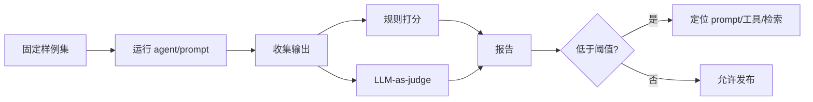

# 第 15 章 · 评估与测试 Agent

> 所属阶段：**第六部分 · 生产化**
> 预计用时：50 分钟 | 难度：⭐⭐⭐☆☆
> 全局导航：[课程导航](../../docs/navigation.md) · [完整大纲](../../docs/curriculum.md) · [知识图谱](../../docs/knowledge-graph.md)

## 学习目标

学完本章你能够：

- [ ] 说清为什么 Agent / LLM 函数**难以用传统单测**覆盖（输出非确定）。
- [ ] 区分三种评估手段：**规则/精确匹配**、**LLM-as-judge**、**回归测试集**，并知道各自适用边界。
- [ ] 设计一份**离线评估数据集**（`input → 期望 / 评分标准`）。
- [ ] 从零搭一个**最小 eval harness**：跑数据集 → 打分 → 汇总通过率与失败用例。
- [ ] 理解如何把评估**接入 CI**，用通过率门槛防止改 prompt 后的"静默退化"。

## 前置知识

- 已读 [第 02 章 · 你的第一次 LLM 调用](../02-first-llm-call/README.md)（`getLLM()` / `chat()`）。
- 了解「结构化抽取」：让模型只吐 JSON 再用 zod 校验（即上一阶段第 13 章的做法，本章会原样复用一个抽取函数当"被测对象"）。
- 已读 [第 14 章 · 流式输出与 UX](../14-streaming-and-ux/README.md)。

## 三层学习路线

| 层级 | 学习目标 | 你要完成什么 |
|------|----------|--------------|
| 极简 | 为 agent 写第一组 eval 样例。 | 能运行固定输入输出检查,知道 demo 成功不等于系统稳定。 |
| 进阶 | 理解规则评分、LLM-as-judge 和回归测试。 | 区分 determinism、正确性、相关性、幻觉、安全性这些不同质量维度。 |
| 真实实践 | 把 eval 接进 CI 和发布门禁。 | 设计一套上线前必须通过的质量阈值,并记录失败样例用于 prompt 或工具修复。 |

---

## 图解学习地图

> 读图顺序：先看本章主线,再回到代码走读。核心焦点：**用评估集和打分器替代凭感觉验收**。



### 原理展开

- AI 应用测试不是只断言一个字符串。更常见的是用样例集、规则评分、人工复核和 LLM judge 组合判断质量。
- 评估集要覆盖真实失败模式: 格式错误、事实错误、拒答边界、工具失败、检索不到。只测 happy path 会制造虚假安全感。
- 分数要可追踪。每次改 prompt、模型或工具后,都应该能比较前后质量,否则优化会变成主观印象。

### 本章和整条路径的关系

本章是课程进入工程化的质量门。后续可观测和部署解决线上发生什么,评估解决上线前是否该发。

---

## 一、原理：为什么不能只靠「看着对」

传统单元测试的前提是**确定性**：同样输入永远同样输出，于是可以写 `expect(f(x)).toBe(y)`。

但 LLM 函数不满足这个前提：

```
同一个输入  →  [ LLM ]  →  这次："好的，{...}"
                         →  下次："{...}"
                         →  再下次：换了个同义词 / 漏了个字段
```

即便把 `temperature` 设成 0 也只能**降低**随机性，不能消除（不同时间、不同模型版本、甚至不同 batch 都可能漂移）。所以"我跑了一遍看着对"是**最不可靠**的验收方式——你只观察到了无数可能输出里的一条。

### 解法：离线评估数据集 + 自动评分 + 回归

把"看着对"升级成"用一组固定样本，自动、可重复地量化质量"：

```
        ┌──────────────── eval dataset ────────────────┐
        │  case1: input → 期望/标准                      │
        │  case2: input → 期望/标准                      │
        │  ...                                          │
        └───────────────────┬──────────────────────────┘
                            │  对每条
                            ▼
            被测函数(input)  ──►  实际输出
                            │
                            ▼
            评分器(实际输出, 期望/标准) ──► {passed, score}
                            │
                            ▼
            汇总：通过率 / 平均分 / 失败用例清单
```

### 三种评分手段，怎么选

| 手段 | 怎么判 | 适合 | 代价 |
|------|--------|------|------|
| **规则/精确匹配** | 字段相等、包含子串、正则、JSON 字段比对 | 有标准答案的维度（分类、抽取、格式） | 零成本、确定、快 |
| **LLM-as-judge** | 让**另一个模型**按标准打 0~10 分 | 开放式输出（语气、是否答到点、有无幻觉） | 要花钱、本身可能误判 |
| **回归测试集** | 改 prompt/模型后**重跑全集**，比对通过率 | 防止"修了 A 弄坏 B"的静默退化 | 需积累数据集 |

> 黄金法则：**能用规则就别用模型当裁判**。规则更便宜更稳；规则覆盖不到的主观维度，才上 judge。

### 回归与 CI

数据集一旦攒起来，它就是你的**安全网**：每次改 prompt、换模型、调温度，重跑全集，通过率掉了就说明引入了退化。把这一步放进 CI——通过率低于门槛就让流水线**变红**，退化的改动就进不了主干。

---

## 二、代码走读

本章拆成 4 个文件，职责清晰分离（被测对象 / 评估框架 / 评分器 / 装配运行）：

| 文件 | 职责 |
|------|------|
| [`extractContact.ts`](./extractContact.ts) | **被测函数（SUT）**：把自由文本抽取成结构化联系人（`name/company/intent`） |
| [`evalHarness.ts`](./evalHarness.ts) | **评估框架**：`runEval` 跑数据集 → 打分 → 汇总 |
| [`scorers.ts`](./scorers.ts) | **评分器**：规则评分 `fieldsMatch/contains/matchesRegex` 与 `llmJudge` |
| [`index.ts`](./index.ts) | **装配**：定义数据集 + 运行 + 打印报告 |

### 1) 被测对象：结构化抽取（来自第 13 章）

一个 zod schema 同时当「类型」和「运行期校验」，模型只准吐 JSON：

```ts
export const ContactSchema = z.object({
  name: z.string(),
  company: z.string(),
  intent: z.enum(["sales", "support", "spam", "other"]),
});

export async function extractContact(text: string): Promise<Contact> {
  const llm = getLLM();
  const result = await llm.chat({ system: "...只输出 JSON...", messages: [{ role: "user", content: text }], temperature: 0 });
  const parsed = ContactSchema.safeParse(JSON.parse(extractFirstJsonObject(result.text)));
  if (!parsed.success) throw new Error("抽取结果不符合契约：...");
  return parsed.data;
}
```

> WHY 抽取对象与评估逻辑**分文件**：SUT 不该知道自己在被测，评估器也不该依赖 SUT 内部实现——这样同一份数据集能复用来测不同版本的 prompt。

### 2) 评估框架：`runEval`

它只做"对每条跑被测函数 → 评分 → 汇总"，**不关心被测函数怎么实现**（解耦的关键）：

```ts
export async function runEval<I>(
  subject: (input: I) => Promise<unknown> | unknown,
  cases: EvalCase<I>[],
): Promise<EvalReport> {
  for (const testCase of cases) {
    try {
      const output = await subject(testCase.input);
      const score = await testCase.score(output);     // 评分逻辑绑在用例上
      // ...记录 passed / score
    } catch (err) {
      // 被测函数抛错也算一次失败用例，而不是让整个评估崩掉
    }
  }
  // 汇总通过率 passRate、平均分 avgScore、失败明细
}
```

> 注意 `catch`：被测函数抛错（如 JSON 解析失败）记为一条 **失败用例**，评估继续跑完——你要的是"全集报告"，不是中途崩溃。

### 3) 评分器：规则 vs 裁判

规则评分（确定、免费）——这里用"字段子集相等"，只断言你关心的字段：

```ts
export function fieldsMatch(expected: Record<string, unknown>) {
  return (output: unknown): ScoreResult => {
    const actual = output as Record<string, unknown>;
    for (const [key, want] of Object.entries(expected)) {
      if (JSON.stringify(actual[key]) !== JSON.stringify(want)) {
        return { passed: false, score: 0, reason: `${key} 不匹配` };
      }
    }
    return { passed: true, score: 1 };
  };
}
```

LLM-as-judge（让另一个模型按标准打分，并要求返回 `{score, reason}` 以便审计）：

```ts
export function llmJudge(criteria: string, threshold = 7) {
  return async (output: unknown): Promise<ScoreResult> => {
    const llm = getLLM();
    const result = await llm.chat({
      system: '你是裁判，按标准打 0-10 分，只输出 {"score":int,"reason":str}',
      messages: [{ role: "user", content: `标准：${criteria}\n被评内容：${JSON.stringify(output)}` }],
      temperature: 0,
    });
    const { score, reason } = parseJudgeOutput(result.text);   // 防御性解析
    return { passed: score >= threshold, score: score / 10, reason };
  };
}
```

### 4) 数据集即测试集

每条用例自带评分逻辑，有标准答案的用规则、含混的交给裁判：

```ts
const dataset: EvalCase<string>[] = [
  { name: "明确销售线索", input: "我是 Acme 的张伟，想咨询批量采购报价。",
    score: fieldsMatch({ intent: "sales", company: "Acme" }) },          // 规则
  { name: "信息含混", input: "在吗？想了解下合作，加个微信？",
    score: llmJudge("intent 判 sales 或 other 皆可，且不得捏造姓名/公司") }, // 裁判
];
```

---

## 三、运行

```bash
# 默认厂商（.env 里的 LLM_PROVIDER）
npx tsx lessons/15-evaluation-and-testing/index.ts
```

临时切厂商（仅本次运行）：

```bash
# PowerShell:
$env:LLM_PROVIDER="openai"; npx tsx lessons/15-evaluation-and-testing/index.ts
# macOS / Linux:
LLM_PROVIDER=openai npx tsx lessons/15-evaluation-and-testing/index.ts
```

预期输出：逐条 `PASS/FAIL` + 分数 + 失败原因，最后一行通过率与平均分。若通过率 < 75%，进程会以**非零退出码**结束（模拟 CI 门槛）。

> 想验证"回归门槛"真的会拦人？故意把 `extractContact.ts` 的 system 提示改坏（比如删掉"只输出 JSON"），重跑，看通过率怎么掉、CI 怎么变红。

---

## 四、练习

1. **加规则评分器**：在 `scorers.ts` 里实现 `oneOf(values)`——断言某字段取值落在白名单内，用它给"意图必须是 4 个枚举之一"加一条用例。
2. **扩充数据集**：再加 3 条覆盖边界的样本（中英混排、一句话里有两个人、完全无关的闲聊），观察通过率变化与失败原因。
3. **量化回归**：把当前通过率记下来（baseline）；修改 `extractContact` 的 system 提示后重跑，对比前后通过率，体会"回归测试"在拦什么。
4. **降低裁判成本**：给 `llmJudge` 加一个"先用规则预筛，规则能判的就不调模型"的快路径，统计省了多少次模型调用。
5. **进阶·接 vitest**：把 `runEval` 的结果改写成 vitest 的 `test.each` 断言（`expect(report.passRate).toBeGreaterThanOrEqual(0.75)`），让 `pnpm test` 直接跑这套评估。

---

<!-- KG:START (由 npm run kg 自动生成，勿手改本标记区) -->

## 知识图谱与延伸阅读

> 本节由 `npm run kg` 自动生成（数据源 `knowledge-graph/data/graph.ts`）。要增删请改数据源后重跑。

### 本章概念图谱

> 节点：**橙框**=本章概念，蓝框=关联的其他章概念。连线按关系类型着色：前置(蓝) · 深化(紫) · 对比(玫红) · 应用(绿) · 组成(橙)。

```mermaid
graph TB
  classDef own fill:#fff7ed,stroke:#ea580c,stroke-width:3px,color:#7c2d12;
  classDef cross fill:#eef2ff,stroke:#6366f1,stroke-width:1.5px,color:#312e81;
  n_c15_nondeterminism["LLM 输出非确定性"]
  n_c15_eval_dataset["离线评估数据集"]
  n_c15_eval_harness["评估框架 runEval"]
  n_c15_rule_scoring["规则评分"]
  n_c15_llm_judge["LLM-as-judge"]
  n_c15_regression_ci["回归测试与 CI 门槛"]
  n_c15_sut_separation["被测对象与评估分离"]
  n_c13_structured_output["结构化输出（第13章）"]
  n_crev_gate["评审门 (critical 即 BLOCK)（第cap-review章）"]
  n_cev_golden["Golden 测试集（第cap-eval章）"]
  n_cev_judges["离线裁判 (tool/keyword/refusal)（第cap-eval章）"]
  n_cev_gate["回归门 (CI exit code)（第cap-eval章）"]
  n_cinc_postmortem["复盘清单（第cap-incident章）"]
  n_cragrerank_llm_rerank["LLM 重排（第rag-rerank章）"]
  n_crageval_llm_judge_rag["RAG 的 LLM-as-judge（第rag-eval章）"]
  n_crageval_stage_localization["按指标定位坏环（第rag-eval章）"]
  n_c15_nondeterminism -->|前置| n_c15_eval_dataset
  n_c15_eval_dataset -->|应用| n_c15_eval_harness
  n_c15_rule_scoring -->|组成| n_c15_eval_harness
  n_c15_llm_judge -->|组成| n_c15_eval_harness
  n_c15_rule_scoring -->|对比| n_c15_llm_judge
  n_c15_eval_harness -->|应用| n_c15_regression_ci
  n_c15_sut_separation -->|前置| n_c15_eval_harness
  n_c15_eval_dataset -->|应用| n_c13_structured_output
  n_crev_gate -->|应用| n_c15_eval_harness
  n_cev_golden -->|组成| n_c15_eval_dataset
  n_cev_judges -->|深化| n_c15_llm_judge
  n_cev_gate -->|组成| n_c15_eval_harness
  n_cinc_postmortem -->|应用| n_c15_regression_ci
  n_cragrerank_llm_rerank -->|对比| n_c15_llm_judge
  n_crageval_llm_judge_rag -->|深化| n_c15_llm_judge
  n_crageval_stage_localization -->|应用| n_c15_eval_harness
  class n_c15_nondeterminism,n_c15_eval_dataset,n_c15_eval_harness,n_c15_rule_scoring,n_c15_llm_judge,n_c15_regression_ci,n_c15_sut_separation own;
  class n_c13_structured_output,n_crev_gate,n_cev_golden,n_cev_judges,n_cev_gate,n_cinc_postmortem,n_cragrerank_llm_rerank,n_crageval_llm_judge_rag,n_crageval_stage_localization cross;
  linkStyle 0 stroke:#2563eb,stroke-width:2px;
  linkStyle 1 stroke:#059669,stroke-width:2px;
  linkStyle 2 stroke:#d97706,stroke-width:2px;
  linkStyle 3 stroke:#d97706,stroke-width:2px;
  linkStyle 4 stroke:#db2777,stroke-width:2px;
  linkStyle 5 stroke:#059669,stroke-width:2px;
  linkStyle 6 stroke:#2563eb,stroke-width:2px;
  linkStyle 7 stroke:#059669,stroke-width:2px;
  linkStyle 8 stroke:#059669,stroke-width:2px;
  linkStyle 9 stroke:#d97706,stroke-width:2px;
  linkStyle 10 stroke:#7c3aed,stroke-width:2px;
  linkStyle 11 stroke:#d97706,stroke-width:2px;
  linkStyle 12 stroke:#059669,stroke-width:2px;
  linkStyle 13 stroke:#db2777,stroke-width:2px;
  linkStyle 14 stroke:#7c3aed,stroke-width:2px;
  linkStyle 15 stroke:#059669,stroke-width:2px;
```



### 与其他章节的关系

- `离线评估数据集` —**应用**→ `结构化输出`（第 13 章）
- `评审门 (critical 即 BLOCK)` —**应用**→ `评估框架 runEval`（第 cap-review 章）
- `Golden 测试集` —**组成**→ `离线评估数据集`（第 cap-eval 章）
- `离线裁判 (tool/keyword/refusal)` —**深化**→ `LLM-as-judge`（第 cap-eval 章）
- `回归门 (CI exit code)` —**组成**→ `评估框架 runEval`（第 cap-eval 章）
- `复盘清单` —**应用**→ `回归测试与 CI 门槛`（第 cap-incident 章）
- `LLM 重排` —**对比**→ `LLM-as-judge`（第 rag-rerank 章）
- `RAG 的 LLM-as-judge` —**深化**→ `LLM-as-judge`（第 rag-eval 章）
- `按指标定位坏环` —**应用**→ `评估框架 runEval`（第 rag-eval 章）

### 延伸阅读

- [Statistical Approaches to Evaluating LLM Outputs (Anthropic - Create strong empirical evaluations)](https://docs.anthropic.com/en/docs/test-and-evaluate/develop-tests) — Anthropic 官方关于设计评估与评分（含规则与模型评分）的指南 `doc`
- [promptfoo - LLM evals & testing](https://www.promptfoo.dev/docs/intro/) — 本章小结点名的生产级 eval/数据集管理框架官方文档 `doc`

> 🗺️ 在[全局知识图谱](../../docs/knowledge-graph.md) / [交互式图谱](../../knowledge-graph/output/index.html) 中查看本章位置。

<!-- KG:END -->

## 五、小结与延伸

- LLM 函数**非确定**，"看着对"不可靠——必须用**固定数据集 + 自动评分**量化质量。
- **能用规则就别用裁判**；规则覆盖不到的主观维度，才上 **LLM-as-judge**（并保留 reason 以便审计）。
- 数据集 = 回归安全网；接入 **CI 门槛**，退化的 prompt 进不了主干。
- 生产里可直接用 **vitest**（写断言）+ **promptfoo / Braintrust**（管数据集与对比）替代本章的手写 harness——但骨架就是本章这套。
- 上一章 [第 14 章 · 流式输出与 UX](../14-streaming-and-ux/README.md)；下一章 [第 16 章 · 可观测性与成本](../16-observability-and-cost/README.md) 学习上线后如何持续盯住质量与花销。

> 💡 **面试会问**：LLM 应用为什么不能只靠传统单测？LLM-as-judge 有什么风险、怎么缓解？回归测试集在 Agent 开发里解决什么问题？
