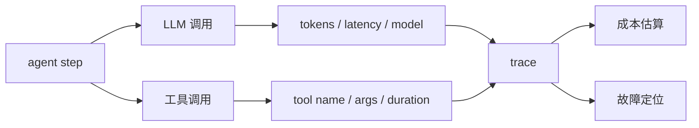
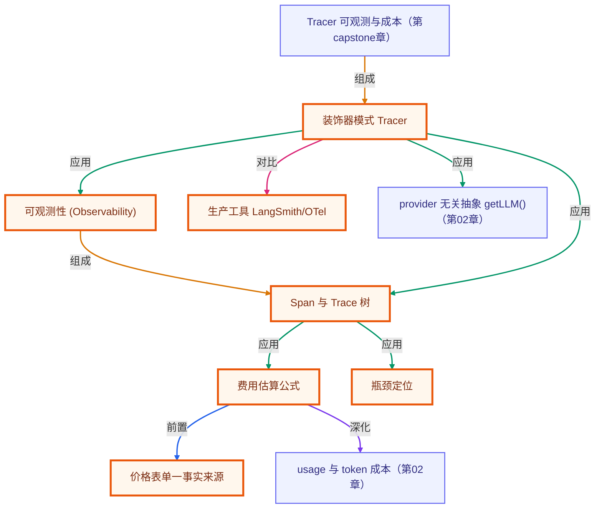

# 第 16 章 · 可观测性与成本

> 所属阶段：**第六部分 · 生产化**
> 预计用时：40 分钟 | 难度：⭐⭐☆☆☆
> 全局导航：[课程导航](../../docs/navigation.md) · [完整大纲](../../docs/curriculum.md) · [知识图谱](../../docs/knowledge-graph.md)

## 学习目标

学完本章你能够：

- [ ] 理解为什么生产 agent **必须可观测**：一次任务会展开成多步、多次调用，出问题只看结果无法定位。
- [ ] 用「装饰器模式」写一个轻量 **Tracer**，透明包住 `LLMClient`，记录每次调用的 model / tokens / 耗时。
- [ ] 掌握费用核算公式：**成本 = tokens × 单价**，并用一张价格表把估算逻辑收敛到一处。
- [ ] 读懂一棵 **trace 树**，从中定位"哪一步最慢、哪一步最贵"。
- [ ] 知道生产里这套东西对应的成熟工具：**LangSmith / OpenTelemetry**。

## 前置知识

- 已读 [第 04 章 · Agent 循环](../04-the-agent-loop/README.md)：本章追踪的就是这个循环里的每次调用。
- 已读 [第 15 章 · 评估与测试](../15-evaluation-and-testing/README.md)：评估关心"对不对"，本章关心"快不快、贵不贵"。
- 熟悉 `runAgent`（[`loop.ts`](../../src/shared/agent/loop.ts)）与 `getLLM`（[`types.ts`](../../src/shared/llm/types.ts)）。

## 三层学习路线

| 层级 | 学习目标 | 你要完成什么 |
|------|----------|--------------|
| 极简 | 为一次 agent 运行记录 trace 和 token 成本。 | 能看出每一步用了哪个模型、多少 token、耗时多久。 |
| 进阶 | 理解 spans、latency、cost、error rate 如何定位问题。 | 用 trace 判断瓶颈来自模型、工具、检索、网络还是重试。 |
| 真实实践 | 搭建生产可观测和预算治理思路。 | 设计 dashboard、告警、用户级成本归因和每日预算上限。 |

---

## 图解学习地图

> 读图顺序：先看本章主线,再回到代码走读。核心焦点：**给每次模型和工具调用装上仪表盘**。



### 原理展开

- 可观测性要贴近边界: 每次外部模型调用、工具调用、检索调用都应该记录输入规模、耗时、结果状态和成本相关信息。
- 成本不是月底账单才看。token、模型单价、调用次数、重试次数都能在请求级估算,这能指导 prompt 压缩和模型分层。
- 日志要保护隐私和密钥。能记录元数据就不要记录完整敏感输入; 需要排障样本时要脱敏和限权。

### 本章和整条路径的关系

本章让 agent 从 demo 变成可运营系统。capstone 里的成本统计就是这套思想的产品化示例。

---

## 一、原理：可观测性 = 在每次外部调用的进出两端打点

抛开花哨概念，一次 agent 任务在底层就是一棵**调用树**：

```
任务：查北京天气并换算华氏度
 │
 ├─ LLM 调用 #1  → 模型决定调用 get_weather        (tokens / 耗时 / $)
 │     └─ 工具 get_weather → {city:北京, 24℃}
 │
 ├─ LLM 调用 #2  → 模型决定调用 celsius_to_fahrenheit (tokens / 耗时 / $)
 │     └─ 工具 celsius_to_fahrenheit → 75.2℉
 │
 └─ LLM 调用 #3  → 模型给出最终答案                  (tokens / 耗时 / $)
```

一个用户请求 → 展开成 **3 次 LLM 调用 + 2 次工具执行**。如果整体"慢"或"贵"，
你必须能回答：是哪一步？是 LLM 慢还是工具慢？是某次输出 token 爆了还是步数太多？
**只看最终答案，这些一概看不出来。** 这就是可观测性存在的理由。

### 该记录什么？

每次 LLM 调用至少记录这几项（一条 **span**）：

| 字段 | 为什么要 |
|------|----------|
| `model` | 不同模型单价差几十倍，计费、对比都要它 |
| `inputTokens` / `outputTokens` | 费用与上下文膨胀的直接信号 |
| `durationMs` | 用 `performance.now()` 测墙钟耗时，定位"慢" |
| `stopReason` | `tool_use` 说明这步在调工具，`stop` 说明出最终答案 |

### 费用怎么算？

公式朴素到不需要解释：

```
费用 = 输入tokens × 输入单价 + 输出tokens × 输出单价
```

唯一的工程问题是**单价从哪来**。答案是：维护一张价格表（按"每百万 tokens"计），
拿 `llm.model` 去查表。把它收敛成常量、只有一个事实来源，官方调价时只改一处。

> ⚠️ 价格随时间变化，且分输入/输出/缓存等多档。课程里的价格是**示意值**，
> 真实计费请以 [Anthropic](https://www.anthropic.com/pricing) / [OpenAI](https://openai.com/api/pricing) 官方价格页为准。

### 怎么做到"零侵入"？——装饰器模式

我们不想为了加监控去改 `runAgent` 一行代码。办法是用**装饰器模式**包住客户端：

```
runAgent  →  Tracer 包装的 client  →  真实 client
            (chat 前后打点)         (照常请求厂商)
```

对外仍是同一个 `LLMClient` 接口，`runAgent` 根本不知道自己被监控了。
生产里 LangSmith / OpenTelemetry 干的也是这件事——只是把 span **上报**到后台看板，
原理与本章一模一样。

---

## 二、代码走读

本章拆成三个文件，职责单一：

| 文件 | 职责 |
|------|------|
| [`pricing.ts`](./pricing.ts) | 价格表常量 + `estimateCost()` 费用估算 |
| [`tracer.ts`](./tracer.ts) | `Tracer`：包住 client、收集 span、产出汇总 |
| [`index.ts`](./index.ts) | 跑多步 agent，打印 trace 树 + 汇总指标 |

### 1) 价格表与费用估算（`pricing.ts`）

```ts
export const PRICE_TABLE: Readonly<Record<string, ModelPrice>> = {
  "claude-opus-4-8": { inputPerMillion: 15, outputPerMillion: 75 },
  "gpt-4o": { inputPerMillion: 2.5, outputPerMillion: 10 },
  // ...
};

export function estimateCost(model: string, inputTokens: number, outputTokens: number): number {
  const price = getPrice(model); // 未知模型回退到 FALLBACK_PRICE，宁可不准也不能不算
  return (inputTokens / 1_000_000) * price.inputPerMillion
       + (outputTokens / 1_000_000) * price.outputPerMillion;
}
```

> 单价是"每百万 token"，所以记得先 `/ 1_000_000`。未知模型不抛错、退化到兜底价，
> 是因为线上随时会上新模型，**计费链路不能因此崩溃**。

### 2) Tracer：透明地包住 client（`tracer.ts`）

核心就是在 `chat()` 前后用 `performance.now()` 打点，记一条 span：

```ts
client(): LLMClient {
  const self = this;
  return {
    provider: this.inner.provider,
    model: this.inner.model,
    async chat(options) {
      const startedAt = performance.now();           // 高精度单调时钟
      const result = await self.inner.chat(options);  // 透传给真实 client
      const durationMs = performance.now() - startedAt;
      self.spans.push({
        index: self.spans.length + 1,
        model: self.inner.model,
        inputTokens: result.usage.inputTokens,
        outputTokens: result.usage.outputTokens,
        durationMs,
        costUSD: estimateCost(self.inner.model, result.usage.inputTokens, result.usage.outputTokens),
        stopReason: result.stopReason,
      });
      return result;
    },
    stream(options) { return self.inner.stream(options); }, // 本章不计费，原样透传
  };
}
```

> 为什么用 `performance.now()` 而不是 `Date.now()`？前者是**单调时钟**，不受系统时间
> 回拨（如 NTP 校时）影响，专门用来测耗时；后者用来取"当前时间点"。

### 3) 串起来：跑多步 agent 并汇总（`index.ts`）

关键只有一行——把 `tracer.client()` 传给 `runAgent`，其余照旧：

```ts
const tracer = new Tracer(getLLM());
const run = await runAgent({
  client: tracer.client(),   // ← 唯一的改动：换成被追踪的客户端
  registry,
  messages: [{ role: "user", content: "北京现在多少度？换算成华氏度并简述天气。" }],
});

const summary = tracer.summary();
// 打印 trace 树、总 tokens、总费用、各步耗时，并定位最慢/最贵的一步
```

结束后我们用 `reduce` 找出**最慢的一步**和**最贵的一步**——这就是可观测性最直接的回报。

---

## 三、运行

```bash
# 默认厂商（.env 里的 LLM_PROVIDER）
npx tsx lessons/16-observability-and-cost/index.ts
```

想看每一步工具的实时输出，打开 `DEBUG`（`logger.debug` 受它控制）：

```bash
# PowerShell:
$env:DEBUG="1"; npx tsx lessons/16-observability-and-cost/index.ts
# macOS / Linux:
DEBUG=1 npx tsx lessons/16-observability-and-cost/index.ts
```

切到 OpenAI 厂商对比 token 用量与费用：

```bash
# PowerShell:
$env:LLM_PROVIDER="openai"; npx tsx lessons/16-observability-and-cost/index.ts
# macOS / Linux:
LLM_PROVIDER=openai npx tsx lessons/16-observability-and-cost/index.ts
```

预期输出：一段最终答案、一棵 trace 树（每次 LLM 调用一个节点）、一份汇总指标
（调用次数 / 总输入输出 tokens / 总耗时 / 估算费用），以及最慢/最贵步骤的定位。

---

## 四、练习

1. **补全价格表**：给 `PRICE_TABLE` 加一个你常用的模型（去官方价格页抄真实单价），
   再用 `ANTHROPIC_MODEL` / `OPENAI_MODEL` 环境变量切到它，观察费用变化。
2. **追踪工具耗时**：目前只追踪了 LLM 调用。仿照 Tracer，给工具执行也打点
   （在 `registry.run` 外面包一层计时），让 trace 树把工具节点的耗时也显示出来。
3. **导出为 JSON**：给 `Tracer` 加一个 `toJSON()`，把 `summary()` 序列化成一行 JSON
   写到文件——这正是上报给 LangSmith / OpenTelemetry 前的数据形态。
4. **设预算护栏**：在 `onStep` 里累加费用，一旦超过设定的预算阈值（如 $0.01）就
   提前中止任务（提示：抛错或把 `maxSteps` 收紧）。这是生产里防"失控烧钱"的常见手段。
5. **进阶**：对比同一任务在 `claude-opus-4-8` 与 `gpt-4o` 下的"费用 / 步数 / 耗时"，
   写一句话结论：什么任务值得用贵模型、什么任务用便宜模型即可。

---

<!-- KG:START (由 npm run kg 自动生成，勿手改本标记区) -->

## 知识图谱与延伸阅读

> 本节由 `npm run kg` 自动生成（数据源 `knowledge-graph/data/graph.ts`）。要增删请改数据源后重跑。

### 本章概念图谱

> 节点：**橙框**=本章概念，蓝框=关联的其他章概念。连线按关系类型着色：前置(蓝) · 深化(紫) · 对比(玫红) · 应用(绿) · 组成(橙)。



### 与其他章节的关系

- `费用估算公式` —**深化**→ `usage 与 token 成本`（第 02 章）
- `装饰器模式 Tracer` —**应用**→ `provider 无关抽象 getLLM()`（第 02 章）
- `Tracer 可观测与成本` —**组成**→ `装饰器模式 Tracer`（第 capstone 章）

### 延伸阅读

- [Anthropic Pricing](https://www.anthropic.com/pricing) — Anthropic 官方价格页，价格表单价的权威来源 `doc`
- [OpenAI API Pricing](https://openai.com/api/pricing) — OpenAI 官方价格页，对比厂商单价用 `doc`

> 🗺️ 在[全局知识图谱](../../docs/knowledge-graph.md) / [交互式图谱](../../knowledge-graph/output/index.html) 中查看本章位置。

<!-- KG:END -->

## 五、小结与延伸

- 可观测性 = 在每次外部调用的进出两端打点，把一次任务还原成可复盘的 trace 树。
- 用装饰器模式包住 `LLMClient`，监控对业务逻辑**零侵入**。
- 成本 = tokens × 单价，价格表收敛成单一事实来源，未知模型用兜底价兜住。
- 生产里把 span 上报到 **LangSmith / OpenTelemetry**，本章的原理就是它们的内核。
- 上一章 [第 15 章 · 评估与测试](../15-evaluation-and-testing/README.md) 关心"对不对"；
  下一章 [第 17 章 · 安全与护栏](../17-safety-and-guardrails/README.md) 学习如何给 agent 上"安全带"。

> 💡 **面试会问**：一次 agent 任务很慢/很贵，你怎么定位瓶颈？token 费用怎么算？为什么测耗时要用 `performance.now()` 而不是 `Date.now()`？
