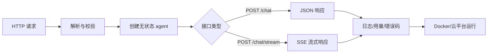
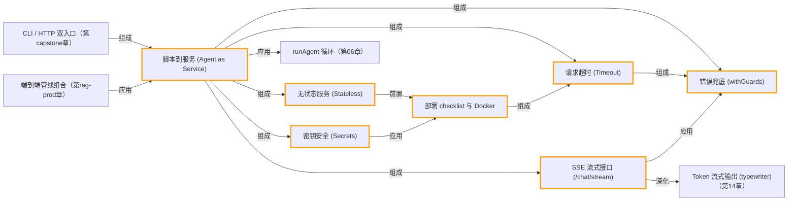

# 第 18 章 · 部署：把 Agent 变成服务

> 所属阶段：**第六部分 · 生产化**
> 预计用时：50 分钟 | 难度：⭐⭐⭐☆☆
> 全局导航：[课程导航](../../docs/navigation.md) · [完整大纲](../../docs/curriculum.md) · [知识图谱](../../docs/knowledge-graph.md)

## 学习目标

学完本章你能够：

- [ ] 用 Node 内置的 `node:http` 把一个 agent 包成 **HTTP API**（无需任何 web 框架）。
- [ ] 实现 **`POST /chat`**（一次性返回 JSON）与 **`POST /chat/stream`**（SSE 流式逐字推送）。
- [ ] 说清服务化的四条生命线：**无状态、超时、错误兜底、密钥安全**。
- [ ] 写出一个**最小前端**（HTML + `fetch`/`EventSource`）消费流式接口。
- [ ] 用 **Dockerfile** 打包，并照一份**上线前 checklist** 自查。

## 前置知识

- 已读 [第 14 章 · 流式输出与交互体验](../14-streaming-and-ux/README.md)，理解"流式优化的是体感、取消是协作式的"。
- 了解 `runAgent` 的用法（见 [`src/shared/agent/loop.ts`](../../src/shared/agent/loop.ts)）。
- 已读 [第 17 章 · 安全与护栏](../17-safety-and-guardrails/README.md)（服务化把"输入即攻击面"放大了）。

## 三层学习路线

| 层级 | 学习目标 | 你要完成什么 |
|------|----------|--------------|
| 极简 | 把 agent 包成一个 HTTP `/chat` 服务。 | 能通过请求触发 agent,拿到正常响应和错误响应。 |
| 进阶 | 理解服务化后的超时、并发、无状态和流式输出。 | 说明为什么要有 health check、request id、SSE、rate limit、secret 管理。 |
| 真实实践 | 把课程 agent 推向可上线服务。 | 写出部署 checklist: 环境变量、日志、监控、回滚、预算、权限和故障预案。 |

---

## 图解学习地图

> 读图顺序：先看本章主线,再回到代码走读。核心焦点：**把脚本式 agent 包装成可运维服务**。



### 原理展开

- 服务化的第一原则是无状态。请求需要的上下文要由客户端或外部存储提供,不要依赖单个 Node 进程内存。
- 生产 API 必须有超时、大小限制、错误码和密钥隔离。脚本里可以简单 throw,服务里要给调用方稳定契约。
- 部署不是最后一步复制命令,而是把运行假设显式化: Node 版本、PORT、环境变量、健康检查、日志、成本和回滚路径。

### 本章和整条路径的关系

本章把前 17 章能力交付成服务边界。到这里,学习者已经具备从 demo 到可演示产品的完整链路。

---

## 一、原理：从脚本到服务

前 17 章我们写的都是"跑一次就退出"的脚本：你 `npx tsx` 它，它打印结果，结束。但真实产品里，agent 要常驻、等别人来调它。这就是**服务**：

```
脚本（前 17 章）            服务（本章）
┌──────────────┐          ┌────────────────────────────┐
│ tsx index.ts │          │  常驻进程，监听端口          │
│   → 跑一次     │          │  ┌── POST /chat ──────────┐ │
│   → 退出       │   ⇒      │  │ 收 {message} → 跑 agent │ │
└──────────────┘          │  │ → 回 JSON               │ │
                          │  ├── POST /chat/stream ───┤ │
   一次性、单用户            │  │ SSE 逐 token 推给前端    │ │
                          │  └─────────────────────────┘ │
                          │  常驻、并发、多用户            │
                          └────────────────────────────┘
```

服务化会立刻逼你回答四个脚本时代可以忽略的问题——这四条是**生产服务的生命线**：

### 1）无状态（Stateless）

> 服务器**不要**在内存里偷偷记住"某个用户的对话历史"。

为什么？因为生产环境往往跑**多个实例**（水平扩展）。请求 A 落到实例 1、请求 B 可能落到实例 2，内存里的会话根本对不上。正确做法是：

```
有状态（错）：服务器内存 = { user42: [历史消息...] }   ← 多实例下必崩
无状态（对）：每个请求自带它需要的全部上下文           ← 任意实例都能处理
            （要持久化历史？放 Redis/DB 这类外部存储，不放进程内存）
```

本章 `/chat` 每次都**新建** registry、**只用**本次请求带来的 `message`，不读任何进程内会话——这就是无状态。短期记忆（[第 07 章](../07-short-term-memory/README.md)）要保留时，让**客户端**把历史一起传上来，或存进外部数据库。

### 2）超时（Timeout）

LLM 调用慢、还可能卡住。"无限等待"是事故之源：慢请求会一直占着连接和内存，最终拖垮服务。所以每个请求都要有**上限**，到点就放弃并返回错误。

### 3）并发与限流（Concurrency / Rate-limit）

Node 是单线程事件循环，处理 I/O 等待（如等模型回包）时不阻塞，天然能并发处理很多连接。但要防住两类滥用：**超大请求体**（撑爆内存）和**高频刷接口**（烧光你的 API 额度）。本章演示最基础的一招——**限制请求体大小**；真实限流见练习。

### 4）密钥安全（Secrets）

`ANTHROPIC_API_KEY` 这种东西**只能**从环境变量读，**绝不能**：写进代码、回进响应、打进日志。本章服务从头到尾不碰 key（`getLLM()` 内部读 env），响应里只回答案和用量。

### 部署平台选型（一句话版）

| 平台 | 适合 | 注意 |
|------|------|------|
| **Vercel** | 前端 + 轻量 API | Serverless 函数有执行时长上限，长流式/长 agent 易被掐 |
| **Render** | 常驻 Node 服务 | 配置简单，适合本章这种长连接 SSE |
| **Fly.io** | 全球边缘部署、容器 | 给容器，控制力强 |
| **Docker（自托管）** | 任意云/自有机器 | 最通用，本章给 Dockerfile |

共同点：它们都通过 **`PORT` 环境变量**告诉你该监听哪个端口——所以**端口必须从 env 读**，别写死。

---

## 二、代码走读

完整代码见 [`index.ts`](./index.ts)（服务）与 [`tools.ts`](./tools.ts)（示例工具）。

### 1）配置全部来自环境变量

```ts
const PORT = Number(getEnv("PORT", "3000"));              // 平台用 PORT 指定端口
const REQUEST_TIMEOUT_MS = Number(getEnv("REQUEST_TIMEOUT_MS", "30000"));
const MAX_BODY_BYTES = Number(getEnv("MAX_BODY_BYTES", "10000")); // 最简防护
```

> 三个旋钮都给了默认值——本地零配置即可跑，上线时用 env 覆盖。

### 2）安全读 body：边收边限制大小

`node:http` 默认**不限制**请求体大小，恶意/异常的超大 body 会吃光内存。所以我们边收边累计字节，超限立刻拒绝：

```ts
req.on("data", (chunk: Buffer) => {
  total += chunk.length;
  if (total > MAX_BODY_BYTES) {
    reject(new Error(`请求体过大（上限 ${MAX_BODY_BYTES} 字节）。`));
    req.destroy();
    return;
  }
  chunks.push(chunk);
});
```

拿到 body 后还要**显式校验** `message` 字段（外部输入一律不可信）：缺字段或类型不对，就抛清晰错误，而不是让后面崩。

### 3）`POST /chat`：跑完整 agent，一次性回 JSON

```ts
const llm = getLLM();
const registry = buildRegistry();          // 每个请求新建，无共享可变状态 → 无状态
const { finalText, steps, usage } = await runAgent({
  client: llm,
  registry,
  system: SYSTEM_PROMPT,
  messages: [{ role: "user", content: message }], // 只用本次请求的输入
});
sendJson(res, 200, { reply: finalText, steps: steps.length, usage });
```

> 响应里只回**答案 + 步数 + token 用量**。不回 key、不回堆栈——这既是安全也是好品味。

### 4）`POST /chat/stream`：SSE 逐 token 推送

SSE（Server-Sent Events）是浏览器原生支持的**服务器→客户端单向流**，报文格式极简：每条事件以 `data: <内容>\n\n` 结尾。关键在三个响应头：

```ts
res.writeHead(200, {
  "Content-Type": "text/event-stream; charset=utf-8", // 告诉浏览器这是 SSE
  "Cache-Control": "no-cache",                        // 别缓存，要实时
  Connection: "keep-alive",                           // 长连接
  "Access-Control-Allow-Origin": "*",
});
```

然后把 `llm.stream()` 的每个 token 包成一个 SSE 事件推出去：

```ts
for await (const chunk of stream) {
  if (clientGone) break;                               // 客户端断了就停（消费侧取消）
  if (chunk.type === "text" && chunk.text) {
    res.write(`data: ${JSON.stringify({ type: "token", text: chunk.text })}\n\n`);
  }
  if (chunk.type === "done" && chunk.result) {
    res.write(`data: ${JSON.stringify({ type: "done", usage: chunk.result.usage })}\n\n`);
  }
}
res.write("event: end\ndata: {}\n\n");                 // 结束哨兵，前端读到就关连接
res.end();
```

> 这里用 `llm.stream()` 而非 `runAgent`：要做聊天产品那种**逐字蹦出**的体感，最直接的是流单轮对话的 token。想把多步工具的**进度**也推给前端？见练习 3。
>
> `req.on("close", ...)` 监听客户端断开——用户关页面/点"停止"时，我们 `break` 出循环、不再向生成器要数据。这正是 [第 14 章](../14-streaming-and-ux/README.md) 讲的**消费侧取消**。

### 5）超时 + 错误兜底：一个统一外壳

每个业务端点都套上同一层 `withGuards`：用 `Promise.race` 让 handler 和"定时器拒绝"赛跑（请求级超时），并把任何异常转成结构化错误——**进程绝不因单个请求崩溃**：

```ts
async function withGuards(res, handler) {
  let timer;
  const timeout = new Promise((_, reject) => {
    timer = setTimeout(() => reject(new Error(`请求处理超时（上限 ${REQUEST_TIMEOUT_MS}ms）。`)), REQUEST_TIMEOUT_MS);
  });
  try {
    await Promise.race([handler(), timeout]);
  } catch (err) {
    const message = (err as Error).message;
    logger.error(`请求处理失败：${message}`);
    if (!res.headersSent) sendJson(res, 500, { error: message }); // 还没发头 → 回标准 500
    else { writeSseEvent(res, { type: "error", message }); res.end(); } // 流式途中 → 尽量收尾
  } finally {
    if (timer) clearTimeout(timer);                                // 永远清理定时器
  }
}
```

> 注意 `headersSent` 的分叉：一旦开始流式（头已发），就不能再改状态码了，只能在流里补一个 error 事件再收尾。

### 6）优雅退出

容器滚动更新时会发 `SIGTERM`。我们停止接收新连接、让在途请求跑完再退出——避免"正在回答的用户被硬切断"：

```ts
process.on("SIGTERM", () => server.close(() => process.exit(0)));
```

---

## 三、运行

### 启动服务

```bash
npx tsx lessons/18-deployment/index.ts
# 看到 "Agent 服务已启动：http://localhost:3000" 即成功
```

临时改端口（仅本次运行）:

```powershell
# PowerShell
$env:PORT="8080"; npx tsx lessons/18-deployment/index.ts
```

```bash
# macOS / Linux
PORT=8080 npx tsx lessons/18-deployment/index.ts
```

### 用 curl 测试（另开一个终端）

```bash
# 健康检查
curl http://localhost:3000/health

# 一次性对话（会触发 calculator 工具）
curl -X POST http://localhost:3000/chat \
  -H "Content-Type: application/json" \
  -d '{"message":"帮我算一下 (3 + 4) * 25 等于多少？"}'

# 流式对话（-N 关闭缓冲，才能看到 token 实时蹦出）
curl -N -X POST http://localhost:3000/chat/stream \
  -H "Content-Type: application/json" \
  -d '{"message":"用三句话介绍一下 SSE 是什么。"}'
```

PowerShell 用户可用 `curl.exe`（注意是 `curl.exe`，避免被 `Invoke-WebRequest` 别名拦截）:

```powershell
curl.exe -X POST http://localhost:3000/chat -H "Content-Type: application/json" -d '{\"message\":\"算一下 12 * 12\"}'
```

### 最小 HTML 客户端（流式）

把下面这段存成 `client.html`，双击用浏览器打开，即可看到逐字蹦出的回答。它用 `fetch` 发 POST、再手动解析 SSE（因为浏览器原生 `EventSource` 只支持 GET）:

```html
<!doctype html>
<meta charset="utf-8" />
<input id="q" value="用一句话解释什么是无状态服务" style="width:320px" />
<button id="go">发送</button>
<pre id="out"></pre>
<script>
  const out = document.getElementById("out");
  document.getElementById("go").onclick = async () => {
    out.textContent = "";
    const res = await fetch("http://localhost:3000/chat/stream", {
      method: "POST",
      headers: { "Content-Type": "application/json" },
      body: JSON.stringify({ message: document.getElementById("q").value }),
    });
    const reader = res.body.getReader();
    const decoder = new TextDecoder();
    let buffer = "";
    while (true) {
      const { value, done } = await reader.read();
      if (done) break;
      buffer += decoder.decode(value, { stream: true });
      // SSE 事件以空行分隔；逐条解析 data: 行
      const parts = buffer.split("\n\n");
      buffer = parts.pop() ?? "";
      for (const part of parts) {
        const line = part.split("\n").find((l) => l.startsWith("data: "));
        if (!line) continue;
        const evt = JSON.parse(line.slice("data: ".length));
        if (evt.type === "token") out.textContent += evt.text;
      }
    }
  };
</script>
```

预期：`/chat` 返回带 `reply` 的 JSON；`/chat/stream` 与 HTML 客户端里能看到回答**逐字出现**。

### Dockerfile 片段

```dockerfile
# 多阶段构建：用官方 Node 镜像，pnpm 装依赖后直接用 tsx 跑（课程项目无构建产物）
FROM node:20-slim
WORKDIR /app

# 先拷依赖清单再装——利用层缓存，源码改动不会让依赖重装
COPY package.json pnpm-lock.yaml ./
RUN corepack enable && pnpm install --frozen-lockfile

# 再拷源码
COPY . .

# 平台会注入 PORT；这里只是声明默认值，别把 key 写进镜像！
ENV PORT=3000
EXPOSE 3000

# 用 tsx 直接运行入口（生产可改为先 tsc 编译再 node 运行）
CMD ["npx", "tsx", "lessons/18-deployment/index.ts"]
```

> 构建运行（key 通过 `-e` 注入，**不**烤进镜像）:
> ```bash
> docker build -t my-agent .
> docker run -p 3000:3000 -e ANTHROPIC_API_KEY=sk-ant-xxx -e LLM_PROVIDER=anthropic my-agent
> ```

### 上线前 checklist

- [ ] **端口**从 `PORT` 读，没写死。
- [ ] **密钥**只来自环境变量；代码/日志/响应里都搜不到 key。
- [ ] **超时**：每个请求有上限，慢请求不会无限占用。
- [ ] **请求体上限**：拒绝超大 body（防内存爆）。
- [ ] **错误兜底**：任何异常都回结构化错误，不泄露堆栈，进程不崩。
- [ ] **无状态**：服务器内存里没有"按用户"的会话；要持久化就用外部存储。
- [ ] **健康检查**：`/health` 可探活（平台/负载均衡需要）。
- [ ] **优雅退出**：处理 `SIGTERM`，让在途请求跑完。
- [ ] **CORS**：按需收紧 `Access-Control-Allow-Origin`（演示里用 `*`，生产应限定域名）。
- [ ] **限流**：对公网接口加速率限制（按 IP/按 key），保护你的 API 额度。
- [ ] **日志**：记录请求耗时、状态、token 用量，但**脱敏**（别记完整 prompt 里的隐私）。

---

## 四、练习

1. **加一个工具**：在 [`tools.ts`](./tools.ts) 里新增一个 `current_time` 工具（返回服务器时间），重启后用 `/chat` 问"现在几点？"验证 agent 会调用它。
2. **真正的多轮**：给 `/chat` 增加可选的 `history` 字段（消息数组），让客户端把历史一起传上来，服务端拼进 `messages`——亲手实现"无状态下的多轮对话"。
3. **流式进度事件**：在 `/chat/stream` 里改用 `runAgent` 的 `onStep` 回调，把每一步"调了哪个工具、结果是什么"也推成 SSE 事件（`type: "step"`），前端就能显示 agent 的思考进度。
4. **简单限流**：用一个 `Map<ip, 时间戳[]>` 实现"每 IP 每分钟最多 N 次"，超限回 `429 Too Many Requests`。思考：为什么这种内存限流在**多实例**下不靠谱？（提示：和"无状态"同一个坑）
5. **进阶 · 容器化跑起来**：照上面的 Dockerfile 把服务打成镜像并 `docker run`，用 curl 打通；再故意**不传** `ANTHROPIC_API_KEY`，观察 `requireEnv` 的快速失败错误是否清晰。

---

<!-- KG:START (由 npm run kg 自动生成，勿手改本标记区) -->

## 知识图谱与延伸阅读

> 本节由 `npm run kg` 自动生成（数据源 `knowledge-graph/data/graph.ts`）。要增删请改数据源后重跑。

### 本章概念图谱



### 与其他章节的关系

- `SSE 流式接口 (/chat/stream)` —**深化**→ `Token 流式输出 (typewriter)`（第 14 章）
- `脚本到服务 (Agent as Service)` —**应用**→ `runAgent 循环`（第 06 章）
- `CLI / HTTP 双入口` —**组成**→ `脚本到服务 (Agent as Service)`（第 capstone 章）
- `端到端管线组合` —**应用**→ `脚本到服务 (Agent as Service)`（第 rag-prod 章）

### 延伸阅读

- [Server-sent events - MDN Web Docs](https://developer.mozilla.org/en-US/docs/Web/API/Server-sent_events) — SSE 与 EventSource 的官方权威说明，对应本章 /chat/stream `doc`
- [Node.js HTTP module documentation](https://nodejs.org/api/http.html) — node:http 内置模块文档，本章无框架起服务的基础 `doc`

> 🗺️ 在[全局知识图谱](../../docs/knowledge-graph.md) / [交互式图谱](../../knowledge-graph/output/index.html) 中查看本章位置。

<!-- KG:END -->

## 五、小结与延伸

- 服务化 = 把"跑一次就退出的脚本"变成"常驻、并发、多用户"的进程。
- 四条生命线：**无状态**（会话别放进程内存）、**超时**（慢请求要有上限）、**错误兜底**（异常转结构化响应、进程不崩）、**密钥安全**（只从 env 读、永不外泄）。
- SSE 是把 token 流给浏览器的最轻方案；客户端断开要做**消费侧取消**。
- 端口从 env 读、加健康检查、处理 `SIGTERM`——这些细节决定了你的服务能不能被平台正确托管。
- 上一章 [第 17 章 · 安全与护栏](../17-safety-and-guardrails/README.md)；下一章 [第 19 章 · Agent 前沿发展与生态拆解](../19-agent-ecosystem-and-frontier/README.md) 会把前面学到的零件放回真实生态里，再去 [毕业项目 · Deep Research Agent](../../capstone/deep-research-agent/README.md) 拼成完整作品。

> 💡 **面试会问**：为什么 web 服务要"无状态"？多实例水平扩展时把会话放内存会出什么问题？SSE 和 WebSocket 有什么区别、各自适合什么场景？请求超时该怎么做，做不好会怎样？API key 这类 secret 该怎么管理？
