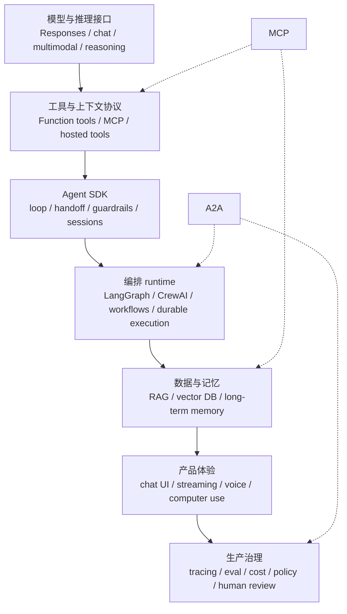
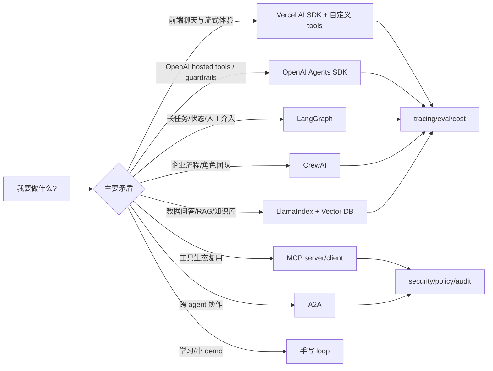
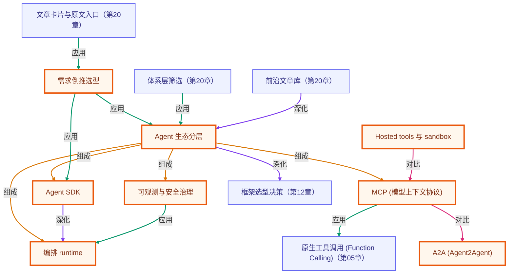

# 第 19 章 · Agent 前沿发展与生态拆解

> 所属阶段：**第七部分 · 前沿与生态**
> 预计用时：70 分钟 | 难度：⭐⭐⭐☆☆
> 资料时间：截至 2026-06-03，基于官方文档与公告整理；生态变化很快，选型前请复核官方链接。
> 全局导航：[课程导航](../../docs/navigation.md) · [完整大纲](../../docs/curriculum.md) · [知识图谱](../../docs/knowledge-graph.md)

## 学习目标

学完本章你能够：

- [ ] 说清 2025–2026 年 agent 发展的主线：从手写 loop 走向 **模型原生工具、标准协议、可观测 runtime、企业治理**。
- [ ] 区分 **模型 API / Agent SDK / 编排 runtime / 工具协议 / 数据层 / UI 层 / 评估治理** 这些生态层。
- [ ] 解释 **MCP** 和 **A2A** 分别解决什么问题：一个偏“agent 连工具/数据”，一个偏“agent 连 agent”。
- [ ] 用一张选型矩阵判断：什么时候该用 Vercel AI SDK、OpenAI Agents SDK、LangGraph、CrewAI、LlamaIndex，什么时候继续手写。
- [ ] 形成“先手写原理，再选生态部件”的判断力，不被框架名词带跑。

## 前置知识

- 已读 [第 04 章 · Agent 循环](../04-the-agent-loop/README.md)，理解 agent loop。
- 已读 [第 06 章 · 工具系统](../06-building-a-tool-system/README.md)，理解 schema、tool registry、运行期校验。
- 已读 [第 09 章 · RAG](../09-rag-from-scratch/README.md)、[第 12 章 · 框架入门](../12-intro-to-frameworks/README.md)、[第 16 章 · 可观测性](../16-observability-and-cost/README.md)。

## 三层学习路线

| 层级 | 学习目标 | 你要完成什么 |
|------|----------|--------------|
| 极简 | 把 agent 生态拆成清晰层级。 | 能区分模型接口、工具协议、Agent SDK、编排 runtime、RAG、UI、观测和安全治理。 |
| 进阶 | 理解 MCP、A2A、SDK、runtime 的边界。 | 解释 MCP 连接工具和数据,A2A 连接 agent,框架负责控制流和持久化。 |
| 真实实践 | 为真实项目做生态选型和迁移路线。 | 根据一个产品需求选择手写、Vercel AI SDK、OpenAI Agents SDK、LangGraph、CrewAI 或 LlamaIndex,并说明取舍。 |

---

## 图解学习地图

> 读图顺序：先从底层模型能力往上看，再从产品需求往下选型。核心焦点：**把 agent 生态拆成可替换的工程层**。



### 原理展开

- 当前 agent 生态的核心变化，不是“又多了一个框架”，而是**分层开始标准化**：模型平台提供 hosted tools，MCP 统一工具/数据接入，A2A 尝试统一 agent 间通信，编排 runtime 负责持久化和人类介入。
- 真正生产化的 agent 不只是 `while + tool call`。它需要会恢复、会被观察、能被评估、能限权、能让人插手，还要能和外部工具、内部数据库、其他 agent 协作。
- 生态选型要从约束出发：你要的是前端流式体验、长任务恢复、企业自动化、多 agent 分工、数据问答，还是 hosted tool / computer use。不同目标对应不同栈。

### 本章和整条路径的关系

前 18 章教你从零造出 agent 的每个零件；本章教你看懂真实生态里这些零件被谁封装、谁标准化、谁负责上线风险。学完后你能更冷静地选框架，而不是被“agent 平台”四个字带着走。

---

## 一、最新发展主线：agent 从 demo 走向平台化

截至 2026-06-03，可以把 agent 发展看成 5 条并行主线。

### 1. 模型 API 变成“agent 原生接口”

早期做 agent，开发者要自己管理：

- 多轮上下文；
- 工具调用 schema；
- 工具调用结果回填；
- 流式事件；
- 文件检索、网页搜索、代码执行、电脑操作等外部能力。

现在模型平台正在把这些能力下沉。以 OpenAI 为例，Responses API 已经把文本/图像输入、状态化交互、file search、web search、computer use、function calling 等放进同一个接口族；Agents SDK 又在其上提供 agent、handoff、guardrails、sessions、tracing 等抽象。

这意味着一个趋势：

```text
过去：开发者写完整 loop，模型只负责下一步文本/工具调用
现在：平台提供更多 loop 基础设施，开发者更多负责业务边界、工具权限、评估与治理
```

这不是说手写 loop 过时了。恰好相反：**只有理解手写 loop，才知道平台帮你隐藏了什么，以及什么时候不能交给平台。**

### 2. 工具接入走向 MCP 标准化

MCP（Model Context Protocol）可以理解成“AI 应用的 USB-C”。它试图标准化 AI 应用如何连接外部数据、工具、工作流。

在课程前面，我们自己写了：

```text
ToolSpec + ToolRegistry + zod schema + run(input)
```

MCP 把这件事扩展成跨应用协议：

```text
MCP Client（Claude / ChatGPT / IDE / 自己的 agent）
    ↕
MCP Server（文件、数据库、Figma、GitHub、内部系统）
    ↕
真实工具 / 数据源 / prompt / resource
```

它解决的是：**每个 agent 不要为每个外部系统单独写一套连接器**。但它也带来新的安全问题：工具权限、prompt injection、数据外泄、恶意/仿冒工具、供应链风险，都必须进入设计。

### 3. Agent 间通信开始出现 A2A

MCP 解决“agent 连工具/数据”，A2A（Agent2Agent）解决“agent 连 agent”。

A2A 的核心不是让一个进程里两个函数互相调用，而是让**不同厂商、不同框架、不同组织**的 agent 能互相发现能力、协作任务、交换文本/文件/结构化数据。

一个简化心智模型：

```text
Agent Card：我是谁、会什么、端点在哪、怎么认证
Task / Message：你要我做什么
Artifact：我交付了什么文件或结构化结果
Status：任务在 queued / running / completed / failed 哪一步
```

当 agent 进入企业系统，跨团队、跨供应商、跨工具链协作会越来越重要。A2A 的价值在于减少“每两个 agent 都定一个私有协议”的混乱。

### 4. 编排 runtime 关注“长任务、状态、人类介入”

手写 loop 适合学习和小项目；一旦进入生产，会遇到：

- 任务跑 10 分钟，中途进程挂了怎么办？
- 人类要在第 3 步批准工具调用怎么办？
- 多 agent 分工后，谁负责全局状态？
- 失败后能不能从某一步恢复？
- 怎么 trace 每个节点、每次工具调用、每个状态变更？

这就是 LangGraph 这类 runtime 的价值。它不是帮你写 prompt，而是提供持久化、streaming、human-in-the-loop、memory、debugging、deployment 等长任务基础设施。

CrewAI 则更偏“团队/流程”心智模型：Flows 控制状态和执行，Crews 是完成具体任务的 agent 团队。LlamaIndex 更偏“数据/RAG/知识 agent”，围绕 query planning、tool use、query engines、workflows 构建数据密集型 agent。

### 5. UI、评估、安全成为 agent 的一等部件

agent 不是只在终端里跑。生产场景里，用户要看到：

- 当前 agent 在做哪一步；
- 用了哪些工具；
- 哪些步骤需要批准；
- 结果来自哪些来源；
- 为什么失败，能不能重试；
- 花了多少钱，是否超预算。

Vercel AI SDK 这类工具把重点放在 TypeScript 全栈、chat UI、streaming、tool call、typed messages 上。OpenAI Agents SDK / LangSmith / 各类 eval 平台则把 tracing、guardrails、evaluation、cost tracking 推到前台。

---

## 二、Agent 生态分层拆解

下面这张表比“哪个框架最好”更重要。你要先知道自己缺哪一层。

| 层 | 解决的问题 | 典型能力 | 代表技术 |
|----|------------|----------|----------|
| 模型接口层 | 模型如何接收输入、输出文本/工具调用 | chat、Responses、reasoning、multimodal、parallel tools | OpenAI Responses API、Anthropic Messages API |
| 工具协议层 | agent 如何安全、标准地调用外部能力 | function tools、MCP server、hosted tools、computer use | MCP、OpenAI hosted tools、Function calling |
| Agent SDK 层 | 如何写 agent loop 和多 agent handoff | agent、tool、handoff、guardrail、session、trace | OpenAI Agents SDK、Vercel AI SDK Agent |
| 编排 runtime 层 | 长任务、状态机、恢复、人类介入 | graph、durable execution、interrupt、checkpoint、subgraph | LangGraph、CrewAI Flows |
| 数据/RAG 层 | agent 如何用私有知识 | ingestion、chunk、embedding、retrieval、query planning | LlamaIndex、vector DB、RAG pipeline |
| 产品/UI 层 | 用户如何感知 agent 过程 | chat UI、streaming、voice、step display、approval UI | Vercel AI SDK、Realtime agents、自建前端 |
| 观测评估层 | 如何知道 agent 对不对、贵不贵、为何错 | tracing、eval、dataset、LLM judge、cost | LangSmith、OpenAI tracing/evals、自建 telemetry |
| 安全治理层 | 如何防止 agent 越权或被注入 | guardrails、policy、human review、sandbox、audit | OpenAI guardrails、sandbox execution、MCP security practices |

### 关键判断

如果你只会问“我要不要用 LangGraph / CrewAI / OpenAI Agents SDK”，说明问题还没拆开。更好的问题是：

```text
我缺的是:
1. 模型接口统一?
2. 工具接入标准?
3. 多 agent handoff?
4. 长任务持久化?
5. 数据/RAG 能力?
6. UI streaming?
7. tracing/eval/guardrails?
```

不同答案，对应完全不同的选型。

---

## 三、MCP vs A2A：别把两个协议混在一起

| 对比 | MCP | A2A |
|------|-----|-----|
| 核心问题 | agent / AI app 如何连接工具、数据、prompt、resource | 不同 agent 如何互相发现、通信、协作 |
| 主要对象 | client、server、tools、resources、prompts | agent card、message/task、artifact、status |
| 类比 | USB-C / 插件接口 | 服务发现 + 跨 agent RPC |
| 典型场景 | Claude Code 连 Figma/GitHub/数据库; ChatGPT 连内部工具 | 一个采购 agent 委托供应链 agent; 一个研究 agent 调用法律 agent |
| 风险重点 | 工具权限、数据外泄、prompt injection、恶意 server | 身份认证、能力声明可信度、跨组织授权、结果审计 |

### 什么时候用 MCP

- 你要把内部数据库、业务 API、文件系统、设计工具、搜索工具暴露给多个 AI 客户端。
- 你想“一次写 server，多处接入”。
- 你关注工具 schema、resource、prompt 复用。

### 什么时候关注 A2A

- 你有多个独立部署的 agent，需要跨系统协作。
- 你要让 agent 暴露可发现的能力，而不是只给一个内部函数调用。
- 你关心任务生命周期、artifact、异步协作、跨组织认证。

### 一句话

```text
MCP: 我这个 agent 能用哪些工具和数据?
A2A: 我这个 agent 能找哪个别的 agent 帮忙?
```

---

## 四、主要框架与平台怎么选

| 选择 | 最适合 | 不适合 | 你该先学哪章 |
|------|--------|--------|--------------|
| 继续手写 | 学原理、小 demo、完全控制 loop | 长任务恢复、多团队协作、大量工具治理 | 04–06 |
| Vercel AI SDK | TypeScript 全栈、chat UI、streaming、tool call、前端集成 | 复杂长任务状态机、跨 agent 协议治理 | 14、18 |
| OpenAI Agents SDK | OpenAI 模型栈、handoff、guardrails、tracing、hosted tools | 强多厂商中立或完全自托管需求 | 12、15、16、17 |
| LangGraph | 长任务、状态图、human-in-the-loop、持久化、可恢复执行 | 只做简单聊天 UI 或一次性脚本 | 10、11、16 |
| CrewAI | 企业流程自动化、角色团队、Flows + Crews | 高度底层自定义 runtime 或数据/RAG 专用 | 11、12 |
| LlamaIndex | 数据密集型 agent、RAG、query planning、知识库工具 | 纯 UI agent 或非数据主线任务 | 08、09 |
| MCP | 工具/数据连接标准化 | 单项目内部函数调用足够时 | 05、06、17 |
| A2A | 独立 agent 之间互操作 | 一个进程内的 manager-worker 模式 | 11、18 |

### 选型口诀

```text
先问任务形态:
- UI/流式优先 -> Vercel AI SDK
- OpenAI hosted tools/guardrails/tracing 优先 -> OpenAI Agents SDK
- 长任务状态/恢复/人工插入 -> LangGraph
- 角色团队/业务流程自动化 -> CrewAI
- 数据/RAG/知识工作流 -> LlamaIndex
- 工具接入标准化 -> MCP
- 跨 agent 互操作 -> A2A
- 还在学原理/需求很小 -> 手写
```

---

## 五、前沿趋势：你应该重点关注什么

### 趋势 1：Hosted tools 与 sandbox execution

平台开始把 web search、file search、computer use、code execution、sandbox 等能力内置。好处是上手快、集成少、默认治理更强; 风险是平台绑定、成本模型和可迁移性。

学习建议：

- demo 阶段可以用 hosted tools 快速验证价值；
- 生产阶段要确认权限、日志、数据保留、成本、失败恢复；
- 对关键业务工具，仍要保留自定义 tool wrapper 和审计。

### 趋势 2：Agent loop 从应用代码下沉到 SDK / runtime

Agents SDK、LangGraph、CrewAI 等都在不同层次接管 loop。开发者工作重心从“怎么让模型下一步调工具”转向：

- 工具是否可信；
- 什么时候人要介入；
- 状态如何持久化；
- 失败如何恢复；
- 如何评估质量；
- 如何控制成本。

### 趋势 3：协议层变重要

MCP 和 A2A 都说明：agent 生态开始从“每个产品自己接插件”走向“标准化发现与调用”。

这会改变工程组织方式：

- 内部工具不再只为一个 bot 写 API，而是写成可被多个 agent client 使用的 server。
- agent 不再只暴露 HTTP endpoint，而是暴露能力描述、认证要求、输入输出模式。
- 安全审计要从单个函数扩展到协议和供应链。

### 趋势 4：Human-in-the-loop 从按钮变成流程设计

人类介入不是最后放一个“Approve”按钮，而是要设计在风险节点：

- 高成本调用前；
- 写数据库/发邮件/转账前；
- 低置信度检索后；
- 安全策略冲突时；
- 跨 agent 委托前。

### 趋势 5：评估和可观测从可选项变成上线门槛

agent 的失败往往不是“程序崩了”，而是：

- 做了错误但看似合理的步骤；
- 调了不该调的工具；
- 检索了错误来源；
- 成本超预算；
- 在多轮中慢慢漂移。

没有 trace、eval dataset、成本日志和 replay 机制，就很难定位。

---

## 六、生态地图：从需求倒推架构



---

## 七、代码走读

本章的 `index.ts` 不调用任何真实模型。它做三件事：

1. 打印 agent 生态分层；
2. 根据需求标签给出推荐栈；
3. 输出一个“从手写到生产”的升级路径。

运行它是为了训练一个能力：**先描述约束，再做选型**。

---

## 八、运行

```bash
npx tsx lessons/19-agent-ecosystem-and-frontier/index.ts
```

预期输出：

- Agent ecosystem layers；
- 典型需求到技术栈的映射；
- 从 demo 到 production 的升级 checklist。

本章不需要 `.env`，不消耗 token。

---

## 九、练习

1. **选型题**：你要做一个“企业内部政策问答 + 引用来源 + 人工复核”的 agent。写出你的技术栈，并说明为什么。
2. **协议题**：把“公司内部 CRM 查询能力”设计成 MCP server，列出 3 个 tools、2 个 resources、2 条安全规则。
3. **A2A 题**：设计一个“旅行规划 agent 调用签证政策 agent”的 Agent Card，写出它应该暴露的能力和认证方式。
4. **治理题**：为一个能发邮件的 agent 设计 human-in-the-loop 节点，说明哪些邮件必须人工确认。
5. **迁移题**：把第 04–06 章手写 agent 迁移到 LangGraph 或 OpenAI Agents SDK，你会保留哪些自定义代码？

---

## 十、官方资料来源

本章参考的官方资料：

- [OpenAI Agents SDK for TypeScript](https://openai.github.io/openai-agents-js/)
- [OpenAI Responses API Reference](https://platform.openai.com/docs/api-reference/responses)
- [OpenAI: The next evolution of the Agents SDK](https://openai.com/index/the-next-evolution-of-the-agents-sdk/)
- [Anthropic: Building effective agents](https://www.anthropic.com/engineering/building-effective-agents)
- [Model Context Protocol: What is MCP?](https://modelcontextprotocol.io/docs/getting-started/intro)
- [Model Context Protocol specification repository](https://github.com/modelcontextprotocol/modelcontextprotocol)
- [A2A Protocol specification](https://github.com/a2aproject/A2A/blob/main/docs/specification.md)
- [LangGraph overview](https://docs.langchain.com/oss/javascript/langgraph/overview)
- [Vercel AI SDK 5 announcement](https://vercel.com/blog/ai-sdk-5)
- [CrewAI introduction](https://docs.crewai.com/en/introduction)
- [LlamaIndex Agents documentation](https://developers.llamaindex.ai/python/framework/use_cases/agents/)

---

> 想按日期浏览完整前沿资料库，见 [第 20 章 · Agent 前沿文章库](../20-agent-frontier-news/README.md)。

## 十一、小结与延伸

你现在可以把 agent 生态拆成 8 层，而不是只记一堆框架名：

```text
模型接口 -> 工具协议 -> Agent SDK -> 编排 runtime -> 数据/RAG -> UI -> 观测评估 -> 安全治理
```

下一步不是追每个新框架，而是训练这个判断：

> 我的业务到底缺哪一层？这一层是买现成的、用开源的、还是继续手写？

当你能回答这个问题，才真正从“会写 agent demo”进入“会设计 agent 系统”。

> 💡 **面试会问**：agent 生态大致分哪几层？面对一个新需求，你怎么判断某一层该买现成的、用开源框架、还是自己手写？MCP 和 A2A 各解决什么问题、有什么区别？为什么说「追每个新框架」不如「判断自己缺哪一层」？

<!-- KG:START (由 npm run kg 自动生成，勿手改本标记区) -->

## 知识图谱与延伸阅读

> 本节由 `npm run kg` 自动生成（数据源 `knowledge-graph/data/graph.ts`）。要增删请改数据源后重跑。

### 本章概念图谱

> 节点：**橙框**=本章概念，蓝框=关联的其他章概念。连线按关系类型着色：前置(蓝) · 深化(紫) · 对比(玫红) · 应用(绿) · 组成(橙)。



### 与其他章节的关系

- `体系层筛选` —**应用**→ `Agent 生态分层`（第 20 章）
- `文章卡片与原文入口` —**应用**→ `需求倒推选型`（第 20 章）
- `Agent 生态分层` —**深化**→ `框架选型决策`（第 12 章）
- `MCP (模型上下文协议)` —**应用**→ `原生工具调用 (Function Calling)`（第 05 章）
- `前沿文章库` —**深化**→ `Agent 生态分层`（第 20 章）

### 延伸阅读

> 标题可点击查看原文；来源为发布方或官方文档站。

- 来源：Anthropic · [Building effective agents](https://www.anthropic.com/engineering/building-effective-agents) — Anthropic 官方工程博客，系统讲解 Agent 的循环、工具与何时该用 Agent，与本章心智模型高度对应 `doc`
- 来源：OpenAI · [OpenAI Agents SDK for TypeScript](https://openai.github.io/openai-agents-js/) — OpenAI 官方 TypeScript Agents SDK 文档，对应 agent、tool、handoff、guardrail、session、tracing、MCP 等 SDK 层能力 `doc`
- 来源：OpenAI · [OpenAI Responses API Reference](https://platform.openai.com/docs/api-reference/responses) — OpenAI 官方 Responses API 参考，对应模型原生输入输出、工具调用与状态化交互接口层 `doc`
- 来源：OpenAI · [OpenAI: The next evolution of the Agents SDK](https://openai.com/index/the-next-evolution-of-the-agents-sdk/) — OpenAI 官方产品文章：Agents SDK 向 sandbox execution、long-horizon tasks、durable harness 演进，是前沿趋势来源 `blog`
- 来源：OpenAI · [OpenAI Docs · Sandbox agents](https://developers.openai.com/api/docs/guides/agents/sandboxes) — Agents SDK sandbox 文档，对应 code execution / long-running task 的隔离执行与生产化边界 `doc`
- 来源：OpenAI · [OpenAI Docs · Evaluate agent workflows](https://developers.openai.com/api/docs/guides/agent-evals) — OpenAI 官方 agent workflow eval 指南，对应第 19 章评估治理层 `doc`
- 来源：OpenAI · [OpenAI Docs · MCP and Connectors](https://developers.openai.com/api/docs/guides/tools-connectors-mcp) — OpenAI 官方 MCP/connectors 文档，对应 hosted platform 如何接入远程工具协议 `doc`
- 来源：OpenAI · [OpenAI Docs · Web search](https://developers.openai.com/api/docs/guides/tools-web-search) — OpenAI 官方 web search 工具文档，对应 hosted tools 层的网页检索能力 `doc`
- 来源：OpenAI · [OpenAI Docs · File search](https://developers.openai.com/api/docs/guides/tools-file-search) — OpenAI 官方 file search 工具文档，对应 hosted tools / 私有资料检索能力 `doc`
- 来源：OpenAI · [OpenAI Docs · Computer use](https://developers.openai.com/api/docs/guides/tools-computer-use) — OpenAI 官方 computer use 工具文档，对应 UI/桌面自动化与 sandbox 风险边界 `doc`
- 来源：OpenAI · [OpenAI Docs · Conversation state](https://developers.openai.com/api/docs/guides/conversation-state) — OpenAI 官方 conversation state 文档，对应状态化交互和从手写 message history 到平台托管状态的迁移 `doc`
- 来源：Anthropic · [Effective context engineering for AI agents](https://www.anthropic.com/engineering/effective-context-engineering-for-ai-agents) — Anthropic 官方：上下文是有限资源，需主动裁剪与压缩，与本章窗口预算/摘要思路一致 `blog`
- 来源：OpenAI · [OpenAI Agents SDK · Guardrails and human review](https://developers.openai.com/api/docs/guides/agents/guardrails-approvals) — OpenAI 官方：guardrails 与 human-in-the-loop approvals 控制敏感工具和副作用 `doc`
- 来源：OpenAI · [OpenAI Agents SDK · Integrations and observability](https://developers.openai.com/api/docs/guides/agents/integrations-observability) — OpenAI 官方：tracing 记录 model calls、tool calls、handoffs、guardrails 与 custom spans `doc`
- 来源：Vercel · [Vercel AI SDK 官方文档](https://sdk.vercel.ai/docs) — generateText / streamText / tool / maxSteps 的权威参考 `doc`
- 来源：Model Context Protocol · [Model Context Protocol: What is MCP?](https://modelcontextprotocol.io/docs/getting-started/intro) — MCP 官方入门，工具/数据连接标准化的一手来源 `doc`
- 来源：Model Context Protocol · [Model Context Protocol specification repository](https://github.com/modelcontextprotocol/modelcontextprotocol) — MCP 官方 specification 与文档仓库，用于复核协议层术语、版本与实现边界 `doc`
- 来源：A2A Project · [A2A Protocol specification](https://github.com/a2aproject/A2A/blob/main/docs/specification.md) — A2A 官方 specification，对应 agent card、task/message、artifact/status 等跨 agent 协作对象 `doc`
- 来源：Google Developers Blog · [Google Developers Blog · Announcing the Agent2Agent Protocol (A2A)](https://developers.googleblog.com/en/a2a-a-new-era-of-agent-interoperability/) — Google Cloud 官方 A2A 发布文章，解释协议动机、设计原则、Agent Card、task/artifact/status 等生态背景 `blog`
- 来源：Google ADK · [Google Agent Development Kit (ADK) docs](https://adk.dev/) — Google ADK 官方文档，对应 Google 生态里的 agent 开发框架与多 agent 工程实践 `doc`
- 来源：LangChain · [LangGraph overview](https://docs.langchain.com/oss/javascript/langgraph/overview) — 编排 runtime 代表，长任务持久化与 human-in-the-loop 官方文档 `doc`
- 来源：LangChain · [LangSmith Observability](https://docs.langchain.com/langsmith/observability) — LangSmith 官方观测文档，对应 agent tracing、调试、线上监控与评估治理层 `doc`
- 来源：Vercel · [Vercel AI SDK 5 announcement](https://vercel.com/blog/ai-sdk-5) — Vercel 官方 AI SDK 5 发布文章，对应前端流式 UI、typed messages、tooling 与产品体验层趋势 `blog`
- 来源：Vercel · [Vercel AI SDK UI · Chatbot](https://ai-sdk.dev/docs/ai-sdk-ui/chatbot) — Vercel AI SDK UI 官方 chatbot 文档，对应产品/UI 层的对话体验与状态管理 `doc`
- 来源：CrewAI · [CrewAI introduction](https://docs.crewai.com/en/introduction) — CrewAI 官方入门，对应企业流程自动化、Flows 与 Crews 的团队/流程 runtime 心智模型 `doc`
- 来源：CrewAI · [CrewAI Flows](https://docs.crewai.com/en/concepts/flows) — CrewAI 官方 Flows 文档，对应事件驱动 workflow、状态管理、条件控制流与长期流程编排 `doc`
- 来源：LlamaIndex · [LlamaIndex Agents documentation](https://developers.llamaindex.ai/python/framework/use_cases/agents/) — LlamaIndex 官方 Agents 用例文档，对应数据密集型 agent、query planning、tools 与 RAG 生态层 `doc`
- 来源：LlamaIndex · [LlamaIndex Workflows](https://developers.llamaindex.ai/python/llamaagents/workflows/) — LlamaIndex 官方 Workflows 文档，对应事件驱动、可观测、可组合的数据/agent 工作流 `doc`
- 来源：Microsoft AutoGen · [Microsoft AutoGen · AgentChat](https://microsoft.github.io/autogen/stable/user-guide/agentchat-user-guide/index.html) — AutoGen 官方 AgentChat 文档，对应 agents、teams、human-in-the-loop、state、observability 等多 agent 框架能力 `doc`
- 来源：Microsoft Learn · [Microsoft Semantic Kernel Agent Framework](https://learn.microsoft.com/en-us/semantic-kernel/frameworks/agent/) — Semantic Kernel 官方 agent framework 文档，对应企业应用里的 agent 协作、人工参与和流程编排 `doc`
- 来源：AWS · [Amazon Bedrock Agents](https://docs.aws.amazon.com/bedrock/latest/userguide/agents.html) — Amazon Bedrock 官方 Agents 文档，对应云平台托管 agent、API action、knowledge base 与企业集成生态 `doc`
- 来源：arXiv · [Testing Agentic Workflows with Structural Coverage Criteria](https://arxiv.org/abs/2605.26521) — 2026 论文：用结构覆盖衡量多 agent workflow 的测试充分性，对应 agent eval 的前沿方向 `paper`
- 来源：arXiv · [Agent-Diff: Benchmarking LLM Agents on Enterprise API Tasks via Code Execution with State-Diff-Based Evaluation](https://arxiv.org/abs/2602.11224) — 2026 论文：用企业 API 任务和 state-diff 合约评估 agent 执行结果，对应生产级 agent benchmark 方向 `paper`
- 来源：arXiv · [A Survey on Large Language Model based Autonomous Agents](https://arxiv.org/abs/2308.11432) — 综述型入口：从 agent 构造、应用到评估梳理 LLM autonomous agents，适合作为第 19 章体系地图的总览来源 `paper`
- 来源：arXiv · [Large Language Model based Multi-Agents: A Survey of Progress and Challenges](https://arxiv.org/abs/2402.01680) — 多 Agent 系统综述，覆盖角色画像、通信、协作机制、环境模拟与常用 benchmark，用于补齐 multi-agent 生态视角 `paper`
- 来源：arXiv · [LLM-Based Human-Agent Collaboration and Interaction Systems: A Survey](https://arxiv.org/abs/2505.00753) — Human-Agent Systems 综述，把人类反馈、控制、协作、profile 与安全风险纳入 agent 体系，而不是只讨论全自动 agent `paper`
- 来源：arXiv · [Memory for Autonomous LLM Agents: Mechanisms, Evaluation, and Emerging Frontiers](https://arxiv.org/abs/2603.07670) — 2026 agent memory 综述：write-manage-read、长期记忆、反思、压缩、隐私治理与评估，为记忆层提供系统分类 `paper`
- 来源：arXiv · [A Comprehensive Survey of Agents for Computer Use: Foundations, Challenges, and Future Directions](https://arxiv.org/abs/2501.16150) — Computer-use agents 综述，按环境、观察空间、动作空间与 agent 学习方式分类 GUI/桌面/浏览器代理 `paper`
- 来源：OpenAI · [OpenAI · Introducing Operator](https://openai.com/index/introducing-operator/) — OpenAI Operator 官方发布文：浏览器 GUI agent、CUA、WebArena/WebVoyager、用户接管与安全确认，是产品化 computer-use agent 的关键来源 `blog`
- 来源：OpenAI · [OpenAI · Introducing deep research](https://openai.com/index/introducing-deep-research/) — OpenAI deep research 官方发布文：长时网页研究、引用报告、文件/PDF/网页综合分析，对应研究型 agent 产品形态 `blog`
- 来源：OpenAI · [OpenAI · Introducing Codex](https://openai.com/index/introducing-codex/) — OpenAI Codex 官方发布文：云端软件工程 agent、隔离 sandbox、并行任务、终端日志与测试证据，对应 coding agent 产品化形态 `blog`
- 来源：OpenAI · [OpenAI · Introducing ChatGPT agent](https://openai.com/index/introducing-chatgpt-agent/) — OpenAI ChatGPT agent 官方发布文：把 Operator、deep research、terminal、connectors 融合为统一 agent mode，展示产品层整合方向 `blog`
- 来源：OpenAI · [OpenAI Apps SDK · MCP Apps compatibility in ChatGPT](https://developers.openai.com/apps-sdk/mcp-apps-in-chatgpt) — OpenAI Apps SDK 文档：MCP Apps 在 ChatGPT 中的兼容与 UI 组件接入，补齐 agent 工具协议到交互界面的桥梁 `doc`
- 来源：Model Context Protocol · [MCP Specification · Lifecycle](https://modelcontextprotocol.io/specification/2025-06-18/basic/lifecycle) — MCP 官方生命周期规范：初始化、能力协商、运行、关闭，是协议实现和兼容性复核的一手来源 `doc`
- 来源：Model Context Protocol · [MCP Specification · Authorization](https://modelcontextprotocol.io/specification/2025-06-18/basic/authorization) — MCP 官方授权规范：OAuth 2.1、resource 参数、audience binding、token passthrough 禁止等安全边界 `doc`
- 来源：Linux Foundation · [Linux Foundation · Agentic AI Foundation (AAIF) announcement](https://www.linuxfoundation.org/press/linux-foundation-announces-the-formation-of-the-agentic-ai-foundation) — Linux Foundation 官方公告：AAIF 承接 MCP、goose、AGENTS.md，说明 agent 生态进入中立治理与标准化阶段 `blog`
- 来源：arXiv · [WebArena: A Realistic Web Environment for Building Autonomous Agents](https://arxiv.org/abs/2307.13854) — Web agent 经典 benchmark：真实网站任务、功能正确性评估、长链路网页操作，是浏览器 agent 评测基线 `paper`
- 来源：arXiv · [OSWorld: Benchmarking Multimodal Agents for Open-Ended Tasks in Real Computer Environments](https://arxiv.org/abs/2404.07972) — Computer-use agent 代表 benchmark：真实 OS、桌面应用、文件系统与跨应用 workflow，用执行脚本验证任务完成 `paper`
- 来源：arXiv · [MacArena: Benchmarking Computer Use Agents on an Online macOS Environment](https://arxiv.org/abs/2606.06560) — 2026 computer-use 新 benchmark：421 个 macOS 任务、50 个应用，用于观察跨平台 GUI agent 能力差异 `paper`
- 来源：arXiv · [τ-bench: A Benchmark for Tool-Agent-User Interaction in Real-World Domains](https://arxiv.org/abs/2406.12045) — tool-agent-user 交互 benchmark：零售/航空领域、多轮用户模拟、数据库状态对齐与 pass^k 稳定性指标 `paper`
- 来源：arXiv · [TRAJECT-Bench: A Trajectory-Aware Benchmark for Evaluating Agentic Tool Use](https://arxiv.org/abs/2510.04550) — 轨迹感知工具使用 benchmark：不仅看最终答案，也看工具选择、参数、顺序、依赖链是否正确 `paper`
- 来源：arXiv · [SWE-agent: Agent-Computer Interfaces Enable Automated Software Engineering](https://arxiv.org/abs/2405.15793) — 软件工程 agent 代表论文，强调 agent-computer interface 对代码浏览、编辑、测试和性能的影响 `paper`
- 来源：arXiv · [SWE-Lancer: Can Frontier LLMs Earn $1 Million from Real-World Freelance Software Engineering?](https://arxiv.org/abs/2502.12115) — OpenAI SWE-Lancer benchmark：把 freelance 软件工程任务映射到真实经济价值，补齐 coding agent 的经济任务评估视角 `paper`
- 来源：arXiv · [PaperBench: Evaluating AI's Ability to Replicate AI Research](https://arxiv.org/abs/2504.01848) — OpenAI PaperBench：以复现 AI 论文为任务，评估 agent 做长周期科研工程的能力、rubric 与 judge 体系 `paper`
- 来源：OWASP · [OWASP · Agentic AI Threats and Mitigations](https://genai.owasp.org/resource/agentic-ai-threats-and-mitigations/) — OWASP Agentic Security Initiative 指南：以 threat model 方式整理 agentic AI 新威胁与缓解策略 `doc`
- 来源：OWASP · [OWASP Top 10 for LLM Applications 2025](https://genai.owasp.org/resource/owasp-top-10-for-llm-applications-2025/) — OWASP LLM Top 10 2025：生产 LLM/agent 应用的通用风险清单，是第 19 章治理层的安全基线 `doc`
- 来源：arXiv · [Design Patterns for Securing LLM Agents against Prompt Injections](https://arxiv.org/abs/2506.08837) — prompt injection 防御设计模式论文，讨论工具权限、敏感信息和 agent 架构层面的安全/效用取舍 `paper`
- 来源：arXiv · [Identity Management for Agentic AI](https://arxiv.org/abs/2510.25819) — OpenID Foundation 相关白皮书：agent 身份、认证、授权、delegated authority 与访问管理，是企业落地关键议题 `paper`
- 来源：arXiv · [When Agents Handle Secrets: A Survey of Confidential Computing for Agentic AI](https://arxiv.org/abs/2605.03213) — 2026 综述：当 agent 持有密钥、记忆和工具权限时，TEE/远程证明/多跳 attestation 如何进入生产安全架构 `paper`
- 来源：arXiv · [ReAct: Synergizing Reasoning and Acting in Language Models](https://arxiv.org/abs/2210.03629) — Agent 控制流的奠基范式：交错 reasoning trace 与 action，让模型边推理边调用外部工具/环境，是本课程 ReAct 循环与 maxSteps 的源头 `paper`
- 来源：arXiv · [Reflexion: Language Agents with Verbal Reinforcement Learning](https://arxiv.org/abs/2303.11366) — 不更新权重、用语言反思 + episodic memory 让 agent 从试错中改进，是自我批判/重试类控制流（含进阶 RAG 的 self-grade）的理论根 `paper`
- 来源：Lil'Log · [LLM Powered Autonomous Agents (Lilian Weng)](https://lilianweng.github.io/posts/2023-06-23-agent/) — 把 LLM agent 拆成 planning / memory / tool use 三大件的经典体系文，第 19 章生态地图的概念脚手架 `blog`
- 来源：Anthropic · [Anthropic · Claude Agent SDK overview](https://platform.claude.com/docs/en/agent-sdk/overview) — 把驱动 Claude Code 的 agent loop / 工具执行 / 上下文管理做成 Python、TS 可编程 SDK 的官方文档，平台级 agent primitives 一手来源 `doc`
- 来源：Anthropic · [Anthropic Engineering · Building agents with the Claude Agent SDK](https://www.anthropic.com/engineering/building-agents-with-the-claude-agent-sdk) — 官方工程博客：用 gather context / take action / verify work 三段式讲如何在 SDK 上搭生产 agent，对照本课程手写 loop 的取舍 `blog`
- 来源：AWS · [Amazon Bedrock AgentCore is now generally available](https://aws.amazon.com/about-aws/whats-new/2025/10/amazon-bedrock-agentcore-available) — AWS 把 Runtime（8 小时执行 + 会话隔离 + A2A）、Memory、Identity、Gateway 等托管 agent 基建打包 GA，企业落地的平台层代表 `doc`
- 来源：Microsoft · [Introducing Microsoft Agent Framework](https://devblogs.microsoft.com/foundry/introducing-microsoft-agent-framework-the-open-source-engine-for-agentic-ai-apps/) — 微软把 Semantic Kernel 的企业基座与 AutoGen 的多 agent 编排合并成单一开源 SDK/runtime（原生支持 A2A、MCP），runtime 收敛的标志性事件 `blog`
- 来源：arXiv · [MemGPT: Towards LLMs as Operating Systems](https://arxiv.org/abs/2310.08560) — 把 LLM 上下文当虚拟内存分层管理（core/recall/archival），用中断在主体与用户间切换控制流，Letta 的理论原型与长期记忆层基石 `paper`
- 来源：arXiv · [Mem0: Building Production-Ready AI Agents with Scalable Long-Term Memory](https://arxiv.org/abs/2504.19413) — 可外挂的记忆层：从对话动态抽取/合并/检索关键信息（含图变体），LOCOMO 上比满上下文省 90%+ token 与延迟，生产记忆的工程权衡样本 `paper`
- 来源：Letta · [Letta · Benchmarking AI Agent Memory](https://www.letta.com/blog/benchmarking-ai-agent-memory/) — Letta（MemGPT 团队）用基准对比文件系统记忆 vs 各类记忆框架，给「agent 记忆到底该怎么存/取」提供可量化对照 `blog`
- 来源：Anthropic · [Anthropic Engineering · Effective harnesses for long-running agents](https://www.anthropic.com/engineering/effective-harnesses-for-long-running-agents) — 长跑 agent 的上下文工程：跨多个 context window 的 compaction、记忆落盘与首窗特殊 prompt，承接 context engineering 的实操篇 `blog`
- 来源：OpenAI · [OpenAI Agents Python v0.17.5 release notes](https://github.com/openai/openai-agents-python/releases/tag/v0.17.5) — 官方 release notes：新增可重试 sandbox_tool 错误、MongoDBSession memory 示例与 ModelSettings.truncation，让托管工具、会话存储和上下文截断的工程边界更明确。 `doc`
- 来源：Microsoft · [Microsoft Agent Framework .NET 1.10.0 release notes](https://github.com/microsoft/agent-framework/releases/tag/dotnet-1.10.0) — 官方 release notes：加入 Authorization Toolbox、Azure AI Foundry deployment docs、上下文 compaction opt-in 与 auto-approval rule 增强，直接影响企业 agent 的授权、部署和长上下文治理。 `doc`
- 来源：Google · [Google ADK Python v1.35.0 release notes](https://github.com/google/adk-python/releases/tag/v1.35.0) — 官方 release notes：加入 OpenTelemetry 自动 tracing、trajectory evaluator、A2A auth vs input required 区分、history compaction summaries 与 request_input 标准化，适合观察多 agent runtime 的工程收敛方向。 `doc`
- 来源：arXiv · [StreamMemBench: Towards Better Long-Context Evaluation for Memory Agents](https://arxiv.org/abs/2509.16490) — 提出 streaming long-context benchmark，把 observations、user feedback、knowledge archive 与 follow-up reuse 放到同一条评测线上，适合校正“只看 recall 不看真实复用”的记忆评测偏差。 `paper`
- 来源：arXiv · [What makes a harness a harness? Model-free foundation for agentic AI](https://arxiv.org/abs/2606.10666) — 把 harness 定义为不依赖模型能力、只负责状态、权限、审批、重试与回放的工程壳层，正好补上『agent framework ≠ harness』这层实践边界。 `paper`
- 来源：arXiv · [WorkBench Revisited: Towards a Scalable Benchmark for Evaluating Agents in Realistic Enterprise Workflows](https://arxiv.org/abs/2606.13715) — 面向真实企业 workflow 的 agent benchmark，强调 success 之外还要统计 unintended / harmful action，适合补齐 workplace agent 的安全型评测口径。 `paper`
- 来源：arXiv · [SciAgentArena: Benchmarking Scientific Agents from Paper to Experiment](https://arxiv.org/abs/2508.21126) — 把 scientific agents 的任务从 paper comprehension 拉到 experiment design / execution planning，适合校验研究型 agent 是否真的能从『读』走到『做』。 `paper`
- 来源：LangChain · [LangGraph CLI 0.4.30 release notes](https://github.com/langchain-ai/langgraph/releases/tag/langgraph-cli%3D%3D0.4.30) — 官方 release notes：CLI 开始校验 deployment 与 API version ranges 的兼容关系，并修复 config init 与 env 注入细节，说明 agent runtime tooling 正把部署契约前移到命令行阶段。 `doc`
- 来源：arXiv · [RetailBench: A Long-Horizon Benchmark for AI Agents in Retail Management](https://arxiv.org/abs/2606.14545) — 把零售经营拆成跨天库存、定价、补货与促销决策，强调 agent 不能只会单步答题，还要在长周期里维持策略一致性与收益稳定。 `paper`
- 来源：arXiv · [Can AI Agents Synthesize Scientific Conclusions? Understanding Strategic Generalization on SciConBench](https://arxiv.org/abs/2606.11337) — 提出 SciConBench，要求 agent 从多篇 scientific claims 做 clean-room 结论综合并避免直接搬运原句，适合检验研究型 agent 是否真的具备跨文献 synthesis 能力。 `paper`
- 来源：arXiv · [SubtleMemory: Benchmarking Long-Term Relational Memory in LLM Agents](https://arxiv.org/abs/2606.05761) — 把长期记忆评测拆成补充关系、矛盾关系与无关关系判断，强调 agent 需要维护人物/事件关系一致性，而不是只做关键词 recall。 `paper`
- 来源：arXiv · [SentinelBench: Benchmarking Monitoring Agents in Dynamic Environments](https://arxiv.org/abs/2606.05342) — 聚焦监控/告警场景，要求 agent 在动态环境中持续观测、解释异常并触发后续动作，补齐 monitoring agent 的时序反应与行动链评测。 `paper`
- 来源：OpenAI · [OpenAI Agents Python v0.17.6 release notes](https://github.com/openai/openai-agents-python/releases/tag/v0.17.6) — 官方 release notes：新增 pre-approval tool input guardrails，并允许 SDK-only custom tool-output data，说明高权限工具的审批边界与工具输出契约正在前移、收紧。 `doc`
- 来源：OpenAI · [OpenAI Agents JS v0.11.8 release notes](https://github.com/openai/openai-agents-js/releases/tag/v0.11.8) — 官方 release notes：JS 版同步加入 opt-in pre-approval tool input guardrails 与 SDK-only custom tool-output data，说明 py/js agent SDK 正在收敛到同一套安全执行边界。 `doc`
- 来源：Google · [Google ADK Python v2.3.0 release notes](https://github.com/google/adk-python/releases/tag/v2.3.0) — 官方 release notes：引入 mTLS AgentRegistry、Remote sandbox workspaces、per-request OpenTelemetry 配置、enterprise 参数迁移与 compaction 修复，说明企业级 agent runtime 的 auth、telemetry 和 remote execution 正在快速工程化。 `doc`
- 来源：LangChain · [LangGraph 1.2.6 release notes](https://github.com/langchain-ai/langgraph/releases/tag/1.2.6) — 官方 release notes：修复 nested subgraph 继承父 checkpoint namespace 回归，以及 v3 stream abort 时未取消运行中 subgraph 的问题，直接关系到 checkpoint 正确性与流式中断一致性。 `doc`
- 来源：arXiv · [Sovereign Execution Brokers: Enforcing Certificate-Bound Authority in Agentic Control Planes](https://arxiv.org/abs/2606.20520) — 提出 Sovereign Execution Broker：把 agent 的 proposal、admission、execution 三层拆开，用证书绑定、撤销窗口、drift 检查和 scoped execution identity 把真实变更权限卡在独立执行边界。 `paper`
- 来源：arXiv · [Efficient and Sound Probabilistic Verification for AI Agents](https://arxiv.org/abs/2606.20510) — 把 runtime monitoring 从 deterministic policy 推到 probabilistic verification：当 PII detector、declassifier 等工具本身有误差时，仍能给出 policy violation 的 sound 上界。 `paper`
- 来源：arXiv · [Probe-and-Refine Tuning of Repository Guidance for Coding Agents](https://arxiv.org/abs/2606.20512) — 研究 repository guidance（如 AGENTS.md）如何影响 coding agent：结论不是“有说明就行”，而是要通过 probe-and-refine 迭代补齐仓库知识，主要提升 agent 找到正确文件的覆盖率。 `paper`
- 来源：CrewAI · [CrewAI 1.14.8a3 release notes](https://github.com/crewAIInc/crewAI/releases/tag/1.14.8a3) — 官方 release notes：统一 declarative flow loading、收敛 `crewai run` / `crewai flow kickoff` 启动入口，并补上 nested crews 的进度可见性，说明多 agent workflow 的定义与运维体验正在继续向声明式和可观测靠拢。 `doc`
- 来源：AWS · [Shared infrastructure, isolated tenants: Pool model multi-tenancy with Amazon Bedrock AgentCore](https://aws.amazon.com/blogs/machine-learning/shared-infrastructure-isolated-tenants-pool-model-multi-tenancy-with-amazon-bedrock-agentcore/) — AWS 官方实践：用 AgentCore 展示 pool-model 多租户模式，强调共享基础设施下仍要隔离 tenant state、identity、telemetry 与审批边界，适合拿来理解生产级 agent runtime 的隔离设计。 `blog`
- 来源：AWS · [Build a protein research copilot with Amazon Bedrock AgentCore](https://aws.amazon.com/blogs/machine-learning/build-a-protein-research-copilot-with-amazon-bedrock-agentcore/) — AWS 官方实践：把自然语言参数抽取、protein embedding 检索和 AI scientific summaries 串成研究 copilot，说明垂类 agent 仍应拆开 query parsing、retrieval、summarization 三段，而不是用一个大 prompt 端到端硬做。 `blog`
- 来源：Linux Foundation · [Linux Foundation Agent Name Service identity infrastructure announcement](https://www.linuxfoundation.org/press/linux-foundation-announces-intent-to-launch-agent-name-service-to-establish-trusted-identity-infrastructure-for-ai-agents) — Linux Foundation 官方公告：计划推出 Agent Name Service，为 AI agents 建 trusted identity infrastructure，信号是跨组织 agent 互认这件事正在从“各家自己做账号映射”走向独立身份层。 `blog`
- 来源：OpenAI · [OpenAI Agents Python v0.17.7 release notes](https://github.com/openai/openai-agents-python/releases/tag/v0.17.7) — 官方 release notes：新增可配置 websocket `max_size`、buffered Chat Completions tool-call streaming，并修复 sibling guardrail cancellation、ambiguous realtime multi-agent tool dispatch、sandbox sink buffering 等问题，信号是 agent runtime 正在补齐并发收尾、流式工具调用和沙箱 IO 的稳定性边界。 `doc`
- 来源：OpenAI · [OpenAI Agents JS v0.12.0 release notes](https://github.com/openai/openai-agents-js/releases/tag/v0.12.0) — 官方 release notes：修复 resolved tool approvals 被重复求值、guardrail failure 后 sibling 任务收尾、特殊 permission bits 解析与 realtime tool dispatch 歧义，说明 JS agent SDK 也在把审批状态机和并发 guardrail 清理做成硬边界。 `doc`
- 来源：Microsoft · [Microsoft Agent Framework .NET 1.11.0 release notes](https://github.com/microsoft/agent-framework/releases/tag/dotnet-1.11.0) — 官方 release notes：要求 file-access tools 在 read-only auto-approval 下也走显式审批，并把 looping、refreshable MCP auth headers、Foundry Hosting 对 MCP 的依赖与 durable worker hosting 进一步收敛到 harness/runtime 层，说明长流程 agent 的权限边界和协议基座正在继续下沉。 `doc`
- 来源：CrewAI · [CrewAI 1.14.8a4 release notes](https://github.com/crewAIInc/crewAI/releases/tag/1.14.8a4) — 官方 prerelease notes：在继续推进 conversational flows CLI 的同时，补上 skill archive symlink path traversal 修复与 declarative flow definition path 校验，说明 workflow DSL 与本地文件边界已经成为 agent runtime 的直接攻击面。 `doc`
- 来源：OpenAI · [OpenAI research: How agents are transforming work](https://openai.com/index/how-agents-are-transforming-work) — OpenAI 官方研究总结：agent 正在把使用场景从单轮问答推向更长、更复杂、跨角色的工作流，信号不是『聊天更顺』，而是任务边界、过程可见性和生产力衡量口径都在变化。 `blog`
- 来源：CrewAI · [CrewAI 1.15.0 release notes](https://github.com/crewAIInc/crewAI/releases/tag/1.15.0) — 官方 release notes：开始系统化追踪 conversational flow turn usage、统一 declarative flow loading，并把 conversational flows 贯通到 CLI/TUI，说明多智能体 workflow 已从『能跑』进入『可观测、可回放、可统一运维』阶段。 `doc`
- 来源：AWS · [Retrofit, don't rebuild: Agentic overlays for transforming legacy enterprise services](https://aws.amazon.com/blogs/machine-learning/retrofit-dont-rebuild-agentic-overlays-for-transforming-legacy-enterprise-services/) — AWS 官方技术实践：提出 agentic overlays，用薄包装层把传统 REST 服务转成 agent 可消费能力，核心不是重写遗留系统，而是把工具接口、权限边界与渐进迁移拆开。 `blog`
- 来源：AWS · [Building agentic AI applications with a modern data mesh strategy on AWS](https://aws.amazon.com/blogs/machine-learning/building-agentic-ai-applications-with-a-modern-data-mesh-strategy-on-aws/) — AWS 官方技术实践：把 governed, serverless data mesh 作为 production agentic AI 的数据底座，强调 catalog、IAM、Lake Formation、knowledge base 与 retrieval 层要一起设计，而不是让 agent 直连散落数据源。 `blog`
- 来源：Microsoft · [Microsoft Agent Framework .NET 1.11.1 release notes](https://github.com/microsoft/agent-framework/releases/tag/dotnet-1.11.1) — 官方 release notes：把 AgentSkillsProvider tools 改成默认 require approval，并补上 AOT-safe declarative workflow checkpointing 与版本升级后的 checkpoint resume 修复，信号是 runtime 的默认权限姿态和持久化兼容性正在被提升为一等边界。 `doc`
- 来源：CrewAI · [CrewAI 1.15.1 release notes](https://github.com/crewAIInc/crewAI/releases/tag/1.15.1) — 官方 release notes：稳定版开始要求显式 CrewAI project 定义、为生成项目自动初始化 Git，并修复 scraping fetches 的 SSRF redirect bypass，说明 coding/deploy agent 的项目边界与网络边界都在继续收紧。 `doc`
- 来源：arXiv · [Benchmarking AI Agents for Addressing Scientific Challenges Across Scales](https://arxiv.org/abs/2606.12736) — SciAgentArena 论文提出约 200 个带 stepwise verification 的交互式科学任务，结果显示 agent 在结构清晰的数据分析流程里更稳，但在自驱探索、原创洞见和开放式研究题上仍明显失稳，适合作为 deep research / science agent 的评测参照。 `paper`
- 来源：Microsoft · [Semantic Kernel Python 1.43.1 release notes](https://github.com/microsoft/semantic-kernel/releases/tag/python-1.43.1) — 官方 release notes：一边给 Azure AI / OpenAI Assistant agents 补 `function_choice_behavior`，一边在 OpenAPI plugin 里拒绝 encoded dot-segment paths，信号是“让 agent 更会调函数”和“把 plugin URL 归一化边界收紧”必须一起治理，否则工具编排能力越强，路径绕过面就越大。 `doc`
- 来源：arXiv · [Towards Automating Scientific Review with Google's Paper Assistant Tool](https://arxiv.org/abs/2606.28277) — PAT 论文把 deep scientific review agent 做成带 inference scaling 的验证流程：不仅总结论文，还检查理论、实验与潜在缺陷，并在 SPOT 数学错误集上把 zero-shot recall 提升约 34%。信号是 research/review agent 的价值不在“给意见”，而在可扩展验证链和保留人类最终裁决。 `paper`
- 来源：arXiv · [Govern the Repository, Not the Agent: Measuring Ecosystem-Level Risk in AI-Native Software](https://arxiv.org/abs/2606.28235) — 论文基于 93 万+ agent-authored PR 研究 integration friction，发现约一半变异留在 repository 层，而且 agent 贡献比 human 更集中到这种仓库级摩擦。信号是 coding agent 不能只按单个任务成功率打分，还要把仓库级并发集成风险、流程成熟度和生态摩擦作为治理对象。 `paper`
- 来源：Microsoft · [Microsoft Agent Framework Python 1.10.0 release notes](https://github.com/microsoft/agent-framework/releases/tag/python-1.10.0) — 官方 release notes：Python 版把 background agent loop 的 provider 解析前移为默认能力，显式暴露 available_resources / scripts，并停止吞掉 skill/resource 错误，外加 standalone Durable Task worker、Foundry adaptive evals 与 reasoning token 统计。信号是 production harness 正在把『可调试、自纠错、可回放』提升为 runtime 的一等职责，而不再只做工具分发器。 `doc`
- 来源：arXiv · [TUA-Bench: A Benchmark for General-Purpose Terminal-Use Agents](https://arxiv.org/abs/2506.17537) — TUA-Bench 给 terminal-use agents 提供 200+ 个跨 coding、文档编辑、邮件、在线研究、内容创作和系统运维的真实知识工作任务，并同时记录成本、时延与任务完成质量。信号是 terminal agent 评测正在从“能不能修代码”扩展到“能不能持续完成真实工作的跨工具链任务”。 `paper`
- 来源：arXiv · [Securing the AI Agent: A Unified Framework for Multi-Layer Agent Red Teaming](https://arxiv.org/abs/2506.19396) — AI-Infra-Guard 论文把 agent 红队统一拆成 infrastructure、protocol、agent、model 四层，强调不能只测 prompt jailbreak，而要同时审查身份、协议调用、工具编排和模型输出。信号是 production agent 的安全验证已从单点提示攻击扩展到多层系统攻防。 `paper`
- 来源：LangChain · [LangGraph 1.2.7 release notes](https://github.com/langchain-ai/langgraph/releases/tag/1.2.7) — 官方 release notes：1.2.7 重点修 checkpoint / delta state 的正确性边界，修掉 `DeltaChannel` 跨 superstep 覆盖、`Overwrite` JSON roundtrip 丢语义，以及 langgraph-api 退出模式下 task_id UUID 非法的问题。信号是图式 agent 一旦进入持久化、回放和 API 化阶段，状态补丁的序列化稳定性本身就是生产事故面，而不只是内部实现细节。 `doc`
- 来源：AWS · [Building a serverless A2A gateway for agent discovery, routing, and access control](https://aws.amazon.com/blogs/machine-learning/building-a-serverless-a2a-gateway-for-agent-discovery-routing-and-access-control/) — AWS 官方实践把 A2A 通信的痛点从『点对点连通』重构为『单域入口 + 注册表 + 语义发现 + JWT scope 授权 + OAuth 代理』。文章直接给出 management / control / execution 三层网关设计，并指出 20 个 agent 无集中层时会膨胀到 190 条点对点连接。信号是 agent 协议标准化只解决“怎么说话”，真正的企业落地还要补 discoverability、authz、rate limit 和统一流式路由。 `blog`
- 来源：AWS · [Structured memory filtering with metadata in AgentCore Memory](https://aws.amazon.com/blogs/machine-learning/structured-memory-filtering-with-metadata-in-agentcore-memory/) — AWS 官方把 AgentCore Memory 的元数据过滤讲成三段式：配置 indexed keys、在 ingestion 期传播或严格保持 metadata、在 retrieval 前先做 metadata pre-filter 再做向量相似度。文中给出 LoCoMo 风格 151 题测试：整体 QA 准确率从 40% 提升到 64%，依赖上下文边界的问题从 16% 提升到 69%。信号是长期记忆系统的关键不只是“记住”，而是让命名空间、确定性标签和时间/权限边界在检索前就先裁掉错误候选集。 `blog`
- 来源：arXiv · [Can Agents Generalize to the Open World? Unveiling the Fragility of Static Training in Tool Use](https://arxiv.org/abs/2607.01084) — OpenAgent 论文把 tool-use agent 的真实部署问题定义成 open-world shift：query、action、observation、domain 都会漂移。作者在受控 sandbox 里按 Perception / Interaction / Reasoning / Internalization 四层制造环境偏移，结果显示 SFT 与 RL agent 都会在开放环境中显著掉点，并提出 Perturbation-Augmented Fine-Tuning 作为鲁棒性补强。信号是静态 benchmark 高分并不等于 agent 已能承受真实工具、真实用户和真实环境的变化。 `paper`
- 来源：GitHub Changelog · [Copilot agent session streaming is now in public preview](https://github.blog/changelog/2026-07-02-copilot-agent-session-streaming-is-now-in-public-preview/) — GitHub 官方 changelog：企业托管用户现在可以通过 streaming endpoint 或 REST API 获取跨 Copilot 客户端的 agent session 数据，包括 prompts、responses 和 tool calls，并可流向 SIEM 或 Microsoft Purview。信号是 coding agent 的企业化重点正在从『能自动做事』推进到『每个 agent session 都能被审计、回放和集中治理』。 `blog`
- 来源：CrewAI · [CrewAI 1.15.2a2 release notes](https://github.com/crewAIInc/crewAI/releases/tag/1.15.2a2) — CrewAI 官方 prerelease：1.15.2a2 增加 Bedrock extra 的 aiobotocore、补充 flow agent options 与 streaming docs，并修复 self-listening flow methods 的拒绝逻辑。信号是多 agent runtime 的生产化边界继续集中在云模型适配、flow 可配置性、流式体验和声明式 flow 的结构校验上。 `doc`
- 来源：SakanaAI · [Sakana Fugu](https://github.com/SakanaAI/fugu) — SakanaAI 官方仓库把 Fugu 定位成『delivered as one model』的 multi-agent system：内部动态编排 frontier models，但对外通过 Sakana API 暴露为单个 LLM，兼容 Chat Completions 与 Responses endpoints，并提供 Codex 安装入口。信号是多 agent 能力正在从应用层框架下沉为模型/API 产品形态，调用者不一定直接管理多个 agent。 `doc`
- 来源：arXiv · [Registry-Governed Agent Lifecycle: Completing EDDOps with Evaluation-Driven Registration, Promotion, and Retirement on AWS AgentCore](https://arxiv.org/abs/2607.00345) — 论文把 Evaluation-Driven Development and Operations 映射到 AgentCore Runtime、Evaluations、Agent Registry 和 CloudWatch observability，强调 agent 上线不是一次性 benchmark 过关，而是注册、晋升、回滚/退休都受评估证据治理。信号是企业 agent 的模型选择正在变成质量、可靠性、安全、时延和成本共同约束下的生命周期治理问题。 `paper`
- 来源：GitHub Changelog · [Set AI credit session limits in Copilot CLI and SDK](https://github.blog/changelog/2026-07-01-set-ai-credit-session-limits-in-copilot-cli-and-sdk/) — GitHub 官方 changelog：Copilot CLI / SDK 支持按 session 设置 AI credit 上限，覆盖模型调用、subagents 和 compaction 等后台工作；达到软上限后 agent 会收尾并报告。信号是 coding agent 的成本控制正在从全局账单后验统计，前移到每次自动化运行的执行边界。 `blog`
- 来源：GitHub Changelog · [Browser tools for GitHub Copilot in VS Code are generally available](https://github.blog/changelog/2026-07-01-browser-tools-for-github-copilot-in-vs-code-are-generally-available/) — GitHub 官方 changelog：VS Code 中的 Copilot browser tools GA，agent 可打开页面、点击、输入、读取页面内容、采集 console errors 和截图；同时强调用户 tab 默认私有、agent tab 隔离、敏感权限需显式批准，并支持企业域名 allow/deny 控制。信号是 browser-use agent 正在从插件能力进入主流 IDE，但权限、cookie、网络边界必须随能力一起产品化。 `blog`
- 来源：Microsoft · [Microsoft Agent Framework .NET 1.13.0 release notes](https://github.com/microsoft/agent-framework/releases/tag/dotnet-1.13.0) — 官方 release notes：.NET 1.13.0 增加 Foundry Hosting per-user session isolation、skill approval options、file editing tools、default-approval harness 可配置化，并把 OpenAI Hosting options 默认改成不透传。信号是 production harness 正在同时收紧身份隔离、工具审批、文件编辑和 shell 默认行为，而不只是给 agent 增加更多工具。 `doc`
- 来源：arXiv · [Agentic generation of verifiable rules for deterministic, self-expanding reaction classification](https://arxiv.org/abs/2607.01061) — 论文用 multi-agent LLM pipeline 自动为 665,901 条美国专利反应分类并生成可验证规则，每条规则都经过 corpus verification loop；标准 taxonomy 从 68 类扩到 14,073 类，并在未见反应上达到 97.7% 分类准确率。信号是 agent 不只生成自由文本，也可以在强验证环里持续扩展 deterministic symbolic rules。 `paper`
- 来源：OpenAI · [OpenAI Agents SDK Python v0.18.0 release notes](https://github.com/openai/openai-agents-python/releases/tag/v0.18.0) — OpenAI Agents Python SDK v0.18.0 把 RealtimeAgent 默认模型升级到 gpt-realtime-2.1，并增加 SQLAlchemySession Unicode storage 选项；同日 openai-agents-js v0.13.0 也同步升级 RealtimeAgent 默认模型。信号是 realtime agent 的模型默认值、session 存储和跨语言 SDK parity 已成为生产升级时必须显式审查的运行时边界。 `doc`
- 来源：Google ADK · [Google ADK Python v2.4.0 release notes](https://github.com/google/adk-python/releases/tag/v2.4.0) — Google ADK Python v2.4.0 增加 ManagedAgent、Workflow as Tool、OpenAI Responses API labs 支持、Vertex AI session TTL、MCP HTTP traces、streamed thought/media/code-exec/function-result deltas，并修复 DNS rebinding、AgentTool config_path traversal、artifact scope 等安全边界。信号是企业 agent SDK 正在把托管执行、工作流复用、session 生命周期、trace 和安全默认值放进同一运行时版本面。 `doc`
- 来源：LangGraph · [LangGraph 1.2.8 release notes](https://github.com/langchain-ai/langgraph/releases/tag/1.2.8) — LangGraph 1.2.8 修复 fresh thread 上 updateState 的 delta channel bug，使其强制写 snapshot 而不是 stub checkpoint；同时包含依赖与 websockets major 更新。信号是 graph agent 的 checkpoint / delta 状态不是内部小细节，而是恢复、时间旅行、回放和线上排障的生产边界。 `doc`
- 来源：arXiv · [Adoption and Impact of Command-Line AI Coding Agents: A Study of Microsoft's Early 2026 Rollout of Claude Code and GitHub Copilot CLI](https://arxiv.org/abs/2607.01418) — 论文研究 Microsoft 早 2026 年面向数万工程师 rollout Claude Code 与 GitHub Copilot CLI 的采用与影响：首次使用主要经由社交网络扩散，留存更多与工程师编码活动相关，采用者合并 PR 数约提升 24%，但作者也明确 merged PR 只是 output proxy，不等同真实价值。信号是企业导入 coding agent 要同时看 adoption、retention、成本、产出代理指标和价值归因，而不能只看单次 benchmark 分数。 `paper`
- 来源：GitHub Changelog · [OpenAI's GPT-5.6 Sol, Terra, and Luna are now available in GitHub Copilot](https://github.blog/changelog/2026-07-09-openais-gpt-5-6-sol-terra-and-luna-are-now-available-in-github-copilot/) — GitHub 官方 changelog：Copilot 在 VS Code、Visual Studio、Copilot CLI、cloud agent、github.com、mobile、JetBrains、Xcode 与 Eclipse 中开放 GPT-5.6 Sol / Terra / Luna。Sol 面向复杂推理和长跑 agentic coding，Terra 作为默认通用编码模型，Luna 主打低成本快速任务；Business / Enterprise 还可由管理员策略控制且使用 usage-based billing。信号是 coding agent 的模型选择正在变成任务复杂度、成本策略、入口一致性和组织治理共同决定的运行时配置。 `blog`
- 来源：GitHub Changelog · [Ask Copilot for a repository overview](https://github.blog/changelog/2026-07-09-ask-copilot-for-a-repository-overview/) — GitHub 官方 changelog：用户可在仓库页让 Copilot 生成 overview，概括项目目的、技术栈、贡献指南，并在缺少 README 时辅助生成 README。信号是 code host 正在把仓库理解和 onboarding 变成默认 agent 入口，但这类自动概览仍必须被 README、源码和人工复核约束，不能直接当成事实源。 `blog`
- 来源：GitHub Changelog · [Enterprise-managed OpenTelemetry export for VS Code and CLI](https://github.blog/changelog/2026-07-08-enterprise-managed-opentelemetry-export-for-vs-code-and-cli/) — GitHub 官方 changelog：Copilot 的 VS Code 扩展与 Copilot CLI agent host 支持由企业策略统一配置 OpenTelemetry 导出，覆盖 endpoint、transport、service/resource attributes、headers 与是否包含 prompts / responses / tool content；托管设置优先于本地环境变量，且 headers 不传给子进程以避免 token 泄露。信号是 coding agent 可观测性正在从开发者本地配置进入企业托管控制面。 `blog`
- 来源：CrewAI · [CrewAI 1.15.2 release notes](https://github.com/crewAIInc/crewAI/releases/tag/1.15.2) — CrewAI 官方 stable release：1.15.2 增加动态 LLM 模型选择、inline skill definitions、Generated Flow Definition authoring skill、templated Flow action inputs、flow stream frame protocol 和 repository agents in flow definitions，并修复 model catalog cache key、flow input resolution、pip audit、Bedrock aiobotocore 与 self-listening flow methods 等问题。信号是多 agent runtime 的 flow、skill、repo-agent 与供应链边界正在从 prerelease 进入可跟踪稳定基线。 `doc`
- 来源：arXiv · [Beyond the Leaderboard: A Synthesis of Agentic AI Benchmarking, Failure Taxonomies, and Evaluation Gaps](https://arxiv.org/abs/2607.05775) — 论文综合 27 篇 agent benchmark、taxonomy 与 audit 研究，分析 19 个 benchmark 和 6 类高频失败：tool-use errors、planning breakdowns、long-context degradation、coordination failures、safety vulnerabilities 与 measurement validity gaps；作者强调子任务强不等于端到端可靠，失败会随任务长度非线性放大。信号是 agent 评估正在从排行榜均分转向失败分桶、轨迹审查和测量有效性。 `paper`
- 来源：OpenAI · [OpenAI Agents SDK Python v0.18.2 release notes](https://github.com/openai/openai-agents-python/releases/tag/v0.18.2) — OpenAI Agents Python SDK v0.18.2 增加 GPT-5.6 request controls 和 hosted multi-agent beta，同时修复 sandbox PTY / Docker deferred cleanup ownership、realtime callback / playback timing，以及 LiteLLM content-filter refusal 被空 turn 吞掉的问题。信号是 agent SDK 的能力升级正在和 sandbox 生命周期、实时交互可靠性、拒答可见性一起进入生产运行时审查清单。 `doc`
- 来源：LangGraph · [LangGraph 1.2.9 release notes](https://github.com/langchain-ai/langgraph/releases/tag/1.2.9) — LangGraph 1.2.9 继续修正 1.2.8 后的 delta channel 边界，重点是 updateState metadata / counters。信号是 checkpoint 体系里的 metadata、counter 与 delta 状态不是 UI 小字段，而会影响 replay、time travel、观测统计和事故排查的一致性。 `doc`
- 来源：Pydantic AI · [Pydantic AI v2.9.0 release notes](https://github.com/pydantic/pydantic-ai/releases/tag/v2.9.0) — Pydantic AI v2.9.0 公告披露 AG-UI UIAdapter.sanitize_messages dangling-tool-call strip 的 CWE-863 中等风险 advisory，并说明 requires_approval=True / ApprovalRequiredToolset 或工具参数鉴权可使敏感工具不受影响；同时加入 GPT-5.6 models、reasoning mode、/usage CLI 和 RunContext usage_limits。信号是 agent UI 消息清洗、工具审批、usage limit 和模型支持正在被同一 runtime release 共同治理。 `doc`
- 来源：GitHub Changelog · [Per-user states for multi-user budgets in the REST API](https://github.blog/changelog/2026-07-10-per-user-states-for-multi-user-budgets-in-the-rest-api/) — GitHub 官方 changelog：企业所有者和 billing managers 可通过单个 REST API 分页读取 multi-user budget 下每个用户的消耗、limit、使用比例过滤、排序和 individual override。信号是 agent / Copilot 成本治理正在从总账预算下沉到用户级状态 API，适合做接近限额预警、自动降级和 enablement 定向。 `blog`
- 来源：arXiv · [Agentic AI and Retrieval-Augmented Models in Straight-Through Underwriting](https://arxiv.org/abs/2607.07858) — 论文面向小型商业 BOP underwriting 构造合成但现实化环境，对比 single-LLM、naive RAG 和 multi-agent Agentic RAG；Agentic RAG 结合 targeted retrieval、third-party data checks 与 multi-step rule evaluation，在多步和缺失信息场景表现最好，并强调透明性、可审计性和 human-in-the-loop governance。信号是行业落地里 agentic RAG 的价值来自规则化证据链和拒绝 unsupported straight-through decision，而不是单纯多调几个工具。 `paper`
- 来源：arXiv · [HealthAgentBench: A Unified Benchmark Suite of Realistic Agentic Healthcare Environments for Challenging Frontier AI Agents](https://arxiv.org/abs/2606.31179) — HealthAgentBench 提供 54 个跨 7 类医疗/生物医学 agent 任务，每个任务把 agent 放进终端环境，要求查数据、用工具、推理并由任务级 verifier 评分；作者报告最强且成本效率最高的 Codex GPT-5.5 也只有约 42% success rate。信号是医疗 agent 评估正在从问答准确率转向长流程、工具、数据访问和领域 verifier 组合。 `paper`
- 来源：Microsoft · [microsoft/HealthAgentBench](https://github.com/microsoft/HealthAgentBench) — Microsoft 官方仓库发布 HealthAgentBench benchmark：包含 54 个 Harbor 风格终端任务、7 个任务类别、任务级 README / success criteria / verifier，并明确建议禁用 web browsing 防止 agent 搜索 gold labels。信号是行业 benchmark 正在把评测环境、数据凭证、执行脚本和防作弊边界一起开源。 `doc`
- 来源：arXiv · [Automated Benchmark Auditing for AI Agents and Large Language Models](https://arxiv.org/abs/2605.26079) — 论文提出 Auto Benchmark Audit，用 agentic framework 系统审计 benchmark 任务中的隐含环境依赖、规格缺口和脆弱评分逻辑；在 168 个 benchmark / 9 个领域中发现 25.7% 任务有关键问题，过滤后 SWE-bench Verified 与 Terminal-Bench 2 平均表现分别上移 9.9% 与 9.6%。信号是评估体系本身也需要 agent 审计与回归治理。 `paper`
- 来源：arXiv · [Harness Engineering for Agentic AI Coding Tools: An Exploratory Study](https://arxiv.org/abs/2602.14690) — 论文系统分析 Claude Code、GitHub Copilot、Cursor、Gemini、Codex 的 repository-level 配置机制，覆盖 AGENTS.md/context files、skills、subagents 等 8 类机制；2,853 个 GitHub 仓库样本显示 AGENTS.md 正在成为跨工具起点，而 skills/subagents 多数仍停在浅层静态说明。信号是 coding agent 的能力上限越来越受 harness / repo guidance 质量影响。 `paper`
- 来源：arXiv · [AIDev: Studying AI Coding Agents on GitHub](https://arxiv.org/abs/2602.09185) — AIDev 汇总 932,791 个由 OpenAI Codex、Devin、GitHub Copilot、Cursor、Claude Code 产生的 Agentic-PR，覆盖 116,211 个仓库和 72,189 名开发者，并提供 33,596 个高星仓库 PR 的评论、评审、提交和 issue 子集。信号是 coding agent 研究正在进入大规模真实 GitHub 轨迹阶段，但 PR 数量只能作为采用和协作研究基础，不能直接等同生产率或代码质量。 `paper`

> 🗺️ 在[全局知识图谱](../../docs/knowledge-graph.md) / [交互式图谱](../../knowledge-graph/output/index.html) 中查看本章位置。

<!-- KG:END -->
