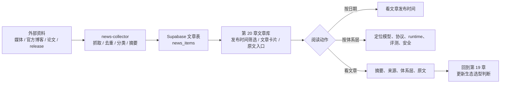
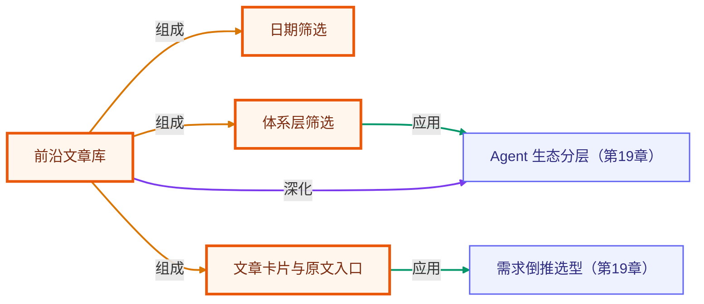

# 第 20 章 · Agent 前沿文章库

> 所属阶段：**第七部分 · 前沿与生态**
> 预计用时：45 分钟 | 难度：⭐⭐☆☆☆
> 资料时间：每日从多源 RSS 聚合，按原文发布时间筛选；阅读前建议复核原文发布日期。
> 全局导航：[课程导航](../../docs/navigation.md) · [完整大纲](../../docs/curriculum.md) · [知识图谱](../../docs/knowledge-graph.md)

## 学习目标

学完本章你能够：

- [ ] 用日历按日期筛选 agent 前沿资料，知道每批资料为什么被收录。
- [ ] 用第 19 章的八层生态框架筛选文章，而不是被框架名词牵着走。
- [ ] 从文章卡片中快速抓住来源、摘要、体系层和原文入口。
- [ ] 把外部资料转化为选型判断、迁移路线和后续学习计划。

## 前置知识

- 已读 [第 19 章 · Agent 前沿发展与生态拆解](../19-agent-ecosystem-and-frontier/README.md)，理解模型接口、协议、SDK、runtime、数据、UI、评估与治理的分层。
- 已读 [第 12 章 · 上框架](../12-intro-to-frameworks/README.md)、[第 16 章 · 可观测性与成本](../16-observability-and-cost/README.md)、[第 17 章 · 安全与护栏](../17-safety-and-guardrails/README.md)。

## 图解学习地图

> 本章不是新增一套理论，而是把持续变化的外部资料整理成可追溯阅读流。读图顺序：先看资料来源，再按体系层和日期筛，最后查看文章卡片并打开原文。



### 原理展开

第 19 章解决“如何理解 agent 生态分层”。第 20 章解决另一个问题：**资料不断增加时，怎么读得有秩序、可回看、可追溯**。

这页的文章库直接读取 Supabase `news_items`，事实源是 `news-collector` 抓取到的公开 RSS/Atom 条目。也就是说：

- 文章标题、来源、摘要和体系层由收集器归一化后入库；
- `published_date` 用于文章日历筛选，`collected_date` 只表示采集批次；
- 页面只用公开 anon 配置读取列表，不接触服务端密钥；
- 读者点击标题或“查看原文”时跳到原始资料，不复制原文全文。

## 一、文章库怎么读

### 1. 先按日期看“这一批资料解决什么问题”

日期不是装饰。agent 生态变化很快，文章的发布时间能帮助你判断：

- 这是哪个阶段的趋势；
- 同一天发布的资料是否围绕同一主题；
- 旧结论是否需要用新文档复核；
- 某个框架或协议的能力边界是否已经变化。

### 2. 再按体系层缩小范围

文章库沿用第 19 章的八层生态框架。

| 体系层 | 收集重点 |
|--------|----------|
| 基础综述 | agent taxonomy、human-agent、多 agent、computer-use 总览 |
| 模型与托管平台 | Responses API、Agents SDK、Hosted tools、sandbox |
| 协议与互操作 | MCP、A2A、Apps SDK、AAIF、生命周期与兼容性 |
| 编排 Runtime | LangGraph、CrewAI、AutoGen、Semantic Kernel、Bedrock Agents |
| 产品与交互 | Operator、deep research、Codex、ChatGPT agent、GUI agent |
| 数据与记忆 | file search、conversation state、context engineering、agent memory |
| 评测与基准 | WebArena、OSWorld、MacArena、tau-bench、SWE-agent、PaperBench |
| 安全与治理 | OWASP、MCP authorization、prompt injection、identity、secrets |

### 3. 最后打开原文复核“这条资料为什么值得读”

文章卡片保留四类信息：

- 摘要：这条资料与课程哪个判断相关；
- 来源：发布方或文档站；
- 体系层：文章类型、体系层和关键主题；
- 原文入口：用于复核 API、协议和发布日期。

---

## 二、前沿文章列表

> 下方文章库由页面直接从 Supabase `news_items` 读取。标题、来源和“查看原文”均会打开原始资料；课程页只保留可追溯摘要，不复制原文全文。

<div data-daily-news></div>

---

## 三、把文章转成工程判断

读完一组资料后，建议把结论写成四句话：

```text
1. 这条资料影响哪一层生态？
2. 它改变了我对哪个框架/协议/runtime 的判断？
3. 它对当前项目是立即可用、值得观察，还是暂不相关？
4. 如果要落地，最低风险的验证实验是什么？
```

示例：

```text
MCP Authorization 影响工具协议层和安全治理层。
它提醒我：MCP server 不能只暴露 tools，还要设计 OAuth、audience binding 和 token 传递边界。
对内部工具平台是立即相关。
最低风险实验：先把一个只读 CRM 查询工具封装成 MCP server，并写权限/审计 checklist。
```

## 四、小结与延伸

前沿文章库的价值不是“多看新闻”，而是让外部资料进入一条稳定路径：

```text
资料 -> 分类 -> 日期 -> 摘要 -> 原文 -> 工程判断
```

当你看到一个新框架、新协议或新 benchmark 时，先把它放回第 19 章的生态层，再判断它解决的是工具接入、状态编排、产品交互、评估治理，还是安全边界。这样追前沿不会变成追名词。

> 💡 **面试会问**：面对一篇新的 agent 论文或官方文档，你怎么判断它影响的是哪一层生态？你如何把一条外部资料转化为项目选型或迁移路线？

<!-- KG:START (由 npm run kg 自动生成，勿手改本标记区) -->

## 知识图谱与延伸阅读

> 本节由 `npm run kg` 自动生成（数据源 `knowledge-graph/data/graph.ts`）。要增删请改数据源后重跑。

### 本章概念图谱

> 节点：**橙框**=本章概念，蓝框=关联的其他章概念。连线按关系类型着色：前置(蓝) · 深化(紫) · 对比(玫红) · 应用(绿) · 组成(橙)。



### 与其他章节的关系

- `体系层筛选` —**应用**→ `Agent 生态分层`（第 19 章）
- `文章卡片与原文入口` —**应用**→ `需求倒推选型`（第 19 章）
- `前沿文章库` —**深化**→ `Agent 生态分层`（第 19 章）

### 延伸阅读

_暂无（可在 `graph.ts` 的 `ARTICLES` 中新增本章关联文章）。_

> 🗺️ 在[全局知识图谱](../../docs/knowledge-graph.md) / [交互式图谱](../../knowledge-graph/output/index.html) 中查看本章位置。

<!-- KG:END -->
