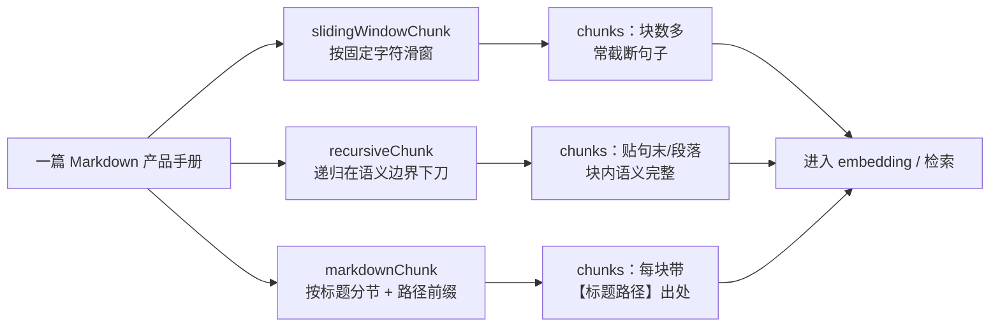
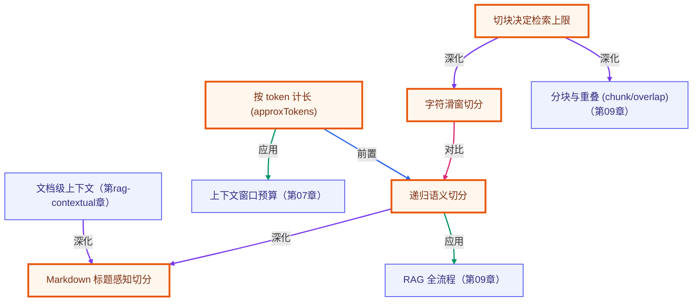

# 进阶分块策略：递归与 Markdown 感知

> 所属：进阶 RAG 专题 · 切块决定检索质量的上限，先把「在哪下刀」学透
> 预计用时：35 分钟 | 难度：⭐⭐⭐
> 全局导航：[课程导航](../../docs/navigation.md) · [完整大纲](../../docs/curriculum.md) · [知识图谱](../../docs/knowledge-graph.md)

## 学习目标

学完本章你能够：

- [ ] 说清一句话：**切块决定检索质量的上限**——块切坏了，后面再强的 embedding / rerank / prompt 都救不回来。
- [ ] 用 `approxTokens` 按 token（而非字符）估算块大小，理解中文为什么不能简单按字符数控长。
- [ ] 对比三种切法：`slidingWindowChunk`（字符滑窗）、`recursiveChunk`（递归语义）、`markdownChunk`（标题感知），并说出各自的代价。
- [ ] 亲眼看到滑窗把句子从中间截断，而递归在句末/段落边界下刀。
- [ ] 理解 `markdownChunk` 的「标题路径前缀」为什么能让片段**自带出处**，同时利于召回与溯源。

## 前置知识

- 已读 [第 08 章 · Embedding 与向量检索](../../lessons/08-embeddings-and-vector-search/README.md)（理解 embedding 与余弦相似度）。
- 已读 [第 09 章 · 从零实现 RAG](../../lessons/09-rag-from-scratch/README.md)（写过带 overlap 的字符滑窗分块——本章的「基线」）。
- 本章 demo 是**纯函数**，无需任何 API key 即可运行（见下文「三、运行」）。

## 三层学习路线

| 层级 | 学习目标 | 你要完成什么 |
|------|----------|--------------|
| 极简 | 跑通 demo，看懂三种切法产出的块数与每块 token。 | 能指着输出说出「这块是从哪里被切开的」。 |
| 进阶 | 理解切块为何是检索质量的上限。 | 解释滑窗截断句子的危害、递归如何贴语义边界、标题路径前缀如何帮溯源。 |
| 真实实践 | 把切块策略接到完整 RAG 管线。 | 在 [RAG 系统实战项目](../../docs/rag-system-project.md) 里，按文档类型选用不同切法并评估召回。 |

---

## 图解学习地图

> 读图顺序：先看一篇文档如何分出三条切块分支，再回到「二、代码走读」。核心焦点：**同一篇文档，三种下刀方式，产出差异巨大的 chunks**。



---

## 一、原理：切块决定检索质量的「上限」

第 09 章我们用「字符滑窗」把文档切块。它最直观，但有个致命问题：**它对文本的语义结构一无所知**，只会数到第 N 个字符就「咔」一刀。这会带来两类损失：

```
原文：……光标与改动实时同步。历史版本默认保留 90 天……
                              ▲ 滑窗恰好切在这里
块A：……光标与改动实时         ← 半句话，"同步"被切走了
块B：同步。历史版本默认保留…    ← 另一半，丢了主语
```

万一用户问「改动会实时同步吗」，**两块都答不全**，召回质量先天受损。这就是「切块决定检索质量上限」的含义：检索/生成只能在你切出来的块里挑，块本身坏了，下游无力回天。

### 递归语义切分（recursiveChunk）：优先在边界下刀

递归切分的思路是给一组**从粗到细的分隔符**：段落 `\n\n` → 行 `\n` → 中文句末 `。！？` → 英文 `. ` → 词 → 字符兜底。它先用最粗的分隔符切，某段仍超过 `chunkSize`（按 `approxTokens` 估算）就换更细的分隔符继续递归，最后把小片段贪心打包成接近目标大小的块，并带上重叠。

```
                  ┌─ 段落够小？ → 直接成块
原文 ─按 \n\n 切─▶ │
                  └─ 段落太大？ → 按 句末 再切 → 还大？按 词 再切 → 兜底按字符
```

效果：**块的边界落在句末/段落处**，块内是完整语义单元，而不是半截话。

### Markdown 标题感知（markdownChunk）：让块自带出处

技术文档的标题层级本身就是绝佳的语义边界。`markdownChunk` 先按 `#`/`##`/`###` 把文档分节，记下每节的**标题路径**（如 `织云协作 用户手册 > 二、价格方案`），再对节内正文做递归切分，最后把标题路径作为 `【...】` 前缀拼回每块，并写进 `metadata.heading`：

```
【织云协作 用户手册 > 二、价格方案】
织云协作提供三档方案（价格为虚构示例）：- 免费版：…… - 标准版：每用户每月 ￥58 ……
▲ 前缀                                  ▲ 节内正文（递归切分）
```

好处有二：检索时这段「标题路径」也参与匹配，**召回更准**；命中后片段**自带出处**，答案更易溯源。

> 注意：`approxTokens` 把 CJK 字按 ~1 token、其余字符按 ~4 字符/token 估算。中文一个字往往就是一个 token，所以**按字符数控长会严重低估中文块的实际 token**——这正是递归/markdown 按 token 而非字符控大小的原因。

---

## 二、代码走读

完整代码见 [`index.ts`](./index.ts)。demo 用一段中文虚构产品手册「织云协作」（版本号/价格均为虚构，凸显私有知识），分别跑三种切法。

### 1) 三条分支用「可比」的参数

为了让差异主要来自「在哪下刀」而非块大小，三者用接近的目标尺寸：

```ts
const SIZE = 120; // 滑窗按字符；递归/markdown 按 token —— 量级接近即可，重点看切法不同。

const sliding = slidingWindowChunk(PRODUCT_MANUAL, { size: SIZE, overlap: 30 });
const recursive = recursiveChunk(PRODUCT_MANUAL, { chunkSize: SIZE, overlap: 20 });
const markdown = markdownChunk(PRODUCT_MANUAL, { chunkSize: SIZE, overlap: 20 });
```

### 2) 打印每块的 approxTokens 与预览

`reportChunks` 遍历块，打印块号、`approxTokens` 估值与单行预览。注意 `noUncheckedIndexedAccess` 下数组下标是 `T | undefined`，所以下面用了可选链 `?.` 兜底：

```ts
const slideTail = sliding[0]?.text.slice(-24) ?? "";
const recurTail = recursive[0]?.text.slice(-24) ?? "";
```

### 3) 直观对比：滑窗截断 vs 递归贴边界

运行时你会看到第 0 块结尾的鲜明对比——滑窗停在半句话，递归停在标题/段落边界：

```
滑窗 #0 结尾：…文档\n多人可以同时编辑同一篇文档，光标与改动实时   ← 半句
递归 #0 结尾：…常见问题，供新用户快速上手。 ## 一、核心功能      ← 完整句 + 段落界
```

### 4) markdownChunk 的标题路径前缀

从带 `metadata.heading` 的块里取一个展示出处：

```ts
const withHeading = markdown.find((c) => typeof c.metadata?.["heading"] === "string");
// 块文本形如：【织云协作 用户手册 > 二、价格方案】\n织云协作提供三档方案……
```

---

## 三、运行

本章 demo 是**纯函数**（只调用 `approxTokens` / `slidingWindowChunk` / `recursiveChunk` / `markdownChunk`），不做 embedding、不调 LLM——**无需任何 API key，离线即可跑通**：

```bash
npx tsx rag-advanced/01-chunking-strategies/index.ts
```

预期输出（依次）：

1. 语料规模（约 493 tokens / 667 字符）。
2. **三条分支**各自的块列表：块号、每块 `approxTokens`、单行预览。
3. **差异 1**：滑窗 #0 结尾是半句话，递归 #0 结尾落在句末/段落边界。
4. **差异 2**：markdownChunk 的块带 `【标题路径】` 前缀（如 `织云协作 用户手册 > 二、价格方案`）。
5. **汇总**：三种策略的块数对比（滑窗块更碎，递归/markdown 更贴结构）。

> 想接着做带检索的实验（如把三种切块入库后比较召回）？那一步需要 embedding，默认走 OpenAI，需要配 `OPENAI_API_KEY`（见 [环境搭建](../../docs/setup.md)）。本章的对比本身不需要。

---

## 四、练习

1. **调 chunkSize**：把 `SIZE` 从 `120` 改成 `60` 再改成 `300`，观察三种策略块数与每块 token 怎么变。体会「太小割裂、太大变钝」。
2. **换分隔符**：给 `recursiveChunk` 传自定义 `separators`（如去掉 `"。"`），看块边界如何变化，理解分隔符优先级的作用。
3. **加一段超长无标题正文**：往 `PRODUCT_MANUAL` 里塞一大段没有句号、没有换行的长文本，看递归如何一路降级到「按字符兜底」。
4. **验证 overlap**：把 `recursiveChunk` 的 `overlap` 设为 `0` 再设为很大值，观察相邻块的重叠文字变化（注意函数内部会把 overlap 夹到 ≤ chunkSize/2）。
5. **进阶 · 接检索**：把三种切法的块分别 `add` 进 `MemoryVectorStore`（需 `OPENAI_API_KEY`），对同一个问题 `search`，比较哪种切法召回到的片段更完整、更易溯源。

---

<!-- KG:START (由 npm run kg 自动生成，勿手改本标记区) -->

## 知识图谱与延伸阅读

> 本节由 `npm run kg` 自动生成（数据源 `knowledge-graph/data/graph.ts`）。要增删请改数据源后重跑。

### 本章概念图谱

> 节点：**橙框**=本章概念，蓝框=关联的其他章概念。连线按关系类型着色：前置(蓝) · 深化(紫) · 对比(玫红) · 应用(绿) · 组成(橙)。



### 与其他章节的关系

- `切块决定检索上限` —**深化**→ `分块与重叠 (chunk/overlap)`（第 09 章）
- `递归语义切分` —**应用**→ `RAG 全流程`（第 09 章）
- `按 token 计长 (approxTokens)` —**应用**→ `上下文窗口预算`（第 07 章）
- `文档级上下文` —**深化**→ `Markdown 标题感知切分`（第 rag-contextual 章）

### 延伸阅读

- [Introducing Contextual Retrieval](https://www.anthropic.com/news/contextual-retrieval) — Anthropic 官方：上下文化分块 + 向量与 BM25 混合 + 重排的实战配方，进阶 RAG 必读 `blog`

> 🗺️ 在[全局知识图谱](../../docs/knowledge-graph.md) / [交互式图谱](../../knowledge-graph/output/index.html) 中查看本章位置。

<!-- KG:END -->

## 五、小结与延伸

- **切块决定检索质量的上限**：盲按字符切省事却易割裂语义；递归在语义边界下刀，块内更完整；Markdown 感知还能让块自带「标题路径」出处。
- 中文要按 **token** 而非字符控长（`approxTokens`），否则会严重低估块大小。
- 没有「最好」的切法，只有「最合适」的：结构化文档优先 `markdownChunk`，自由长文用 `recursiveChunk`，讲原理或快速原型用 `slidingWindowChunk`。
- 下一步：把切好的块接进检索与生成链路，见 [RAG 系统实战项目](../../docs/rag-system-project.md)；切块只是第一环，后续还有 BM25 / 混合检索 / 精排 / 查询改写等进阶专题。

> 💡 **面试会问**：为什么说切块决定 RAG 质量的上限？递归切分相比固定窗口好在哪？为中文文档控制块大小，按字符还是按 token，为什么？标题路径前缀对召回和溯源各有什么帮助？
