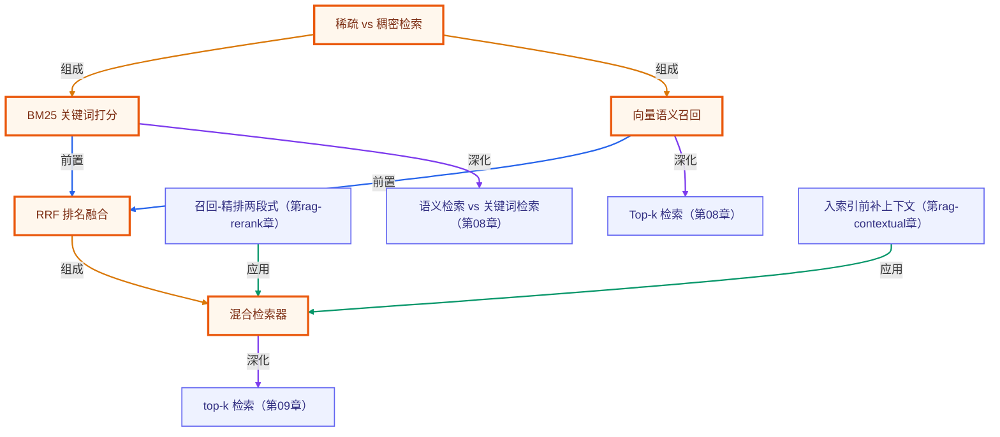

# 混合检索：向量 + BM25 + RRF 融合

> 所属：进阶 RAG 专题 · 用 RRF 把语义向量与关键词 BM25 两路召回融合，补齐各自盲区
> 预计用时：35 分钟 | 难度：⭐⭐⭐
> 全局导航：[课程导航](../../docs/navigation.md) · [完整大纲](../../docs/curriculum.md) · [知识图谱](../../docs/knowledge-graph.md)

## 学习目标

- [ ] 说清向量检索与 BM25 各自的强项与盲区，理解为什么要「混合」而不是二选一
- [ ] 理解 RRF（Reciprocal Rank Fusion）为何只看名次不看分值，以及它为什么不需要分数归一化
- [ ] 会用 `MemoryVectorStore`、`BM25Index`、`tokenize` 分别跑出两路召回
- [ ] 会用 `reciprocalRankFusion` 手动融合，并用 `HybridRetriever` 一行搞定端到端混合检索
- [ ] 能用「目标文档在各路的名次」这一观测方法，量化融合带来的召回提升

## 前置知识

- [第 08 章 · Embeddings 与向量检索](../../lessons/08-embeddings-and-vector-search/README.md)：稠密向量、余弦相似度、向量库的 add/search
- [第 09 章 · 从零实现 RAG](../../lessons/09-rag-from-scratch/README.md)：检索 → 拼上下文 → 生成的完整链路
- 知道 OPENAI_API_KEY 怎么配（见 [docs/setup.md](../../docs/setup.md)），因为向量路要算 embedding

## 三层学习路线

| 层次 | 目标 | 怎么做 |
| --- | --- | --- |
| 极简 | 看懂「单路会漏、双路互补」 | 只读本页「图解学习地图」+「命中对比」那段输出 |
| 进阶 | 理解 RRF 机制并能手算 | 读 `./index.ts` 里手算 RRF 的片段，对照 `reciprocalRankFusion` 实现 |
| 真实实践 | 把混合检索接进自己的 RAG | 用 `HybridRetriever` 替换毕业项目里的纯向量检索，见 [docs/rag-system-project.md](../../docs/rag-system-project.md) |

## 图解学习地图

```mermaid
flowchart LR
  Q[查询<br/>含语义改写 + 精确专名] --> V[向量路<br/>MemoryVectorStore.search<br/>余弦相似度 top-N]
  Q --> B[BM25 路<br/>BM25Index.search<br/>词频/IDF top-N]
  V --> R[reciprocalRankFusion<br/>只看名次：累加 1/&#40;k+rank&#41;]
  B --> R
  R --> T[融合 top-k<br/>两类命中都在]
```



## 一、原理：两种检索的盲区，与 RRF 如何缝合它们

**向量检索**把文本压成稠密向量，按余弦相似度找「意思相近」的内容。它的强项是**语义近似**——用户问「最多能接多少终端」，能召回写着「可同时承载上万台客户机」的句子，哪怕两句**没有一个共同的字**。它的盲区是**私有专名/型号/编号**：像虚构的固件号 `FW-2024.11`、工单号 `INC-8842`，这些 token 没在嵌入模型的训练分布里建立起有意义的几何位置，向量距离对它们不敏感，于是**精确命中会漏**。

**BM25** 是经典的稀疏关键词检索：先 `tokenize` 切词（中文按单字 + 相邻二元组），再按词频与逆文档频率（IDF）打分，稀有词权重更高。它的强项恰好是向量的盲区——`FW-2024.11` 这种字面词命中极准。它的盲区也恰好是向量的强项——**只要措辞与查询零字面重合，BM25 的得分就是零**，「换个说法」必然漏。

```
查询：FW-2024.11 最多能接多少终端？
            │
   ┌────────┴─────────┐
   ▼                  ▼
向量路              BM25 路
命中 d2（承载上万台客户机） 命中 d1（FW-2024.11）
漏/排不准 d1（专名）      漏 d2（与查询零字面重合 → 零分）
   └────────┬─────────┘
            ▼  reciprocalRankFusion
        d1 与 d2 都在 top-k
```

> ⚗️ **对照实验要把变量控干净**：demo 里 d2 的措辞被刻意写成与查询**没有任何共同的字**（连「设备/终端」都不出现）。若 d2 里残留「终端」这类与查询重合的词，BM25 会靠中文二元组「侥幸」捞回它，「BM25 漏语义改写」就演示不出来了。BM25 漏 d2 因此是**确定性**的（零重合 → 零分），不依赖任何模型。

**为什么用 RRF 融合，而不是把两路分数相加？** 因为向量的余弦相似度大约落在 0~1，而 BM25 的分数能到几十——**量纲不可比**，直接相加会被大数支配。RRF 绕开这个问题：它**只看名次，不看分值**，每个结果在某一路里排第 `rank` 名就贡献 `1/(k+rank)`（k 默认 60），多路贡献相加后重新排序。名次越靠前贡献越大；既不需要归一化，又对异常分值鲁棒。一个文档只要在**任意一路**里靠前，就能被推上融合榜——这正是「补齐盲区」的来源。

## 二、代码走读

完整代码见 [`./index.ts`](./index.ts)。它对同一份语料跑三路，并打印各自的名次。

语料刻意混入「精确专名」与「可被语义改写命中的句子」，好让两路各自露怯（全部为虚构数据）：

```ts
const CORPUS = [
  { id: "d1", text: "玄武 X9 边缘网关运行固件 FW-2024.11（虚构），最大并发连接数为 12000。" },
  { id: "d2", text: "这款旗舰网关在压力测试里可同时承载上万台客户机而不掉线（虚构数据）。" },
  // ...d3 干扰型号（含「终端」字面词，BM25 反而容易召回它——错的那条）、
  //    d4 工单编号、d5 无关价格、d6 另一处语义改写
];
```

两路分别召回——向量走 `MemoryVectorStore`，BM25 走 `BM25Index`：

```ts
const store = new MemoryVectorStore();
await store.add(CORPUS.map((c) => ({ id: c.id, text: c.text })));
const vecIds = (await store.search(query, k)).map((h) => h.doc.id);

const bm25 = new BM25Index();
bm25.add(CORPUS.map((c) => ({ id: c.id, text: c.text })));
const bmIds = bm25.search(query, k).map((h) => h.id);
```

端到端混合只需 `HybridRetriever`，它内部就是「两路召回 + `reciprocalRankFusion`」：

```ts
const hybrid = new HybridRetriever();
await hybrid.index(CORPUS.map((c) => ({ id: c.id, text: c.text })));
const fusedChunks = await hybrid.retrieve(query, k); // RetrievedChunk[]
```

为了让读者看清融合「只看名次」的本质，demo 还把前两路的 id 列表**直接喂给** `reciprocalRankFusion` 手算一遍，结果应与 `HybridRetriever` 一致：

```ts
const manualFused = reciprocalRankFusion([vecIds, bmIds]); // [{ id, score }]
```

> 注意：项目开启了 `noUncheckedIndexedAccess`，所以数组下标取值是 `T | undefined`。demo 里凡是按下标取元素都用了 `!` 或 `?.`/`find` 守卫，避免 tsc 报错。

## 三、运行

```bash
npx tsx rag-advanced/02-hybrid-search/index.ts
```

- 需要的 key：`OPENAI_API_KEY`（向量路要算 embedding；BM25 路本身不需要 key，但本 demo 的看点是三路对比，所以整体要求有 key）。
- 预期输出：依次打印「查询」「纯向量名次」「纯 BM25 名次」「tokenize 词元」「混合名次」「手算 RRF」，最后一段「命中对比」会显示——
  - `d1`（专名 `FW-2024.11`）：BM25 稳居第 1（三个 ASCII 词元 `fw/2024/11` 全中）；
  - `d2`（语义改写「承载上万台客户机」）：**BM25 必然未召回**（与查询零字面重合 → 零分，这是确定性的）；向量路按语义把它排进前列；
  - 顺带观察 BM25 把含「终端」字面的 `d3`（朱雀 Mini，错误答案）排得很靠前——**字面命中 ≠ 语义正确**，这正是纯关键词检索的另一类坑；
  - 而**混合**里 `d1` 与 `d2` 都在 top-k。小结由代码按实际名次动态判定后打印。

> 嵌入结果会随模型版本浮动，向量路名次可能略有差异；但 BM25 漏 `d2` 是构造保证的，「混合补盲区」的结论稳定。

## 四、练习

1. 把查询改成纯专名（如只留 `INC-8842`），观察向量路是否几乎全漏，而 BM25 稳稳命中 `d4`。
2. 把查询改成纯语义（如「这台网关最多支持几台设备」，不含任何编号），观察反过来的现象。
3. 给 `HybridRetriever` 传 `{ rrfK: 5 }` 再传 `{ rrfK: 100 }`，对比融合名次的变化，体会 RRF 常数 k 越大越「平滑」（名次差异被削弱）。
4. 调用 `tokenize(query)` 打印词元，解释为什么中文要切「二元组」才能让 BM25 在中文上可用。
5. 进阶：把 `HybridRetriever` 当作 `Retriever` 传给上层（参见 barrel 里的 `answerWithRag`），观察混合召回如何影响最终答案的事实准确性。

<!-- KG:START (由 npm run kg 自动生成，勿手改本标记区) -->

## 知识图谱与延伸阅读

> 本节由 `npm run kg` 自动生成（数据源 `knowledge-graph/data/graph.ts`）。要增删请改数据源后重跑。

### 本章概念图谱

> 节点：**橙框**=本章概念，蓝框=关联的其他章概念。连线按关系类型着色：前置(蓝) · 深化(紫) · 对比(玫红) · 应用(绿) · 组成(橙)。



### 与其他章节的关系

- `召回-精排两段式` —**应用**→ `混合检索器`（第 rag-rerank 章）
- `向量语义召回` —**深化**→ `Top-k 检索`（第 08 章）
- `BM25 关键词打分` —**深化**→ `语义检索 vs 关键词检索`（第 08 章）
- `混合检索器` —**深化**→ `top-k 检索`（第 09 章）
- `入索引前补上下文` —**应用**→ `混合检索器`（第 rag-contextual 章）

### 延伸阅读

- [Introducing Contextual Retrieval](https://www.anthropic.com/news/contextual-retrieval) — Anthropic 官方：上下文化分块 + 向量与 BM25 混合 + 重排的实战配方，进阶 RAG 必读 `blog`
- [Okapi BM25 - Wikipedia](https://en.wikipedia.org/wiki/Okapi_BM25) — BM25 打分公式与 k1/b 参数的权威说明，对应本章 BM25Index `doc`
- [Reciprocal Rank Fusion outperforms Condorcet and individual Rank Learning Methods](https://dl.acm.org/doi/10.1145/1571941.1572114) — RRF 原始论文 (Cormack et al., SIGIR 2009)，混合检索融合法的来源 `paper`

> 🗺️ 在[全局知识图谱](../../docs/knowledge-graph.md) / [交互式图谱](../../knowledge-graph/output/index.html) 中查看本章位置。

<!-- KG:END -->

## 五、小结与延伸

要点回顾：

- 向量擅长**语义近似**、BM25 擅长**精确专名**，两者盲区互补。
- RRF **只看名次不看分值**，所以无需分数归一化、对异常分值鲁棒，是混合检索最常用的融合法。
- `HybridRetriever = 两路召回 + reciprocalRankFusion`，对外是统一的 `Retriever` 接口，可无缝接入下游精排/生成/评估。
- 观测方法：用「目标文档在各路的名次」来量化召回，比只看最终答案更能定位「漏召回」问题。

延伸阅读：

- 上游：[第 09 章 · 从零实现 RAG](../../lessons/09-rag-from-scratch/README.md) 的检索环节，可直接换成本章的混合检索。
- 下游：把融合后的候选交给精排（`llmRerank`）或查询改写（`multiQuery`/`hyde`）会进一步提质，见进阶 RAG 后续章节。
- 落地：[docs/rag-system-project.md](../../docs/rag-system-project.md) 的毕业项目，建议默认就用混合检索作为召回层。

> 💡 面试会问：
> - 「向量检索都那么强了，为什么还要 BM25？」——答：向量对私有专名/型号/编号不敏感，BM25 的字面命中正好补这个盲区。
> - 「两路分数怎么合并？为什么不直接加权求和？」——答：余弦分与 BM25 分量纲不可比，加权需调参且对异常值敏感；RRF 只看名次、无需归一化，是更稳的默认选择。
