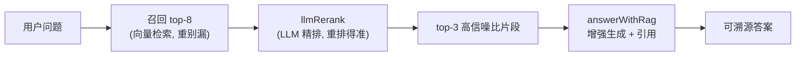
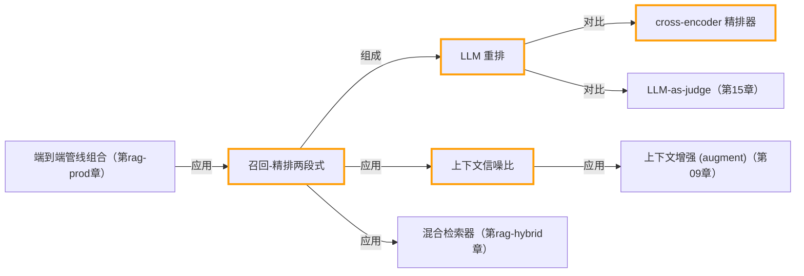

# 召回-精排两段式：LLM 重排

> 所属：进阶 RAG 专题 · 先廉价多召回「别漏」，再用 LLM 精排「排得准」，提升注入上下文的信噪比。
> 预计用时：40 分钟 | 难度：⭐⭐⭐
> 全局导航：[课程导航](../../docs/navigation.md) · [完整大纲](../../docs/curriculum.md) · [知识图谱](../../docs/knowledge-graph.md)

## 学习目标

学完本章你能够：

- [ ] 说清「召回（recall）」与「精排（rerank）」各自的目标：召回重**别漏**、精排重**排得准**。
- [ ] 用 `llmRerank` 把召回的 top-8 候选精排到 top-3，并读懂**精排前后顺序变化**说明了什么。
- [ ] 用 `answerWithRag` 跑通 `rerank:false` vs `rerank:true` 的 A/B，对比**答案质量、引用片段、token 用量**。
- [ ] 解释为什么「召回多 → 精排裁」能提升注入上下文的**信噪比**，而不是单纯「召回越多越好」。
- [ ] 知道生产里精排常用专门的 cross-encoder reranker，本章用一次 LLM 调用近似、原理一致。

## 前置知识

- 已读 [第 08 章 · Embedding 与向量检索](../../lessons/08-embeddings-and-vector-search/README.md)（理解 embedding、余弦相似度、向量库）。
- 已读 [第 09 章 · 从零实现 RAG](../../lessons/09-rag-from-scratch/README.md)（跑通 chunk → retrieve → augment → generate 闭环，会用「只许据资料作答 + 标注引用」）。
- 已按 [环境搭建](../../docs/setup.md) 配好 `.env`：本章 embedding 默认走 OpenAI，需要 `OPENAI_API_KEY`；生成走 `getLLM()` 选用的 provider（Claude 或 OpenAI）。

## 三层学习路线

| 层级 | 学习目标 | 你要完成什么 |
|------|----------|--------------|
| 极简 | 跑通「召回 top-8 → 精排 top-3」一条线。 | 能在输出里指出精排把哪个 id 提上来、把哪个挤下去。 |
| 进阶 | 理解精排提升的是「注入上下文信噪比」，不是召回数量。 | 比较 A/B 两次回答的引用片段，说清噪声片段如何被裁掉。 |
| 真实实践 | 把「LLM 近似精排」对照到生产级 reranker。 | 对照 [RAG 系统项目](../../docs/rag-system-project.md) 中的检索服务，思考何时换 cross-encoder reranker、如何控延迟与成本。 |

---

## 图解学习地图

> 读图顺序：先看主线两段式，再回到「代码走读」对应到函数。核心焦点：**召回求全、精排求准**。



---

## 一、原理：为什么要把检索拆成两段

单段检索有个绕不开的两难：

- **召回太少**（如只取 top-3）：稍微问得刁钻一点，真正含答案的片段就可能排在第 4、第 5 名，直接被漏掉——答案从源头就缺了。
- **召回太多**（如直接取 top-12 全塞进 prompt）：相近但跑题的「噪声片段」也一起进了上下文。噪声越多，模型越容易被带偏、跑题甚至基于无关内容编造，token 还更贵。

两段式（recall → rerank）就是把这对矛盾**拆开各管一头**：

```
            第一段：召回(recall)              第二段：精排(rerank)
            目标 = 别漏（求全）               目标 = 排得准（求精）
            手段 = 便宜快的向量/BM25          手段 = 更强但更贵的判断器(LLM)
  问题 ──▶  多捞候选 top-8  ───────────▶  从 8 条里精挑 top-3  ───▶  注入生成
            （宁可多带几条）                 （裁掉噪声，只留最相关）
```

关键直觉：**召回阶段不怕带进噪声，因为后面有精排兜底；精排阶段不怕漏，因为它只在召回给的池子里挑。** 两段配合，最终注入生成的少数几条既「没漏」又「够准」，也就是**信噪比更高**。

为什么向量检索本身还不够准？余弦相似度衡量的是「语义相近」，但「相近」不等于「能回答这个问题」。比如问 Halo X2 续航，"耳机续航 28 小时"、"续航三大影响因素"在向量空间里都离问题很近，却答非所问。精排让 LLM **同时看到问题和所有候选**，做的是「哪条真能回答」的判断，粒度比单条相似度更细。

> 生产提示：本章用一次 LLM 调用近似精排，胜在零额外依赖、好理解；真实系统更常用专门的 **cross-encoder reranker**（如 bge-reranker、Cohere Rerank），更快更便宜。两者原理一致：让模型同时审视 query 与候选，给出相关性排序。

## 二、代码走读

完整代码见 [`./index.ts`](./index.ts)，这里拆讲三个关键点。

**1）召回与精排是两次独立调用。** 先用 `asRetriever` 把向量库适配成统一 `Retriever`，召回 top-8；再把召回结果交给 `llmRerank` 精排到 top-3：

```ts
const retriever = asRetriever(store);

// 第一段：召回 top-8（重「别漏」）
const recalled = await retriever.retrieve(question, 8);

// 第二段：精排到 top-3（重「排得准」）
const reranked = await llmRerank(question, recalled, { topN: 3 });
```

**2）直观对比精排前后的顺序变化。** 精排的价值要「看得见」——把召回 top-3 与精排 top-3 的 id 列出来，标出被提拔/被挤出的片段：

```ts
const recallTop3 = recalled.slice(0, 3).map((c) => c.id);
const rerankTop3 = reranked.map((c) => c.id);
const promoted = rerankTop3.filter((id) => !recallTop3.includes(id)); // 精排提上来的
const dropped = recallTop3.filter((id) => !rerankTop3.includes(id));  // 精排刷掉的
```

> 注意：本项目开启了 `noUncheckedIndexedAccess`，数组下标访问会得到 `T | undefined`。所以代码里用 `chunks[0]!`、可选链等方式处理，避免类型报错。

**3）A/B：让 `answerWithRag` 自己完成两段式。** `answerWithRag` 内置了精排开关——`rerank:true` 时它会先按 `recallK` 召回、再用 `llmRerank` 精排到 `k`，最后注入生成。我们跑两次对比：

```ts
// A) 不精排：直接召回 top-3 注入
const plain = await answerWithRag({ query, retriever, k: 3, rerank: false });

// B) 精排：先召回 8 条，精排到 3 条再注入
const reranT = await answerWithRag({ query, retriever, k: 3, recallK: 8, rerank: true });
```

两次都返回 `{ answer, contexts, usage }`：`contexts` 是**实际注入生成的片段**（引用锚点），`usage` 给出 token 用量。对比 `contexts` 的 id 就能看出精排是否把噪声片段换成了更相关的片段；对比 `usage` 能感受 token 成本。事实型问答内部用 `temperature: 0`，保证可复现。

## 三、运行

```bash
npx tsx rag-advanced/03-reranking/index.ts
```

需要的 key：

- `OPENAI_API_KEY`：本章 embedding 默认走 OpenAI（向量化入库 + 召回）。
- 生成用 `getLLM()` 选定的 provider（Claude 或 OpenAI），按 [环境搭建](../../docs/setup.md) 配好即可。

预期输出（顺序，数字随模型与语料而变）：

1. **构建向量库**：入库 10 条虚构语料（青萍科技产品手册）。
2. **召回 top-8**：按余弦相似度排序的 8 条，其中混有相近但跑题的干扰项。
3. **精排 top-3**：LLM 重排后的 3 条，并打印「召回 top-3 → 精排 top-3」的顺序变化、被提拔/被挤出的 id。
4. **A/B 生成对比**：两段答案 + 各自引用片段 id + token 用量。
5. **怎么读对比**：是否含真正的答案片段 `c1`、噪声是否被裁掉、token 差异从哪来。

> 这是联网 demo（要消耗少量 embedding + LLM 额度）。若只想离线验证 shared/rag 的纯逻辑，可跑免 key 的 `npx tsx rag-advanced/smoke.ts`。

## 四、练习

1. **制造「召回会漏」的场景**：把问题改得更刁钻（如只问「开了常亮显示能用几天」），观察含答案的 `c1` 在召回里排第几；再把召回数从 8 调到 3，看 `rerank:false` 是否就此漏掉答案，而 `rerank:true`（`recallK:8`）能否救回来。
2. **调 `topN` / `k`**：把精排 `topN` 从 3 改成 1 或 5，对比注入片段与答案的变化。`topN` 越小信噪比越高，但漏答风险也上升——找你这份语料的「甜点值」。
3. **加更多噪声**：往 `CORPUS` 里再塞几条「也讲续航/快充」但答非所问的虚构片段，让召回 top-8 更脏，观察精排是否仍稳定把 `c1` 留在 top-3。
4. **量化信噪比**：统计两次 `contexts` 里「真正相关片段（c1/c3/c6 类）」的占比，用数字而不是感觉说明精排提升了多少信噪比。
5. **换更快的精排（选做）**：把 `llmRerank` 换成「逐条让 LLM 打 0-10 分再排序」或接入真实 cross-encoder reranker，对比延迟与排序质量，体会本章「一次调用近似」的取舍。

<!-- KG:START (由 npm run kg 自动生成，勿手改本标记区) -->

## 知识图谱与延伸阅读

> 本节由 `npm run kg` 自动生成（数据源 `knowledge-graph/data/graph.ts`）。要增删请改数据源后重跑。

### 本章概念图谱



### 与其他章节的关系

- `召回-精排两段式` —**应用**→ `混合检索器`（第 rag-hybrid 章）
- `端到端管线组合` —**应用**→ `召回-精排两段式`（第 rag-prod 章）
- `上下文信噪比` —**应用**→ `上下文增强 (augment)`（第 09 章）
- `LLM 重排` —**对比**→ `LLM-as-judge`（第 15 章）

### 延伸阅读

- [Cohere · Rerank documentation](https://docs.cohere.com/docs/rerank-overview) — 生产级 rerank API 与 cross-encoder 精排的官方说明，对照本章 llmRerank `doc`

> 🗺️ 在[全局知识图谱](../../docs/knowledge-graph.md) / [交互式图谱](../../knowledge-graph/output/index.html) 中查看本章位置。

<!-- KG:END -->

## 五、小结与延伸

要点回顾：

- 两段式把「别漏」和「排得准」拆开：**召回求全、精排求准**，配合起来提升注入上下文的**信噪比**。
- 向量相似 ≠ 能回答问题；精排让 LLM 同时看 query 与候选，做更细粒度的相关性判断。
- `answerWithRag({ rerank:true, recallK, k })` 一行打开两段式：先召回 `recallK`、精排到 `k` 再生成。
- 精排不是「召回越多越好」的替代——它正因为「敢多召回」才成立，二者是一对。
- 生产里精排常换成专门的 cross-encoder reranker，更快更省；本章 LLM 近似只为讲清原理。

延伸阅读：

- 上游：先做查询改写（multiQuery / hyde）把召回拉得更全，再交给本章精排，往往叠加增益。
- 下游：精排后接 `evaluateRag` 给答案打分（contextRelevance / faithfulness / answerRelevance），把「信噪比提升」变成可度量指标。
- 工程落地：对照 [RAG 系统项目](../../docs/rag-system-project.md)，思考精排放在检索服务的哪一层、如何控延迟与成本、何时该上专用 reranker。

> 💡 面试会问：
> - 「召回和精排分别优化什么？为什么不一步到位？」——召回重 recall（别漏）、精排重 precision（排得准）；一步到位会在「漏答」和「噪声多」之间二选一，两段式把矛盾拆开。
> - 「向量检索已经按相似度排了，为什么还要精排？」——相似 ≠ 能回答；精排做的是更细的相关性判断，能裁掉「相近但跑题」的噪声。
> - 「精排用 LLM 有什么代价，生产怎么办？」——多一次调用、增延迟与成本；生产常换成 cross-encoder reranker（bge-reranker / Cohere Rerank）兼顾质量与速度。
