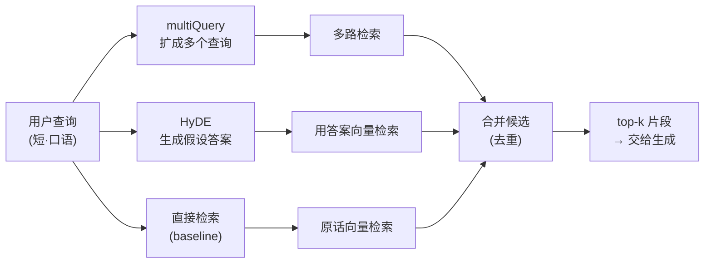
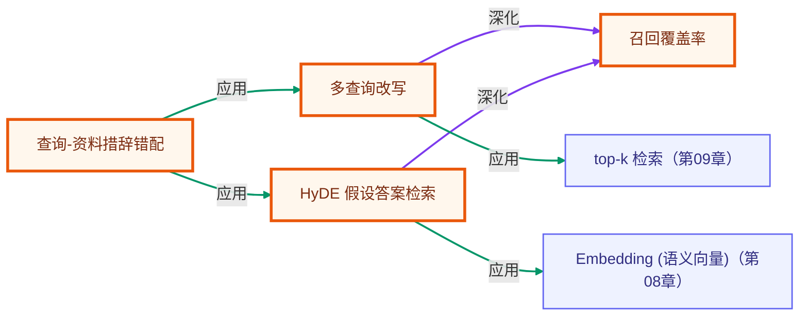

# 查询改写：multi-query 与 HyDE

> 所属：进阶 RAG 专题 · 在检索之前先优化查询，从「问得对不对」这一端提升召回。
> 预计用时：40 分钟 | 难度：⭐⭐⭐
> 全局导航：[课程导航](../../docs/navigation.md) · [完整大纲](../../docs/curriculum.md) · [知识图谱](../../docs/knowledge-graph.md)

## 学习目标

学完本章你能够：

- [ ] 说清「问法 ≠ 写法」这一召回鸿沟：用户问得短、口语、用词和资料对不上，导致**明明库里有却召不回**。
- [ ] 用 **multiQuery** 把一个意图扩成多个措辞的查询，**多路检索后合并去重**以扩大召回覆盖（recall）。
- [ ] 用 **HyDE**（假设文档向量）先生成「假设答案」，再拿它的向量去检索，理解「**答案比问题更像资料**」为何能提精度。
- [ ] 对比直接检索 / multiQuery / HyDE 三者的命中片段，亲眼看出改写**补回了哪些被漏掉的文档**。
- [ ] 知道两种改写各自的代价（多花的 LLM 调用、可能引入的噪声）以及何时该叠加使用。

## 前置知识

- 已读 [第 08 章 · Embedding 与向量检索](../../lessons/08-embeddings-and-vector-search/README.md)：理解 embedding、余弦相似度、向量库 `MemoryVectorStore`。
- 已读 [第 09 章 · 从零实现 RAG](../../lessons/09-rag-from-scratch/README.md)：跑通过「分块 → 入库 → 检索 top-k → 增强 → 生成」的完整闭环。
- 已按 [环境搭建](../../docs/setup.md) 配好 `.env`。注意：**embedding 默认走 OpenAI**，所以本章需要 `OPENAI_API_KEY`；查询改写用的 LLM 走默认 `LLM_PROVIDER`（Claude 或 OpenAI 均可）。

## 三层学习路线

| 层级 | 学习目标 | 你要完成什么 |
|------|----------|--------------|
| 极简 | 跑通 demo，看懂三种策略各召回了哪些片段。 | 指出「直接检索漏掉、改写补回」的那条文档是谁。 |
| 进阶 | 理解 multiQuery 扩召回、HyDE 提精度的机制差异与代价。 | 换更刁钻的口语化查询，观察两种策略的增益此消彼长。 |
| 真实实践 | 把查询改写接进端到端管线。 | 用改写后的查询喂给 `answerWithRag`，对照 [RAG 系统实战项目](../../docs/rag-system-project.md) 的检索前处理层。 |

---

## 图解学习地图

> 读图顺序：先看主线「一个查询如何被改写成多路/更像资料的查询」，再回到代码走读。核心焦点：**改写发生在检索之前，目的是让 embedding 召回更全、更准**。



---

## 一、原理：检索之前，先把「问题」修好

RAG 的召回质量，一半取决于**库里有没有**，另一半取决于**你拿什么去检索**。第 09 章我们都是拿用户原话直接检索，但真实用户的问法常常和资料的写法对不上：

```
  用户问：「我的数据会被删掉吗」        ← 短、口语、用了「删」
  资料写：「冷数据归档策略……保留 365 天后永久删除」  ← 用了「归档 / 保留期 / 永久删除」
                    ▲
          向量空间里两者距离偏远 → 直接检索可能把它排在后面甚至漏掉
```

查询改写（query transformation）就是在「检索之前」这一步动手，把问题修成更容易召回的形态。本章讲两种最常用的：

### 1) multiQuery：用「多措辞并集」对抗漏召回

一个问题只有一种措辞，万一这种措辞恰好和资料对不上，这一路就废了。multiQuery 让 LLM 把同一意图改写成**多个角度/措辞**的查询，每个查询各跑一路检索，最后把命中**合并去重**：

```
  原始：我的数据会被删掉吗
  改写1：CloudStack 数据保留多久后会被删除
  改写2：冷数据归档与永久删除策略
        │            │            │
        ▼            ▼            ▼
     检索一路     检索一路     检索一路
        └──────────合并去重──────────┘  ← 一句话漏的，另一句话补上
```

代价：多了 1 次 LLM 调用 + 多路检索；改写得太发散也可能把无关片段一起捞上来。所以 multiQuery 主要提升的是**召回率（recall）**，不是精度。

### 2) HyDE：用「假设答案」对抗问答不对称

HyDE = Hypothetical Document Embeddings（假设文档向量）。它的洞察是：**在向量空间里，「一段答案」比「一个问题」更接近真正的资料**——因为答案和资料都是「陈述句、信息密度高、用词专业」，而问题往往短而口语。

于是 HyDE 反其道而行：先让 LLM **凭空写一段假设答案**（哪怕细节是编的也没关系），再用这段答案的向量去检索：

```
  问题：我的数据会被删掉吗
        │ LLM 写一段假设答案（不查库，纯生成）
        ▼
  假设答案：「未访问数据会先转入冷存储，保留一年后永久删除，可延长保留期……」
        │ embed 这段答案
        ▼
  用「答案向量」去库里检索 → 命中真正的「归档/保留」片段（更准）
```

注意：假设答案里的具体数字可能是模型编的（幻觉），**但我们只用它的向量去检索，不把它当答案给用户**。真正的答案仍来自检索回来的真实资料。HyDE 主要提升的是**精度**。

> 一句话区分：**multiQuery 扩召回（多捞），HyDE 提精度（捞得准）。** 二者正交，可叠加。

---

## 二、代码走读

完整代码见 [`index.ts`](./index.ts)。语料是一份**虚构**的内部产品手册（版本号 / 价格 / 数字都是编的），模型训练时没见过，只能靠检索召回——正好检验「查询改写能不能把对的片段捞上来」。

### 1) 制造「问法 ≠ 写法」的鸿沟

语料里每段刻意用「资料的措辞」，而 demo 的查询刻意用「用户的口语」：

```ts
// 资料写「归档 / 保留期 / 永久删除」
{ id: "doc-retention", text: "冷数据归档策略：超过 90 天未访问的数据自动转入冷存储，冷存储默认保留 365 天（虚构）后永久删除……" }

// 用户却这样问（短、口语、用「删」）
const QUERY = "我的数据会被删掉吗";
```

### 2) 策略 A：直接检索（baseline）

复用统一检索抽象：把向量库适配成 `Retriever`，三种策略都基于它，便于对照。

```ts
const retriever = asRetriever(store);
const directHits = await retriever.retrieve(QUERY, TOP_K); // 用户原话直接检索
```

### 3) 策略 B：multiQuery 多路召回 + 合并去重

`multiQuery` 返回的数组**首项即原始 query**，其余是改写。多路检索后按文档 `id` 合并，同一文档被多路命中时保留分数最高的那次：

```ts
const queries = await multiQuery(QUERY, 3); // [原始, 改写1, 改写2, ...]

const merged = new Map<string, RetrievedChunk>();
for (const q of queries) {
  const hits = await retriever.retrieve(q, TOP_K);
  for (const hit of hits) {
    const prev = merged.get(hit.id);
    if (!prev || hit.score > prev.score) merged.set(hit.id, hit); // 去重保最高分
  }
}
const multiHits = [...merged.values()].sort((a, b) => b.score - a.score);
```

### 4) 策略 C：HyDE 用「假设答案」的向量检索

`hyde` 只负责生成那段假设答案。要拿它当查询向量，就 `embedOne` 它，再和库里每条文档的向量比余弦相似度自己排序（`MemoryVectorStore.search` 只接受字符串查询，所以这里手动算）：

```ts
const hypothetical = await hyde(QUERY); // LLM 凭空写一段假设答案

const queryEmbedding = await embedOne(hypothetical);
const hydeHits = store
  .all()
  .map((doc) => ({ id: doc.id, text: doc.text, score: cosineSimilarity(queryEmbedding, doc.embedding) }))
  .sort((a, b) => b.score - a.score)
  .slice(0, TOP_K);
```

### 5) 对比：谁被漏掉、谁被补回

最后把三种策略的召回集合并排打印，并找出「直接检索漏掉、却被改写策略补回」的文档——这就是改写带来的增益。注意 `noUncheckedIndexedAccess` 下数组下标是 `T | undefined`，本章用 `for...of` 遍历与 `?.`/守卫规避，未用裸下标。

---

## 三、运行

```bash
# 默认厂商（.env 里的 LLM_PROVIDER）做查询改写；embedding 始终走 OpenAI
npx tsx rag-advanced/04-query-transformation/index.ts
```

切换「改写」用的厂商（embedding 不受影响，仍走 OpenAI）：

```bash
# PowerShell:
$env:LLM_PROVIDER="openai"; npx tsx rag-advanced/04-query-transformation/index.ts
# macOS / Linux:
LLM_PROVIDER=openai npx tsx rag-advanced/04-query-transformation/index.ts
```

需要的 key：`OPENAI_API_KEY`（embedding 必需）+ 你选定厂商的 key（改写用）。**本章需要 key，无法离线跑通。**

预期输出（依次）：向量库条数 → **策略 A** 直接检索命中 → **策略 B** 扩展出的多个查询 + 合并去重后的命中 → **策略 C** LLM 生成的假设答案 + HyDE 命中 → 三种策略**召回覆盖对比** + 「改写额外捞回」的文档清单。

> 提示：因为查询改写靠 LLM，每次改写措辞会略有不同，命中可能轻微抖动，这是正常现象。

---

## 四、练习

1. **换更刁钻的查询**：把 `QUERY` 改成只有一个词，比如「单点登录」或「赔偿」，看直接检索是否漏掉对应片段，而 multiQuery / HyDE 是否补回。
2. **调改写数量**：把 `multiQuery(QUERY, 3)` 的 `n` 调成 `1` 和 `6`，观察「召回更全 vs 引入更多噪声/更费 token」的取舍。
3. **HyDE 反例**：问一个资料里**根本没有**的问题（如「支持 Excel 导入吗」），看 HyDE 生成的假设答案是否把检索带偏到无关片段——体会「HyDE 在无答案时可能放大噪声」。
4. **multiQuery + HyDE 叠加**：对 `multiQuery` 产出的每个查询都各做一次 HyDE，再统一合并去重，对比单独使用的召回差异。
5. **接进生成**：把某一策略合并后的 top-k 片段，连同原问题喂给 `answerWithRag`（或自己拼 `buildContextBlock` + `getLLM().chat`），用 `temperature: 0` 生成带引用的答案，确认改写确实让答案更贴资料。

---

<!-- KG:START (由 npm run kg 自动生成，勿手改本标记区) -->

## 知识图谱与延伸阅读

> 本节由 `npm run kg` 自动生成（数据源 `knowledge-graph/data/graph.ts`）。要增删请改数据源后重跑。

### 本章概念图谱

> 节点：**橙框**=本章概念，蓝框=关联的其他章概念。连线按关系类型着色：前置(蓝) · 深化(紫) · 对比(玫红) · 应用(绿) · 组成(橙)。



### 与其他章节的关系

- `HyDE 假设答案检索` —**应用**→ `Embedding (语义向量)`（第 08 章）
- `多查询改写` —**应用**→ `top-k 检索`（第 09 章）

### 延伸阅读

- [Precise Zero-Shot Dense Retrieval without Relevance Labels (HyDE)](https://arxiv.org/abs/2212.10496) — HyDE 原始论文：用假设性文档的向量做检索 `paper`

> 🗺️ 在[全局知识图谱](../../docs/knowledge-graph.md) / [交互式图谱](../../knowledge-graph/output/index.html) 中查看本章位置。

<!-- KG:END -->

## 五、小结与延伸

- 召回质量不只取决于「库里有没有」，还取决于「你拿什么去检索」——**改写发生在检索之前**。
- **multiQuery** 用「多措辞并集」扩召回（提 recall），代价是多次调用与可能的噪声；**HyDE** 用「答案比问题更像资料」提精度，代价是假设答案可能在无答案时把检索带偏。
- 两者**正交可叠加**：先 multiQuery 扩出多个查询，再对每个查询做 HyDE，最后合并去重。
- 上接 [第 09 章 · 从零实现 RAG](../../lessons/09-rag-from-scratch/README.md) 的检索闭环；下一步可把改写接进端到端检索链路，详见 [RAG 系统实战项目](../../docs/rag-system-project.md)。

> 💡 **面试会问**：为什么直接拿用户问题检索常常召不回？multiQuery 和 HyDE 分别优化的是召回还是精度？HyDE 生成的假设答案里有幻觉，为什么不影响最终答案的可信度？什么场景下应该把两者叠加？
