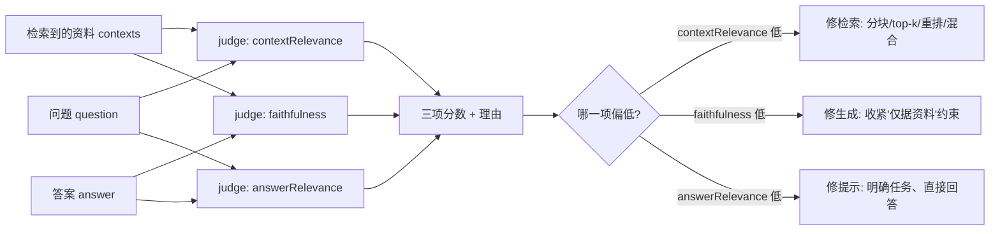
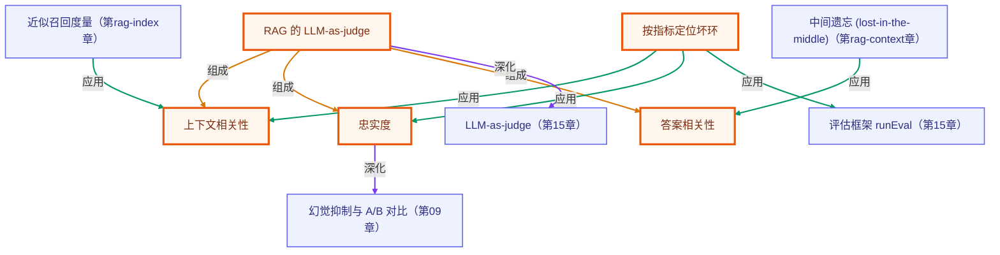

# 进阶 RAG · 05 · RAG 评估：三指标定位坏在哪一环

> 所属：进阶 RAG 专题 · 用三个独立分数把「RAG 答得不好」拆解成「坏在检索 / 生成 / 切题哪一环」
> 预计用时：50 分钟 | 难度：⭐⭐⭐
> 全局导航：[课程导航](../../docs/navigation.md) · [完整大纲](../../docs/curriculum.md) · [知识图谱](../../docs/knowledge-graph.md)

## 学习目标

学完本章你能够：

- [ ] 说清 RAG 评估为什么要**拆成多指标**：一个「好不好」的总分无法告诉你该去修哪一环。
- [ ] 解释三个核心指标各自体检哪一环：**contextRelevance（检索）/ faithfulness（生成忠实度）/ answerRelevance（切题）**。
- [ ] 用 **LLM-as-judge** 给一次问答打分，并读懂分数 + 理由。
- [ ] 通过 **A/B 对照**（健康 vs 故意做坏）亲眼看到「三分如何分别指向不同病灶」。
- [ ] 知道这套离线指标怎么接回[第 15 章的 eval 集](../../lessons/15-evaluation-and-testing/README.md)做回归。

## 前置知识

- 已读 [第 08 章 · Embedding 与向量检索](../../lessons/08-embeddings-and-vector-search/README.md) 与 [第 09 章 · 从零实现 RAG](../../lessons/09-rag-from-scratch/README.md)（理解检索→增强→生成全流程）。
- 已读 [第 15 章 · 评估与测试](../../lessons/15-evaluation-and-testing/README.md) 更佳（理解 LLM-as-judge 与 eval 集；本章是它在 RAG 上的专门化）。
- 已配好 `.env`：embedding 走 OpenAI（需 `OPENAI_API_KEY`），裁判与生成走 `LLM_PROVIDER` 指定的厂商。

## 三层学习路线

| 层级 | 学习目标 | 你要完成什么 |
|------|----------|--------------|
| 极简 | 跑通一次 `evaluateRag`，拿到三项分数与理由。 | 能说出每个分数在体检「哪一环」。 |
| 进阶 | 理解「三分各管一环、互不替代」。 | 解释为什么一个答非所问的答案可能 faithfulness 不低，却 answerRelevance 很低。 |
| 真实实践 | 把三指标变成可回归的质量门槛。 | 设计一组固定问答，定期跑评估，分数跌破阈值就报警。 |

---

## 图解学习地图

> 读图顺序：先看本章主线，再回到代码走读。核心焦点：**把一次问答拆成三路独立裁判，定位坏环**。



### 原理展开

- RAG 是一条**多环链路**（检索 → 增强 → 生成）。任意一环坏了，最终答案都会差，但「答案差」这一个信号无法区分是哪一环的锅。
- 把评估拆成三个**只看一环输入**的裁判，就能把「答案差」翻译成「检索没找对 / 模型乱编 / 答非所问」之一，从而知道该改哪里。
- 这三项裁判都用 **LLM-as-judge**：让另一个模型按明确标准打 0~1 分并给一句理由。它的输入组合刻意不同：
  - contextRelevance 只看 (问题, 资料) —— 资料能支撑回答这个问题吗？**坏 → 检索环**。
  - faithfulness 只看 (资料, 答案) —— 答案里的事实都能在资料里找到依据吗？**坏 → 生成环（在臆造）**。
  - answerRelevance 只看 (问题, 答案) —— 有没有直接、切题地回答？**坏 → 提示/任务环**。

### 本章和整条路径的关系

本章把[第 15 章](../../lessons/15-evaluation-and-testing/README.md)的「LLM-as-judge」专门化到 RAG 三指标，是[第 03 章重排](../03-reranking/README.md)、[第 01 章分块](../01-chunking-strategies/README.md)等优化动作的「验收尺子」——没有它，你只能凭感觉调参。

---

## 一、原理：为什么一个总分不够用

设想 RAG 答错了。可能的原因至少有三类，且**修法完全不同**：

```
问题 ──▶ [检索] ──▶ 资料 ──▶ [增强+生成] ──▶ 答案
            │                      │
       检索没找对           模型拿着对的资料
       (该调分块/topk/重排)  乱编 或 答非所问
                            (该收紧约束/改提示)
```

如果只有一个「整体好不好」的分数，三种病灶都表现为「分数低」，你根本不知道该去动检索还是动提示。**把分数按链路环节拆开**，每一项只盯一个可能的故障点，低分就直接指向要修的地方——这正是 RAGAS 等 RAG 评估框架的核心设计。

本章实现的 `evaluateRag` 返回三项 0~1 的分数 + 各自一句理由：

- `contextRelevance`：检索到的资料与问题的相关度。**只用 (问题, 资料)**。
- `faithfulness`：答案对资料的忠实度（有没有臆造）。**只用 (资料, 答案)**。
- `answerRelevance`：答案对问题的切题度。**只用 (问题, 答案)**。

> 关键直觉：一个**答非所问但没编造**的答案（比如你问价格、它认真介绍了吉祥物），faithfulness 可能不低（它确实忠于某段资料），但 answerRelevance 会很低。三分分开看，才能区分「忠实」「切题」「检索对」是三件不同的事。

---

## 二、代码走读

完整代码见 [`index.ts`](./index.ts)。核心就是「建索引 → 跑 A/B 两次问答 → 各自 `evaluateRag` → 并排打报告」。

### 1) 评估一次问答：`evaluateRag`

三项裁判并行执行，返回分数与理由（实现见 `src/shared/rag/evaluate.ts`）：

```ts
import { asRetriever, answerWithRag, evaluateRag } from "../../src/shared/rag";

const good = await answerWithRag({ query: question, retriever, k: 3 });
const goodScores = await evaluateRag({
  question,
  answer: good.answer,
  contexts: good.contexts, // 用实际检索到的片段评估「检索」环
});
// goodScores = { contextRelevance, faithfulness, answerRelevance, reasons:{...} }
```

### 2) A/B 对照：故意把「检索」和「切题」做坏

B 组手工构造两类病灶——喂给评估的 `contexts` 换成全无关的噪声片段（检索坏），答案故意答吉祥物而非价格（切题坏）：

```ts
const badAnswer = "云笺笔记的吉祥物是一只名叫「墨墨」的小水獭……"; // 答非所问
const badScores = await evaluateRag({
  question,
  answer: badAnswer,
  contexts: IRRELEVANT_CONTEXTS, // 全是无关噪声
});
// 预期：contextRelevance↓（检索坏）、answerRelevance↓（切题坏），faithfulness 未必低
```

### 3) 把分数读成「体检报告」

低于 0.6 标黄/红，一眼定位坏环（见 `printReport`）：每一项后面跟着裁判给的理由，便于人工复核分数是否可信。

---

## 三、运行

```bash
# 需要 OPENAI_API_KEY（embedding）；裁判与生成走 .env 的 LLM_PROVIDER
npx tsx rag-advanced/05-rag-evaluation/index.ts
```

预期输出：建索引条数 → A 组答案与实际检索片段 → B 组的坏答案与噪声上下文 → **两份三指标体检报告并排**（A 组三分偏高；B 组 contextRelevance 与 answerRelevance 明显偏低）→ 「怎么读这三个分数」的对照说明。

> 注：LLM 评分有波动，分数不必逐次完全一致；要看的是**相对关系**——B 组的检索/切题项应显著低于 A 组。

---

## 四、练习

1. **改坏 B 组的不同环**：把 B 组改成「资料对、但答案编造一个资料里没有的价格」，观察这次是 `faithfulness` 掉下来而非 `answerRelevance`，体会三分各管一环。
2. **做成 eval 集**：把 3~5 个固定问题 + 期望来源整理成数组，循环跑 `answerWithRag` + `evaluateRag`，打印每题三分与平均分——这就是[第 15 章](../../lessons/15-evaluation-and-testing/README.md) eval 集在 RAG 上的形态。
3. **设阈值告警**：当任一平均分跌破 0.6 时让进程以非零码退出（`process.exitCode = 1`），把它接进 CI 做回归门槛。
4. **对比检索策略**：分别用第 09 章的 `MemoryVectorStore` 与[第 02 章的混合检索](../02-hybrid-search/README.md)做 retriever，比较 `contextRelevance` 是否提升——用分数证明「混合检索更好」。
5. **换裁判模型**：给 `evaluateRag` 传一个更小/更大的 `llm`，看裁判一致性如何变化，理解「裁判本身也需要被信任」。

---

<!-- KG:START (由 npm run kg 自动生成，勿手改本标记区) -->

## 知识图谱与延伸阅读

> 本节由 `npm run kg` 自动生成（数据源 `knowledge-graph/data/graph.ts`）。要增删请改数据源后重跑。

### 本章概念图谱

> 节点：**橙框**=本章概念，蓝框=关联的其他章概念。连线按关系类型着色：前置(蓝) · 深化(紫) · 对比(玫红) · 应用(绿) · 组成(橙)。



### 与其他章节的关系

- `RAG 的 LLM-as-judge` —**深化**→ `LLM-as-judge`（第 15 章）
- `忠实度` —**深化**→ `幻觉抑制与 A/B 对比`（第 09 章）
- `按指标定位坏环` —**应用**→ `评估框架 runEval`（第 15 章）
- `近似召回度量` —**应用**→ `上下文相关性`（第 rag-index 章）
- `中间遗忘 (lost-in-the-middle)` —**应用**→ `答案相关性`（第 rag-context 章）

### 延伸阅读

- [RAGAS: Automated Evaluation of Retrieval Augmented Generation](https://arxiv.org/abs/2309.15217) — RAG 评估指标 (faithfulness / context & answer relevance) 的代表性论文，本章三指标的来源 `paper`

> 🗺️ 在[全局知识图谱](../../docs/knowledge-graph.md) / [交互式图谱](../../knowledge-graph/output/index.html) 中查看本章位置。

<!-- KG:END -->

## 五、小结与延伸

- RAG 评估的关键不是「打一个总分」，而是**按链路环节拆分**：contextRelevance 管检索、faithfulness 管生成忠实、answerRelevance 管切题。
- 三分**互不替代**：忠实 ≠ 切题 ≠ 检索对；只有分开看才能定位该修哪一环。
- 这套离线指标天然适合做**回归门槛**：固定问答 + 定期评分 + 阈值告警，把质量退化挡在上线前。
- 上一章 [04 · 查询改写](../04-query-transformation/README.md) 优化召回；下一章 [06 · 生产化 RAG](../06-production-rag/README.md) 把分块/混合/精排/评估组装成接近生产的全链路。再往后是 [RAG 系统实战项目](../../docs/rag-system-project.md)。

> 💡 **面试会问**：RAG 怎么评估？faithfulness 和 answer relevance 有什么区别？检索质量差和生成幻觉，分别用哪个指标定位？为什么用 LLM-as-judge 而不是规则评分？
