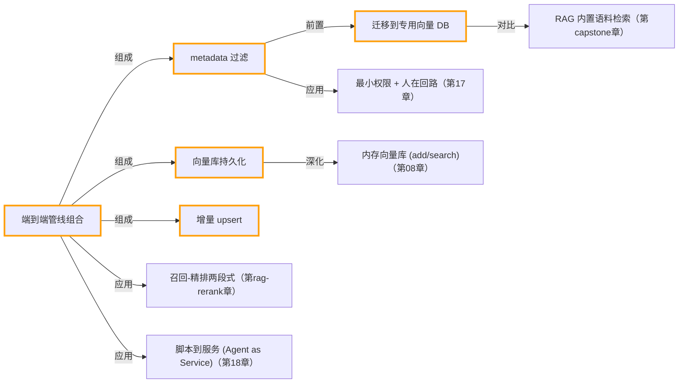

# 生产化 RAG：过滤、持久化、增量与全链路

> 所属：进阶 RAG 专题 · 把零散进阶能力组装成一条接近生产的 RAG 链路
> 预计用时：50 分钟 | 难度：⭐⭐⭐
> 全局导航：[课程导航](../../docs/navigation.md) · [完整大纲](../../docs/curriculum.md) · [知识图谱](../../docs/knowledge-graph.md)

## 学习目标

学完本章你能够：

- [ ] 用 `metadata.tenant` 给文档打标签，并用 `search` 的 `filter` 谓词实现**按租户/权限隔离检索**。
- [ ] 用 `toJSON()` / `fromJSON()` 持久化向量库，理解「**为什么持久化能省下重复 embedding 的钱**」。
- [ ] 用 `upsert()` 按 `id` **增量更新**单条文档，只为变更项重新付费向量化。
- [ ] 用 `asRetriever()` + `answerWithRag({ rerank: true })` 串起**召回 → 精排 → 带引用生成**的全链路。
- [ ] 说清这四件事各自解决了生产里的什么问题（成本、权限、时效、可溯源）。

## 前置知识

- 已读 [第 08 章 · Embedding 与向量检索](../../lessons/08-embeddings-and-vector-search/README.md)：理解 embedding、余弦相似度、向量库。
- 已读 [第 09 章 · 从零实现 RAG](../../lessons/09-rag-from-scratch/README.md)：跑通过「分块 → 入库 → 检索 → 拼 prompt → 生成」最小闭环。
- 已按 [环境搭建](../../docs/setup.md) 配好 `.env`。注意：**embedding 默认走 OpenAI**，本章需要 `OPENAI_API_KEY`（生成与精排可继续用 Claude 或 OpenAI）。

## 三层学习路线

| 层级 | 学习目标 | 你要完成什么 |
|------|----------|--------------|
| 极简 | 跑通本章五步 demo。 | 看懂「持久化 / 增量 / 过滤 / 全链路」分别对应输出里的哪一段。 |
| 进阶 | 理解每个能力背后的生产权衡。 | 解释持久化省了什么钱、过滤把安全边界放在了哪一层、精排为什么要先宽召回。 |
| 真实实践 | 对照生产级知识库项目。 | 把本章链路映射到 [docs/rag-system-project.md](../../docs/rag-system-project.md)：入库服务、权限隔离、检索服务、可观测性。 |

---

## 图解学习地图

> 读图顺序：先顺着这条数据流过一遍，再回到「代码走读」对照五个步骤。核心焦点：**把进阶能力组装成可长期运行、可隔离、可溯源的链路**。

```mermaid
flowchart LR
  A["带 metadata.tenant 的语料"] -->|add| B["MemoryVectorStore"]
  B -->|toJSON| C["临时文件<br/>os.tmpdir"]
  C -->|fromJSON 不重嵌| D["省钱副本 store"]
  D -->|upsert by id| E["增量更新一条"]
  E -->|search k + filter by tenant| F["仅租户 A 的命中"]
  F -->|asRetriever + recallK| G["宽召回候选"]
  G -->|llmRerank 精排| H["top-k 片段"]
  H -->|answerWithRag| I["带 [片段 N] 引用的答案"]
```



---

## 一、原理：从「能跑」到「能上线」缺的那几块

第 09 章的 RAG 已经能回答私有知识了，但它离生产还差四件事。本章把这四件事补齐，且全部建立在同一个 `MemoryVectorStore` 上、向后兼容。

**1）持久化：embedding 是要花钱的网络调用，不能每次重启都重算。**

```
启动 → add(文档) → 调 embedding API（花钱、耗时）→ 内存里的向量
                                    ↑
重启后这些向量就没了，下次又得重新调一遍 API ——纯属浪费
```

`toJSON()` 把「**算好的向量 + 文本 + metadata**」一起序列化；`fromJSON()` 只解析 JSON、重建内存结构，**不会再触发任何 embedding 调用**。这就是「持久化 = 省下重复 embedding 的钱」的本质。生产里这个 JSON 会换成 pgvector / Qdrant 等向量库，但「向量算一次、存起来反复用」的思路完全一样。

**2）增量 upsert：知识库天天在变，整库重嵌又慢又贵。**

`upsert(items)` 按 `id` 命中就覆盖、没命中就插入，**只对传入的这几条重新向量化**。改一条文档就只为这一条付费，而不是把整库重算一遍。

**3）metadata 过滤：多租户 / 权限场景下，安全边界要放在检索层。**

```
search(query, k, { filter })  的执行顺序：
  先按 filter 谓词筛出子集  →  再在子集里算相似度、取 top-k
  ↑ 安全边界在这里：B 租户的文档根本进不了候选集
```

把隔离做在**检索阶段**（先筛子集再排序），而不是寄希望于大模型「看到了但别说出来」——后者随时可能被一句 prompt 绕过。本章 demo 会断言：过滤后命中里绝不出现别的租户。

**4）精排：先宽召回再精排，把最相关的片段顶到前面。**

`answerWithRag({ rerank: true })` 会先用 `recallK`（默认 `k*3`）宽召回，再用 LLM 精排到 `k` 条注入生成。召回保证「不漏」，精排保证「准」，最后生成阶段要求「仅据资料作答 + 标注 [片段 N]」，答案因此**可溯源、抗幻觉**。

## 二、代码走读

完整代码见 [./index.ts](./index.ts)，按 demo 五步拆解。

**① 入库带 metadata：** 语料是一个数组常量（A/B 两个租户、数字均为虚构），每条带 `metadata.tenant`。

```ts
await store.add(CORPUS); // CORPUS[i].metadata = { tenant: "A" | "B" }
```

**② 持久化：** `toJSON()` 写到 `os.tmpdir()` 下的临时文件，再 `fromJSON()` 读回。注意读回用的是 `readFileSync`，整条链路没有第二次 embedding。

```ts
const snapshotPath = join(tmpdir(), "agent-build-rag-store.json");
writeFileSync(snapshotPath, store.toJSON(), "utf-8");
const reloaded = MemoryVectorStore.fromJSON(readFileSync(snapshotPath, "utf-8"));
```

**③ 增量 upsert：** 用相同 `id`（`A-pricing`）覆盖旧文档，文档总数不变 —— 这是「更新」而非「新增」的证据。

```ts
await reloaded.upsert([
  { id: "A-pricing", text: "（虚构）……2025Q3 新价：每席位每月 218 元……", metadata: { tenant: "A" } },
]);
```

**④ 过滤检索：** `filter` 谓词只放行租户 A，并断言没有跨租户泄漏。注意 `metadata` 是 `Record<string, unknown>`，取字段用 `doc.metadata?.["tenant"]`（开启了 `noUncheckedIndexedAccess`，可选链 + 索引签名访问更安全）。

```ts
const hits = await reloaded.search(query, 3, {
  filter: (doc) => doc.metadata?.["tenant"] === "A",
});
const leaked = hits.some((hit) => hit.doc.metadata?.["tenant"] !== "A");
```

**⑤ 全链路生成：** `asRetriever(store)` 把向量库适配成统一 `Retriever`，`rerank: true` 开启「先宽召回（`recallK`）再精排到 `k`」，输出 `answer` + 实际注入的 `contexts`（顺序与答案里的 `[片段 N]` 一致）。

```ts
const result = await answerWithRag({
  query, retriever: asRetriever(reloaded),
  k: 2, recallK: 4, rerank: true,
  systemPreamble: "你是租户 A 的内部知识库助手，只回答租户 A 的问题。",
});
```

## 三、运行

```bash
npx tsx rag-advanced/06-production-rag/index.ts
```

需要的 key：

- `OPENAI_API_KEY`：**必需**。`add` / `upsert` / `search` 的向量化默认走 OpenAI embedding。
- 生成 + 精排走 `getLLM()`：用 Claude 还是 OpenAI 取决于你的 `.env` 配置（见 [setup.md](../../docs/setup.md)）。

预期输出（五个分隔区块）：

1. 入库 5 条文档；
2. 打印临时文件路径与字节数，并提示「从磁盘载回 5 条、重启不重嵌」；
3. upsert 后提示「文档总数仍为 5（覆盖而非新增）」；
4. 检索命中**全部是 `[A] xxx`**，并打印「过滤生效：没有跨租户泄漏」；
5. 输出一段**带 `[片段 N]` 引用的中文答案**（应包含「218 元 / 满 30 席位」这类升级后的新价），随后列出注入的引用片段与 token 用量。

> 临时文件写在 `os.tmpdir()` 下，跑完保留无妨（系统会自行清理），不会污染仓库。

## 四、练习

1. **观察增量生效：** 把 `upsert` 改回原价（188 元 / 满 50 席位），重新运行，确认答案随之变化 —— 证明生成用的是检索到的当前数据，而非模型记忆。
2. **制造跨租户泄漏：** 把第 ④ 步的 `filter` 去掉，再问租户 A 的问题，看看 B 租户的「夜莺 ERP」资料会不会混进命中；体会「过滤即权限边界」。
3. **关掉精排对比：** 把 `rerank` 设为 `false`、`k` 调大到 4，对比答案引用的片段是否变多、是否引入噪声；思考 `recallK` 与 `k` 的取舍。
4. **持久化省钱验证：** 在 `fromJSON` 后打印 `reloaded.size`，并思考：如果这里改成重新 `add(CORPUS)` 会多花几次 embedding 调用？
5. **加一个 `category` 维度：** 给语料再加 `metadata.category`（如 `pricing` / `sla`），写一个组合 `filter`（同时满足 `tenant === "A"` 且 `category === "sla"`），体会多维过滤。

<!-- KG:START (由 npm run kg 自动生成，勿手改本标记区) -->

## 知识图谱与延伸阅读

> 本节由 `npm run kg` 自动生成（数据源 `knowledge-graph/data/graph.ts`）。要增删请改数据源后重跑。

### 本章概念图谱



### 与其他章节的关系

- `端到端管线组合` —**应用**→ `召回-精排两段式`（第 rag-rerank 章）
- `metadata 过滤` —**应用**→ `最小权限 + 人在回路`（第 17 章）
- `向量库持久化` —**深化**→ `内存向量库 (add/search)`（第 08 章）
- `端到端管线组合` —**应用**→ `脚本到服务 (Agent as Service)`（第 18 章）
- `迁移到专用向量 DB` —**对比**→ `RAG 内置语料检索`（第 capstone 章）

### 延伸阅读

- [pgvector — open-source vector similarity search for Postgres](https://github.com/pgvector/pgvector) — 最常见的生产持久化向量库，迁移目标之一，对照本章 MemoryVectorStore 接口 `doc`

> 🗺️ 在[全局知识图谱](../../docs/knowledge-graph.md) / [交互式图谱](../../knowledge-graph/output/index.html) 中查看本章位置。

<!-- KG:END -->

## 五、小结与延伸

要点回顾：

- **持久化** = 向量算一次、存起来反复用，省下重复 embedding 的钱（`toJSON` / `fromJSON` 不重嵌）。
- **增量 upsert** = 按 `id` 只为变更项付费，知识库变动时不必整库重建。
- **metadata 过滤** = 先筛子集再排序，把权限/租户隔离做在检索层，而非依赖大模型自觉。
- **全链路** = `asRetriever` + `answerWithRag({ rerank })` 把召回、精排、带引用生成串成一个函数。

延伸阅读：

- 相邻进阶章节：本专题前置的分块、BM25、混合检索、查询改写、精排、评估能力都沉淀在 `src/shared/rag`，可与本章自由组合。
- 生产蓝图：[docs/rag-system-project.md](../../docs/rag-system-project.md) —— 把本章链路扩展为入库服务、权限隔离、检索服务与可观测性。

> 💡 面试会问：
> - 「RAG 怎么做多租户隔离？」—— 在检索层用 metadata 过滤先筛子集，安全边界不依赖大模型。
> - 「知识库更新了怎么办，要重建整个向量库吗？」—— 不用，按 id `upsert` 只重嵌变更项。
> - 「embedding 很贵，怎么省？」—— 向量算好后持久化（`toJSON`/`fromJSON` 或换成 pgvector），重启复用不重算。
> - 「rerank 为什么要先召回更多再精排？」—— 召回保召回率（不漏），精排保精确率（准），两阶段各司其职。
