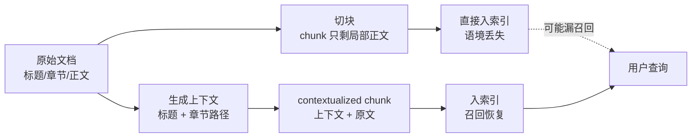
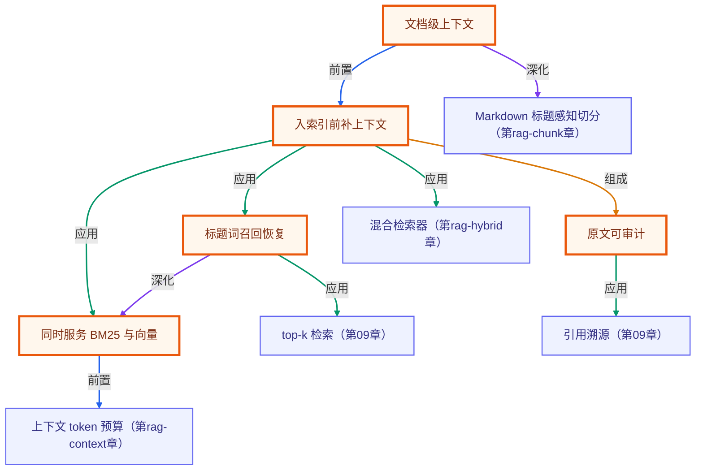

# Contextual Retrieval：给 chunk 补文档上下文

> 所属：进阶 RAG 专题 · 检索前让孤立片段重新带上出处语境
> 预计用时：30 分钟 | 难度：⭐⭐⭐
> 全局导航：[课程导航](../../docs/navigation.md) · [完整大纲](../../docs/curriculum.md) · [知识图谱](../../docs/knowledge-graph.md)

## 学习目标

- [ ] 说清 **Contextual Retrieval**：在 embedding/BM25 入索引前，先给每个 chunk 补「文档标题、章节路径、局部摘要」等上下文。
- [ ] 理解为什么孤立 chunk 会丢语境：chunk 只保留一句话时，检索词可能只存在于标题或上级章节里。
- [ ] 用 `contextualizeChunk()` 把原文包成「上下文 + 原文」两段，保证不改写原始事实。
- [ ] 用运行时对照证明：原始 chunk 漏召回，补上下文后命中目标片段。

## 前置知识

- 已读 [第 01 章 · 进阶分块策略](../01-chunking-strategies/README.md)：知道 chunk 如何从文档切出来。
- 已读 [第 02 章 · 混合检索](../02-hybrid-search/README.md)：知道 BM25 与向量召回各有盲区。
- 本章 demo 是纯函数 + BM25，对照收益离线确定，**无需任何 API key**。

## 图解学习地图



## 原理

很多 chunk 是从大文档里切出来的。切出来后，它可能只剩一句局部事实：

> 超过 90 天未访问后转入冷存储，默认 365 天后永久删除。

这句话本身没有「云笺」「数据生命周期」「删除规则」这些上级标题词。用户搜「云笺 数据生命周期 删除规则」时，原始 chunk 就可能输给一个字面更像但主题不对的干扰项。

Contextual Retrieval 的做法是在入索引前把上下文补回去：

```ts
const contextual = contextualizeChunk({
  id: "target-retention",
  documentTitle: "云笺数据生命周期与删除规则",
  sectionPath: "治理 > 生命周期",
  text: "超过 90 天未访问后转入冷存储，默认 365 天后永久删除。",
});
```

注意：这不是让模型“编摘要”。本章用确定性方式补标题和章节路径，原文仍完整保留，所以结论可离线验证。

## 运行

```bash
npx tsx rag-advanced/07-contextual-retrieval/index.ts
```

预期看到三条核对：

- 原始 chunk top1 被账号删除干扰项抢走；
- 补上下文后 top1 命中目标生命周期片段；
- contextualized text 保留原文，不改写事实。

## 练习

1. 把 query 改成「365 天后删除」，观察原始 chunk 是否也能命中，理解 contextual retrieval 主要解决哪类“标题词缺失”问题。
2. 删除 `documentTitle` 里的「生命周期」，观察 top1 是否再次变化。
3. 把 `contextualizeChunk()` 改成只加标题不加章节路径，比较标题和章节各自贡献。

## 小结

- Contextual Retrieval 解决的是「chunk 被切出来后丢了文档级语境」。
- 最保守的上下文来自标题、章节路径、metadata；它们不改写事实，适合先做成确定性管线。
- 生产中可以进一步用 LLM 生成短上下文，但必须把“生成上下文”与“原始正文”分开保存、可审计。

<!-- KG:START (由 npm run kg 自动生成，勿手改本标记区) -->

## 知识图谱与延伸阅读

> 本节由 `npm run kg` 自动生成（数据源 `knowledge-graph/data/graph.ts`）。要增删请改数据源后重跑。

### 本章概念图谱

> 节点：**橙框**=本章概念，蓝框=关联的其他章概念。连线按关系类型着色：前置(蓝) · 深化(紫) · 对比(玫红) · 应用(绿) · 组成(橙)。



### 与其他章节的关系

- `文档级上下文` —**深化**→ `Markdown 标题感知切分`（第 rag-chunk 章）
- `入索引前补上下文` —**应用**→ `混合检索器`（第 rag-hybrid 章）
- `标题词召回恢复` —**应用**→ `top-k 检索`（第 09 章）
- `原文可审计` —**应用**→ `引用溯源`（第 09 章）
- `同时服务 BM25 与向量` —**前置**→ `上下文 token 预算`（第 rag-context 章）

### 延伸阅读

- [Introducing Contextual Retrieval](https://www.anthropic.com/news/contextual-retrieval) — Anthropic 官方：上下文化分块 + 向量与 BM25 混合 + 重排的实战配方，进阶 RAG 必读 `blog`

> 🗺️ 在[全局知识图谱](../../docs/knowledge-graph.md) / [交互式图谱](../../knowledge-graph/output/index.html) 中查看本章位置。

<!-- KG:END -->
