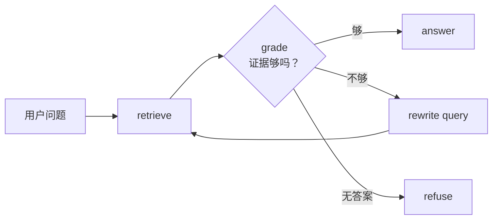
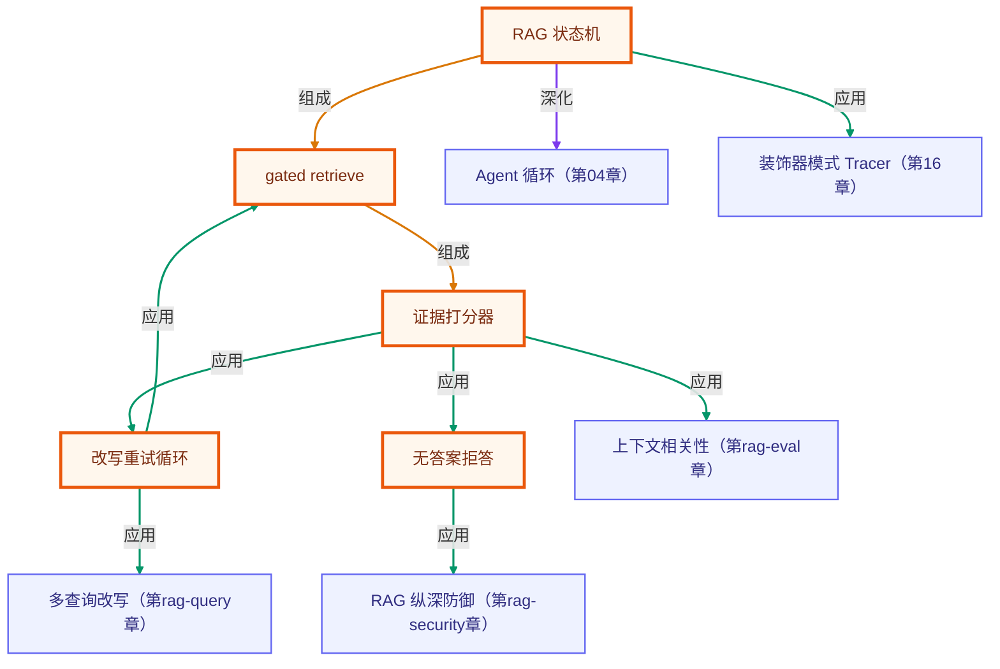

# Agentic RAG：带检索打分与重试的 RAG 循环

> 所属：进阶 RAG 专题 · 一次检索不够时，让系统自己判断是否要重试
> 预计用时：35 分钟 | 难度：⭐⭐⭐
> 全局导航：[课程导航](../../docs/navigation.md) · [完整大纲](../../docs/curriculum.md) · [知识图谱](../../docs/knowledge-graph.md)

## 学习目标

- [ ] 说清 **Agentic RAG**：不是检索一次就回答，而是检索后先判断证据是否足够。
- [ ] 理解 gated retrieve：命中相关证据才进入回答，否则改写 query 后重试。
- [ ] 理解无答案拒答：golden set 或判断器认为资料无答案时，应拒答而不是硬编。
- [ ] 用 `runAgenticRetrieval()` 跑通 `retrieve → grade → rewrite → re-retrieve` 状态机。

## 前置知识

- 已读 [第 04 章 · 查询改写](../04-query-transformation/README.md)：知道 query 可以被改写成更接近资料的形式。
- 已读 [第 05 章 · RAG 评估](../05-rag-evaluation/README.md)：知道检索结果需要用指标或判断器验收。
- 本章 demo 是纯函数 + BM25 + golden set，对照收益离线确定，**无需任何 API key**。

## 图解学习地图



## 原理

普通 RAG 常见写法：

```text
query -> top-k -> prompt -> answer
```

问题是 top-k 可能没找对，模型仍然会被迫回答。Agentic RAG 把「检索是否足够」变成显式 gate：

1. **retrieve**：先用当前 query 检索；
2. **grade**：判断候选是否包含相关证据；
3. **rewrite**：证据不足则改写 query；
4. **re-retrieve**：用新 query 再检索；
5. **answer/refuse**：命中证据才回答，无答案就拒答。

本章为了离线确定，把 `gradeRetrieval()` 写成 golden-set 判断：命中标注相关 id 就回答，否则重试；标注无答案则拒答。生产中可以把 grade 换成 LLM judge 或 cross-encoder，但状态机边界相同。

## 运行

```bash
npx tsx rag-advanced/08-agentic-rag/index.ts
```

预期看到：

- 首轮「坏了咋办」没有命中 SLA 证据；
- 系统改写为「SLA 可用性 补偿 服务积分 事故 申诉」；
- 二轮命中 `sla-compensation`，允许回答；
- 无答案问题进入 refuse 分支。

## 练习

1. 把 `maxAttempts` 改成 `1`，观察系统会拒答而不是硬答。
2. 给 `rewriteForAgenticRetrieval()` 增加「登录」改写，验证 `auth-sso` 能被二轮命中。
3. 把 `expectedRelevantIds` 改错，观察 gate 如何阻止回答。

## 小结

- Agentic RAG 的核心是检索后的控制流，而不是“多调用几次模型”。
- `grade` 是系统安全阀：证据不足就 retry，无答案就 refuse。
- 状态机可用纯函数先做教学版，再把 grader/rewrite 换成 LLM 或 reranker。

<!-- KG:START (由 npm run kg 自动生成，勿手改本标记区) -->

## 知识图谱与延伸阅读

> 本节由 `npm run kg` 自动生成（数据源 `knowledge-graph/data/graph.ts`）。要增删请改数据源后重跑。

### 本章概念图谱

> 节点：**橙框**=本章概念，蓝框=关联的其他章概念。连线按关系类型着色：前置(蓝) · 深化(紫) · 对比(玫红) · 应用(绿) · 组成(橙)。



### 与其他章节的关系

- `改写重试循环` —**应用**→ `多查询改写`（第 rag-query 章）
- `证据打分器` —**应用**→ `上下文相关性`（第 rag-eval 章）
- `无答案拒答` —**应用**→ `RAG 纵深防御`（第 rag-security 章）
- `RAG 状态机` —**深化**→ `Agent 循环`（第 04 章）
- `RAG 状态机` —**应用**→ `装饰器模式 Tracer`（第 16 章）

### 延伸阅读

- [Self-RAG: Learning to Retrieve, Generate, and Critique through Self-Reflection](https://arxiv.org/abs/2310.11511) — 把检索、生成、批判做成可控循环的代表论文，对应本章 gated retrieve / grade / retry 思想 `paper`
- [Corrective Retrieval Augmented Generation](https://arxiv.org/abs/2401.15884) — CRAG 用检索评估触发纠错与补充检索，对应本章证据不足就改写重试的控制流 `paper`

> 🗺️ 在[全局知识图谱](../../docs/knowledge-graph.md) / [交互式图谱](../../knowledge-graph/output/index.html) 中查看本章位置。

<!-- KG:END -->
