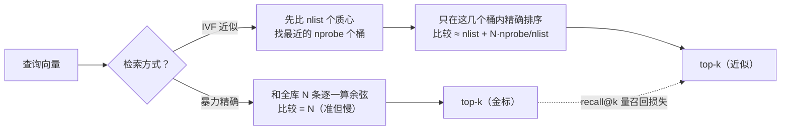
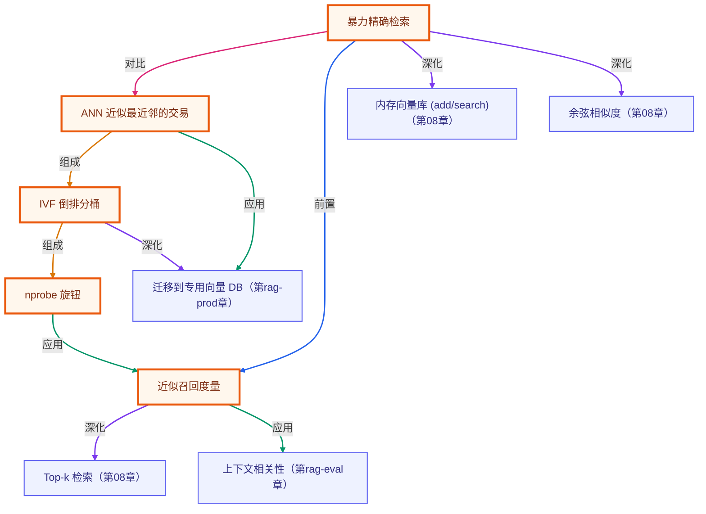

# 向量索引内部机制：从全库暴力扫描到分桶近似检索

> 所属：进阶 RAG 专题 · 用一点点召回损失，换数量级的比较次数下降
> 预计用时：35 分钟 | 难度：⭐⭐⭐
> 全局导航：[课程导航](../../docs/navigation.md) · [完整大纲](../../docs/curriculum.md) · [知识图谱](../../docs/knowledge-graph.md)

## 学习目标

学完本章你能够：

- [ ] 说清一句话：**第 08 章的 `MemoryVectorStore.search` 是「暴力精确检索」**——每次查询都和全库每一条算余弦，比较次数恒等于库大小 N。
- [ ] 解释 ANN（近似最近邻）的核心交易：**用可控的召回损失，换数量级的比较次数下降**。
- [ ] 看懂 IVF（倒排文件 / 粗量化）的两步：先聚类分桶，查询时只比「最近的 nprobe 个桶」。
- [ ] 理解 `nprobe` 这个旋钮：小 = 快但可能漏，大 = 准但接近全扫；`nprobe = nlist` 时退化为暴力精确（还多花了质心扫描）。
- [ ] 用**暴力结果当金标**、`recall@k` 当尺子，把「ANN 到底漏没漏」从「感觉」变成「实测」。

## 前置知识

- 已读 [第 08 章 · Embedding 与向量检索](../../lessons/08-embeddings-and-vector-search/README.md)（知道余弦相似度、top-k 检索、`MemoryVectorStore`）。本章解释那条 `search` 在大规模下为什么慢、生产怎么提速。
- 已读 [第 05 章 · RAG 评估三指标](../05-rag-evaluation/README.md) 或了解 `recall@k`（本章用它量「近似漏了多少」）。
- 本章 demo 是**纯函数 + 合成确定向量**，无需任何 API key 即可运行（见下文「三、运行」）。

## 三层学习路线

| 层级 | 学习目标 | 你要完成什么 |
|------|----------|--------------|
| 极简 | 跑通 demo，看懂「比较次数」和「召回」随 nprobe 怎么变。 | 能指着输出说出「小 nprobe 省算但漏一点，大 nprobe 准但变贵」。 |
| 进阶 | 理解暴力为什么是 O(N)、IVF 为什么能把比较次数降到 ≈ nlist + N·nprobe/nlist。 | 解释分桶如何缩小候选集合，以及召回损失从哪来。 |
| 真实实践 | 把直觉映射到生产向量库（pgvector 的 IVFFlat、FAISS 的 IVF/HNSW）。 | 能说清生产里 `lists`/`probes`、`m`/`efSearch` 这些参数对应本章的什么旋钮。 |

---

## 图解学习地图

> 读图顺序：先看一条查询如何「先比质心、再只钻几个桶」，再回到「二、代码走读」。核心焦点：**索引的本质是缩小要比较的集合**。



---

## 一、原理：索引就是「想办法少比较」

向量检索的内核很朴素：给一个查询向量，找出库里余弦最相近的 k 条。第 08 章的实现是**暴力精确**：

```
for 每条文档向量 in 全库:        ← N 次余弦比较
    score = cosine(query, 文档)
排序，取 top-k
```

库里 1 万条就比 1 万次，100 万条就比 100 万次——**比较次数 = N，随库线性增长**。库一大，每次查询都全扫一遍就太慢。

ANN（Approximate Nearest Neighbor，近似最近邻）换个思路：**别和所有人比，只和「可能是答案」的一小撮比**。代价是偶尔漏掉真正的最近邻（召回 < 1），收益是比较次数从 N 降一两个数量级。这是一桩**有意识的交易**，不是 bug。

### IVF：先分桶，查询只钻几个桶

IVF（Inverted File，倒排文件 / 粗量化）是最好理解的一种 ANN：

1. **建索引（离线一次）**：把全库向量聚成 `nlist` 个簇，每簇一个质心（centroid），每条向量归到最近的质心 → 形成 `nlist` 个「桶」。
2. **查询（在线每次）**：先把查询和 `nlist` 个**质心**比，挑出最近的 `nprobe` 个桶；**只在这几个桶里**做精确比较、排序取 top-k。

比较次数 ≈ `nlist`（质心扫描）+ `N · nprobe / nlist`（探到的桶里的向量数）。当 `nprobe ≪ nlist`，这远小于 N。

### nprobe：那个唯一的旋钮

- `nprobe` 小 → 钻的桶少 → 比较少（快）→ 但更可能漏掉「恰好落在邻桶」的最近邻（召回低）。
- `nprobe` 大 → 钻的桶多 → 比较多（慢）→ 召回高。
- `nprobe = nlist` → 钻所有桶 → 候选 = 全库 → **退化为暴力精确**（召回 = 1），但比暴力还多扫了 `nlist` 个质心，**反而更贵**。

所以 ANN 真正省算的区间是 `nprobe ≪ nlist`。**召回随 nprobe 单调升、比较次数随 nprobe 单调升**——这两条由构造保证，demo 会现场核对。

> 生产里的对应：pgvector 的 `IVFFlat` 用 `lists`(=nlist) / `probes`(=nprobe)；FAISS 的 `IVF`、图索引 `HNSW` 用 `efSearch` 控制同一种「查得多准 vs 查得多快」的取舍。参数名不同，旋钮是同一个。

---

## 二、代码走读

完整实现见 [`../../src/shared/rag/annIndex.ts`](../../src/shared/rag/annIndex.ts)，demo 见 [`index.ts`](./index.ts)。所有随机性走**带种子的 PRNG**，因此结果完全可复现。

### 1) 合成确定向量（为什么不用真 embedding）

```ts
const { vectors, centers } = makeSyntheticCorpus({ clusters: 8, perCluster: 24, dim: 32, jitter: 0.1, seed: 42 });
// 8 个随机中心，每个抖动出 24 条 → 192 条带簇结构的向量（簇内相近、跨簇相远）
// 再确定性打乱，避免 IVF 初始化「按簇排列」作弊
```

合成向量让本章**离线、确定、可单测**——真 embedding 需要 key，且每次都一样的向量才好讲清「分桶到底省了多少、漏了多少」。

### 2) 暴力精确：金标

```ts
const gold = bruteForceSearch(vectors, query, 10);
// gold.comparisons === 192（= N，每条都比）
// gold.ids 是「真正的最近邻」，后面拿它当 recall 的金标
```

### 3) IVF：建索引 + 按 nprobe 检索

```ts
const index = buildIvfIndex(vectors, { nlist: 16, iterations: 15 }); // 确定性 k-means 分 16 桶
const approx = ivfSearch(index, query, 10, /* nprobe */ 2);
// approx.comparisons ≈ 16(质心) + 两个桶里的向量数 → 远小于 192
const recall = recallAtK(approx.ids, new Set(gold.ids), 10); // 近似漏了多少，用金标量
```

> demo 里每条结论都用 `invariant(...)` 在运行时核对，**不写死**：比较次数单调、召回单调、`nprobe=nlist` 退化为精确——任一条被构造改坏，demo 立刻报错而不是给你假结论（呼应「教学 demo 结论由构造保证 + 运行时核对」）。

---

## 三、运行

本章 demo 是**纯函数 + 合成向量**（不调 embedding、不联网）——**无需任何 API key，离线即可跑通**：

```bash
npx tsx rag-advanced/10-index-internals/index.ts
```

预期看到（**具体数字由运行时打印，下面是构造保证的趋势**）：

1. **暴力金标**：每次查询比较次数 = 全库 N（本例 192），精确但全扫。
2. **IVF 扫 nprobe 表**：随 nprobe 从 1 增到 nlist，
   - 比较次数**单调上升**（`nprobe=1` 仅几十次，省算数倍）；
   - 平均 `recall@10` **单调上升**（小 nprobe 漏一点，nprobe 增到约 `nlist/4` 时已接近/达到 1.0）。
3. **退化点**：`nprobe = nlist` 时 `recall = 1.000`（结果与暴力完全一致），但比较次数**反而 > 暴力**（多扫了 nlist 个质心）——印证「全探无意义」。
4. **甜点区**：存在一个**远小于 nlist 的 nprobe**（本例小到 nprobe=1 就够），既高召回（≥ 0.8）又显著省算（< 暴力一半）——不必把 nprobe 开大。

也可跑纯函数冒烟（含本章断言）：`npx tsx rag-advanced/smoke.ts`。

---

## 四、练习

1. **拧旋钮看曲线**：把 `NLIST` 调成 `8`（= 簇数），再调成 `32`，观察「nprobe=1 的召回」和「比较次数」怎么变（`NPROBE_SWEEP` 会自动把末档对齐到新的 NLIST，所以末档始终是「全探=退化为暴力」那一行）。体会 nlist 大 → 桶细 → 单桶省算更多但更易漏。
2. **召回门槛**：给 `ivfSearch` 包一层「召回不达标就自动加大 nprobe 重查」的逻辑，直到平均 `recall@10 ≥ 0.95`，打印它最终用了多大的 nprobe。
3. **换个金标尺子**：把 demo 里的 `recall@k` 换成第 05 章的 `ndcgAtK`/`reciprocalRank`，想想对「近似检索质量」这几把尺子各自敏感什么。
4. **空桶与坍缩**：把 `JITTER` 调到很大（如 `0.6`）让簇不再分得开，观察召回整体下滑、且结论 ⑤ 会从「甜点 nprobe=…」变成「**无甜点**」——这正是「ANN 的前提是数据真有簇结构」被打破的体现（demo 仍正常退出，把它当预期教学点看，而非报错）。
5. **进阶 · 映射生产**：查 pgvector 的 `lists`/`probes` 或 FAISS 的 `nprobe`、HNSW 的 `efSearch`，用本章的语言解释它们各自在调什么。

---

<!-- KG:START (由 npm run kg 自动生成，勿手改本标记区) -->

## 知识图谱与延伸阅读

> 本节由 `npm run kg` 自动生成（数据源 `knowledge-graph/data/graph.ts`）。要增删请改数据源后重跑。

### 本章概念图谱

> 节点：**橙框**=本章概念，蓝框=关联的其他章概念。连线按关系类型着色：前置(蓝) · 深化(紫) · 对比(玫红) · 应用(绿) · 组成(橙)。



### 与其他章节的关系

- `暴力精确检索` —**深化**→ `内存向量库 (add/search)`（第 08 章）
- `暴力精确检索` —**深化**→ `余弦相似度`（第 08 章）
- `近似召回度量` —**深化**→ `Top-k 检索`（第 08 章）
- `近似召回度量` —**应用**→ `上下文相关性`（第 rag-eval 章）
- `ANN 近似最近邻的交易` —**应用**→ `迁移到专用向量 DB`（第 rag-prod 章）
- `IVF 倒排分桶` —**深化**→ `迁移到专用向量 DB`（第 rag-prod 章）

### 延伸阅读

- [Faiss: A library for efficient similarity search (Meta Engineering)](https://engineering.fb.com/2017/03/29/data-infrastructure/faiss-a-library-for-efficient-similarity-search/) — FAISS 官方工程博客，讲清暴力检索为何扛不住规模、IVF 等索引如何用分桶换速度，本章 IVF 直觉的来源 `blog`
- [Efficient and robust approximate nearest neighbor search using HNSW graphs](https://arxiv.org/abs/1603.09320) — HNSW 原始论文 (Malkov & Yashunin)：另一类主流 ANN 索引，efSearch 与本章 nprobe 同属『查多准 vs 查多快』旋钮 `paper`

> 🗺️ 在[全局知识图谱](../../docs/knowledge-graph.md) / [交互式图谱](../../knowledge-graph/output/index.html) 中查看本章位置。

<!-- KG:END -->

## 五、小结与延伸

- **暴力检索 = O(N)**：第 08 章的 `search` 每查都全扫，库一大就是瓶颈；比较次数随库线性增长。
- **ANN 是一桩有意识的交易**：用可控的召回损失，换数量级的比较次数下降——不是更聪明的精确，是「只和可能的答案比」。
- **IVF 的两步与一个旋钮**：聚类分桶（离线）+ 只钻 nprobe 个桶（在线）；`nprobe` 小=快可能漏、大=准接近全扫、=nlist 退化为暴力还更贵。
- **近似必须量化**：拿暴力当金标、`recall@k` 当尺子，召回是可实测、可回归的，别只看延迟。
- 下一步：本章是「检索怎么变快」；配合第 05 章「检索/生成质量怎么量」一起，才能在「快」和「准」之间为生产做有依据的取舍。

> 💡 **面试会问**：暴力向量检索的复杂度是多少？ANN 为什么能更快，代价是什么？IVF 的 nlist 和 nprobe 分别控制什么？为什么 `nprobe = nlist` 时 ANN 反而比暴力慢？你怎么离线衡量一个 ANN 索引的召回损失？
