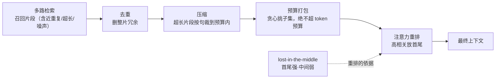
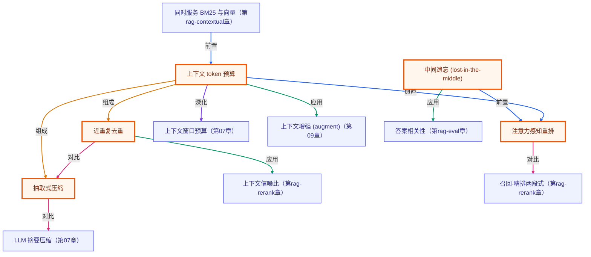

# 检索后的上下文工程：去重 / 压缩 / 预算 / 注意力重排

> 所属：进阶 RAG 专题 · 检索到 ≠ 用得上，装配才决定模型读到什么
> 预计用时：35 分钟 | 难度：⭐⭐⭐
> 全局导航：[课程导航](../../docs/navigation.md) · [完整大纲](../../docs/curriculum.md) · [知识图谱](../../docs/knowledge-graph.md)

## 学习目标

学完本章你能够：

- [ ] 说清一句话：**检索到 ≠ 用得上**——召回片段还要经过「装配」才进提示，装配质量直接决定模型读到什么。
- [ ] 用 **去重**（dedupeChunks）删掉多路召回 / 块重叠带来的近重复整片冗余，把预算让给唯一信息。
- [ ] 用 **抽取式压缩**（compressChunk）把超长片段按句裁到预算内——纯抽取是原文子串，无改写、无幻觉。
- [ ] 用 **预算打包**（packWithinBudget）在 token 预算内贪心挑价值最高的子集，且**绝不超预算**。
- [ ] 理解 **lost-in-the-middle**（中间遗忘），用 **注意力感知重排**（reorderForAttention）把最该读的片段放到首尾高注意力位。

## 前置知识

- 已读 [第 09 章 · 从零实现 RAG](../../lessons/09-rag-from-scratch/README.md)（知道检索→增强→生成、把片段拼进 system 提示）。本章接着讲「拼之前怎么挑、怎么排」。
- 已读 [第 07 章 · 短期记忆与上下文](../../lessons/07-short-term-memory/README.md) 或了解「上下文窗口预算」（本章把会话历史的预算思路延伸到检索片段）。
- 选读 [第 03 章 · 召回-精排两段式](../03-reranking/README.md)：精排按相关性排序，本章的「重排」按位置注意力排序，目标不同（见下文对比）。
- 本章 demo 是**纯函数**（去重/压缩/预算/重排都不调模型、不联网），**无需任何 API key** 即可运行。

## 三层学习路线

| 层级 | 学习目标 | 你要完成什么 |
|------|----------|--------------|
| 极简 | 跑通 demo，看懂「同样的预算，去重+压缩后能多塞进几条唯一信息」。 | 能指着输出说出「朴素打包把预算浪费在了高分重复上」。 |
| 进阶 | 理解四个动作各管什么：去重删整片冗余、压缩裁单片冗长、预算挑子集、重排对抗中间遗忘。 | 解释为什么「相关性之和」会因重复而虚高，按唯一信息算才公平。 |
| 真实实践 | 把直觉映射到生产：rerank 之后的 context 组装、长上下文重排、prompt 压缩。 | 能说清生产里 LangChain `LongContextReorder`、prompt 压缩各对应本章哪个动作。 |

---

## 图解学习地图

> 读图顺序：跟着一批召回片段，从左到右走「去重 → 压缩 → 预算 → 重排」，看它如何被装配成最终上下文。核心焦点：**每一步都在为「最该读的内容、用最少的预算、放到最该放的位置」服务**。



---

## 一、原理：检索到 ≠ 用得上

第 08/09 章把片段「检索出来」，很多人以为剩下的就是 `chunks.join("\n")` 拼进提示。可一旦上规模，问题全冒出来：

- **窗口有预算**：top-k 调大召回更全，但片段塞不下，且每多塞一段都付 token 成本。
- **召回有冗余**：多路召回（向量 + BM25 + 改写）、块重叠会把**几乎一样**的内容拿回好几份。
- **长文塞不下**：一份长文档一条就吃掉大半预算，挤掉其它精炼片段。
- **位置有偏见**：模型对上下文**首尾注意力强、中间弱**（lost-in-the-middle），埋在中部的关键证据容易被忽略。

「上下文工程」就是把「装配」这一步做成**确定性的纯函数**，分四个动作各司其职：

### 1) 去重：删整片冗余

近重复检测用 **Jaccard 相似度**（基于内容词元集合）：相似度 ≥ 阈值就判为近重复。按**输入顺序**保留先出现者——所以**先按相关性降序排序再去重**，让更相关的那条留下。

```
J(A,B) = |词元(A) ∩ 词元(B)| / |词元(A) ∪ 词元(B)|     # ∈ [0,1]，越大越像
```

> 为什么是「整片」冗余：去重删的是**和别人几乎一样的整条片段**（多路召回的重复命中）；单条内部的冗长由下面的「压缩」管。两件事互补。

### 2) 压缩：把超长片段裁进预算（抽取式）

**抽取式**压缩：按句末标点切句，在预算内**贪心保留整句**，超预算即停。返回文本是原文的一个**前缀**（不改写、不生成）——所以离线确定、无幻觉风险。这和第 07 章用 LLM 摘要压会话历史（生成式、需 key）是两条路：一个抽取、一个生成。

### 3) 预算分配：在 token 预算内贪心挑子集

给定每条片段的 `(relevance, tokens)`，在 `budget` 内按相关性（或「相关性/token」性价比）降序贪心装入，装不下就跳过。**硬保证：用量绝不超预算**。贪心不是背包最优解——这是有意的教学简化，真正不可破的是「绝不超预算」。

> ⚠️ 一个反直觉的坑：朴素打包的「**相关性之和**」会因为**重复内容被重复计数**而虚高。一条高分重复（如同一片段被两路召回拿到两次）会挤掉一条唯一片段，却让总分看起来更高。**按唯一信息算才公平**——这正是去重要在打包前做的原因。

### 4) lost-in-the-middle 与注意力重排

把「首尾强、中间弱」建模成一条 **U 形位置权重**（两端=1，正中最低），再定义：

```
有效相关性 = Σ  relevanceᵢ · 位置权重ᵢ
```

要最大化它，按**重排不等式**（rearrangement inequality）：把相关性最高的片段放到权重最高的位置（首尾），次高的放另一端……依次向中间填。于是**重排后有效相关性一定不低于任何其它顺序**（包括「一味按相关性降序」）。

> 和「精排」的区别（第 03 章）：**精排**把最相关的排**最前**；**重排**却可能把次相关的也放到**末尾**——因为位置注意力不均，「排第一」不等于「被最好利用」。精排决定**选谁**，重排决定**放哪**。

---

## 二、代码走读

完整实现见 [`../../src/shared/rag/contextAssembly.ts`](../../src/shared/rag/contextAssembly.ts)，demo 见 [`index.ts`](./index.ts)。全部是**纯函数**，随机性为零，结果只取决于输入。

```ts
import {
  makeContextCorpus, dedupeChunks, compressChunk,
  packWithinBudget, reorderForAttention, effectiveRelevance,
} from "../../src/shared/rag";

const corpus = makeContextCorpus();                          // 9 条：含 2 条近重复、1 条超长、1 条噪声
const sorted = [...corpus].sort((a, b) => b.relevance - a.relevance);

// 1) 去重：先按相关性排序，让更相关的留下
const { kept, dropped } = dedupeChunks(sorted, { threshold: 0.6 });   // 丢掉 dup1/dup2

// 2) 压缩：只裁真正超长的片段
const compacted = kept.map((c) => (c.tokens > 40 ? compressChunk(c, 40).chunk : c));

// 3) 预算打包：绝不超预算
const packed = packWithinBudget(compacted, { budget: 130 });          // usedTokens <= 130（恒成立）

// 4) 注意力重排：高相关放首尾
const finalOrder = reorderForAttention(packed.selected);
// effectiveRelevance(finalOrder) >= effectiveRelevance(packed.selected)（重排不等式保证）
```

> demo 里每条结论都分两类、**绝不写死**：
> - **构造保证腿**用 `invariant(...)` 运行时硬核对（对任意旋钮都成立）：去重是分区、打包不超预算、压缩 ≤ 预算且为原文前缀、重排是排列且有效相关性不降。
> - **数据依赖腿**用「现场计算 + else 诊断」：去重是否腾出名额、重排是否有正增益——条件不满足时打印诊断而非报错（那本身是教学点）。

---

## 三、运行

本章 demo 是**纯函数**（不调模型、不联网）——**无需任何 API key，离线即可跑通**：

```bash
npx tsx rag-advanced/11-context-engineering/index.ts
```

预期看到（**具体数字由运行时打印，下面是构造保证的趋势**）：

1. **去重**：9 条里**必丢 2 条近重复**（dup1→u1、dup2→u2，Jaccard ≥ 阈值），保留 7 条。分区不变量 `kept + dropped = 9` 现场核对。
2. **压缩**：超长片段 `long1` 的 token 数**显著下降且 ≤ 上限**，裁后文本是原文前缀（本例 91 → 28，裁掉 4 句）。
3. **预算打包**：同一 token 预算下，
   - **朴素打包**把预算浪费在高分重复上，按唯一信息只覆盖少数几条（本例 2 条）；
   - **去重+压缩后打包**覆盖**更多唯一信息**（本例 4 条，含压缩后的 long1）。
   - 两种打包**用量都 ≤ 预算**（硬保证）。
4. **注意力重排**：重排后**有效相关性不降**（重排不等式保证；本例 +0.36），位置权重是首尾高、中间低的 U 形。

也可跑纯函数冒烟（含本章全部不变量断言）：`npx tsx rag-advanced/smoke.ts`。

---

## 四、练习

> 本章 demo 的「构造保证腿」对**任意旋钮**都成立（改旋钮不会误报崩）；会变的只是「数据依赖腿」的软结论——那正是设计好的观察点。下面几题专挑这些软结论来拨。

1. **拨预算看去重价值**：默认 `BUDGET=130` 下，朴素打包选 `[u1,u2,dup1]`——第三个名额被高分重复 `dup1`（rel 0.90、49 token）占掉，而工程打包把它让给唯一片段 `u3`，这就是 ⑥「去重 payoff」。把 `BUDGET` 调大到放得下全部片段（如 `400`），⑥ 翻转成「**去重未腾出名额**」——预算够松时去重不再抢名额（但仍省 token、去噪）。反过来调到 `110`（在 u1+u2 之后已放不下 dup1 的 49 token），`dup1` 落选、朴素与工程打包重新趋同——可见「高分重复抢名额」只发生在预算**刚好够它挤进来**的那段窗口。
2. **关掉 lost-in-the-middle**：把 `MIDDLE_WEIGHT` 调成 `1.0`（首尾与中间权重拉平），结论 ⑦ 会从「重排 payoff」变成「**重排无增益**」——这正是「位置注意力不均」这个前提被去掉的体现（demo 仍正常退出，当预期教学点看，而非报错）。
3. **拨去重阈值**：把 `DEDUP_THRESHOLD` 调到 `0.9`，两条近重复（Jaccard≈0.73/0.76）将**不再被删**，观察预算重新被重复内容浪费。再调到 `0.4`，看会不会误删本不该删的片段。
4. **换打包策略**：给 `packWithinBudget` 传 `{ strategy: "density" }`（按「相关性/token」性价比挑），和默认的 `"relevance"` 对比同预算下覆盖的片段集合，想想各自适合什么场景。
5. **进阶 · 映射生产**：查 LangChain 的 `LongContextReorder` 或任一 prompt 压缩库（如 LLMLingua），用本章的语言说清它们各自在做「去重 / 压缩 / 预算 / 重排」里的哪一步。

---

<!-- KG:START (由 npm run kg 自动生成，勿手改本标记区) -->

## 知识图谱与延伸阅读

> 本节由 `npm run kg` 自动生成（数据源 `knowledge-graph/data/graph.ts`）。要增删请改数据源后重跑。

### 本章概念图谱

> 节点：**橙框**=本章概念，蓝框=关联的其他章概念。连线按关系类型着色：前置(蓝) · 深化(紫) · 对比(玫红) · 应用(绿) · 组成(橙)。



### 与其他章节的关系

- `同时服务 BM25 与向量` —**前置**→ `上下文 token 预算`（第 rag-contextual 章）
- `上下文 token 预算` —**深化**→ `上下文窗口预算`（第 07 章）
- `上下文 token 预算` —**应用**→ `上下文增强 (augment)`（第 09 章）
- `近重复去重` —**应用**→ `上下文信噪比`（第 rag-rerank 章）
- `注意力感知重排` —**对比**→ `召回-精排两段式`（第 rag-rerank 章）
- `抽取式压缩` —**对比**→ `LLM 摘要压缩`（第 07 章）
- `中间遗忘 (lost-in-the-middle)` —**应用**→ `答案相关性`（第 rag-eval 章）

### 延伸阅读

- [Lost in the Middle: How Language Models Use Long Contexts](https://arxiv.org/abs/2307.03172) — Liu 等 (2023)：实证模型对长上下文『首尾强、中间弱』的 U 形利用曲线，本章注意力重排的直接依据 `paper`
- [LangChain · How to reorder retrieved results for long context](https://python.langchain.com/docs/how_to/long_context_reorder/) — 把最相关文档放到上下文首尾、次相关压中间的工程实现，正是本章 reorderForAttention 的现成对应 `doc`

> 🗺️ 在[全局知识图谱](../../docs/knowledge-graph.md) / [交互式图谱](../../knowledge-graph/output/index.html) 中查看本章位置。

<!-- KG:END -->

## 五、小结与延伸

- **检索到 ≠ 用得上**：召回之后还有「装配」这一步，它决定模型最终读到什么；装配是确定性纯函数，不是玄学。
- **四个动作各司其职**：去重删整片冗余、压缩裁单片冗长、预算挑子集、重排对抗中间遗忘——顺序通常是「去重 → 压缩 → 预算 → 重排」。
- **当心虚高的相关性之和**：高分重复会被重复计数、挤掉唯一信息；**按唯一信息算**才公平，这也是去重要先于打包的原因。
- **位置也是信息**：模型对上下文首尾强、中间弱；「排第一」不等于「被最好利用」，把最该读的放到首尾。
- 下一步：本章是「检索结果怎么装配」；配合第 05 章「检索/生成质量怎么量」，就能在「省、准、好读」之间为生产做有依据的取舍。

> 💡 **面试会问**：召回之后到拼进提示之间还该做哪些处理？为什么「相关性之和最高」的上下文不一定最好？lost-in-the-middle 是什么、它如何影响 RAG 答案质量？抽取式压缩和 LLM 摘要压缩各有什么取舍？去重为什么要放在预算打包之前？
