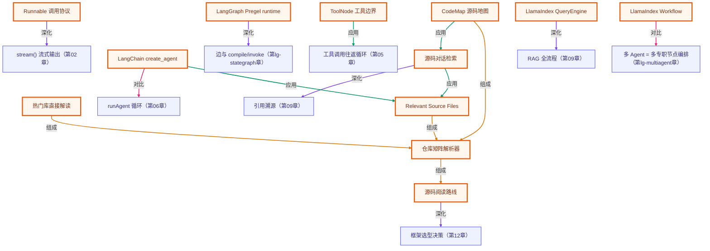

# 源码解析

> 目标：从“会调用框架 API”推进到“能读懂框架 runtime”。这一章不要求你背完 LangChain、LangGraph、LlamaIndex 的所有源码，而是训练一套稳定读法：入口函数怎么接到运行时，状态在哪里保存，工具和检索在哪里执行，循环又在哪里停止。

本章源码路径按 **2026-06-29 核对过的官方 GitHub 主干路径** 组织。框架源码变化很快，所以这里把“读法”放在第一位，把具体类名放在第二位。你以后遇到新版本，也能沿同一条线重新定位。

## 学完你要能做到

| 能力 | 完成标准 |
|------|----------|
| 定位入口 | 能从 `create_agent`、`StateGraph(...).compile()`、`index.as_query_engine()` 找到框架真正的运行时对象。 |
| 看懂控制流 | 能指出循环、分支、工具调用、检索、handoff、停止条件分别在哪层实现。 |
| 区分职责 | 能分清模型只负责“请求/生成”，本地 runtime 负责校验、执行、状态和副作用。 |
| 对照手写版 | 能把第 04-09 章的 `runAgent`、`ToolRegistry`、RAG pipeline 映射到三个框架源码。 |
| 判断选型边界 | 能回答什么时候用 LangChain，什么时候用 LangGraph，什么时候用 LlamaIndex。 |

## 源码阅读总路线

读 agent 框架源码时，不要从仓库根目录开始硬啃，也不要只停在 README 示例。按这四层走：

```text
用户级入口
  -> runtime / graph / query engine 对象
  -> 状态、工具、检索、middleware、event 的边界
  -> 停止条件、错误处理、stream、checkpoint、trace
```

对应到三个框架：

| 框架 | 用户级入口 | runtime 主体 | 最该追的边界 |
|------|------------|--------------|--------------|
| LangChain | `create_agent(...)` | agent factory + Runnable / graph runtime | middleware、structured output、tool node、model call |
| LangGraph | `StateGraph(...).compile()` / `create_react_agent(...)` | Pregel-style compiled graph | channel reducer、conditional edge、checkpoint、ToolNode |
| LlamaIndex | `index.as_query_engine()` / workflow agent | QueryEngine + Workflow runtime | retriever、node postprocessor、response synthesizer、event / handoff |

## 先读哪几个文件

| 路线 | 官方源码入口 | 本章深入页 |
|------|--------------|------------|
| LangChain | [`libs/langchain_v1/langchain/agents/factory.py`](https://github.com/langchain-ai/langchain/blob/master/libs/langchain_v1/langchain/agents/factory.py) | [LangChain 源码解析](./langchain.md) |
| LangGraph | [`libs/langgraph/langgraph/graph/state.py`](https://github.com/langchain-ai/langgraph/blob/main/libs/langgraph/langgraph/graph/state.py) + [`libs/langgraph/langgraph/pregel/main.py`](https://github.com/langchain-ai/langgraph/blob/main/libs/langgraph/langgraph/pregel/main.py) | [LangGraph 源码解析](./langgraph.md) |
| LlamaIndex | [`llama-index-core/llama_index/core/query_engine/retriever_query_engine.py`](https://github.com/run-llama/llama_index/blob/main/llama-index-core/llama_index/core/query_engine/retriever_query_engine.py) | [LlamaIndex 源码解析](./llamaindex.md) |

## DeepWiki-style 仓库解析器

> 参考 [DeepWiki](https://deepwiki.com/) 的热门仓库入口 / 仓库 Wiki / Relevant source files / 架构矩阵 / 源码对话 / CodeMap 形态：先从热门库或指定仓库进入，再把仓库切成可读矩阵，决定从哪个入口文件下钻。

<dl>
  <dt>支持输入</dt>
  <dd>热门库卡片、公开 GitHub 仓库 URL 或 <code>owner/repo</code>，例如 <code>langchain-ai/langgraph</code>。</dd>
  <dt>输出</dt>
  <dd>热门库直接解读、仓库总览、语言分布、目录/包矩阵、Relevant Source Files、源码对话、CodeMap 和阅读路径。</dd>
  <dt>边界</dt>
  <dd>浏览器端读取 GitHub 公开 tree 和 raw source；无 token、无服务器 clone。三套内置仓库提供离线矩阵；对话模式只在可读取 raw source 时给 GitHub 行号引用，CodeMap 节点都回链源码文件。</dd>
</dl>

<div data-source-analysis-explorer></div>

完整字段说明、热门库入口、源码对话和 CodeMap 边界见 [仓库矩阵解析器](./repository-matrix.md)。

## 1. LangChain：从 agent factory 看组合式 runtime

LangChain 的关键不是“某个神奇 Agent 类”，而是把模型、工具、结构化输出、middleware 和 runtime 组装成一个可调用对象。

```text
create_agent(...)
  -> 规范化 model / tools / middleware / response_format
  -> 创建模型调用节点
  -> 创建工具执行节点
  -> 接入 structured output 策略
  -> 返回可 invoke / stream 的 agent runtime
```

读 `factory.py` 时，重点看四个问题：

| 问题 | 为什么重要 |
|------|------------|
| model 是什么时候被初始化或包裹的？ | 这决定 provider 差异被隔离在哪一层。 |
| tools 如何变成 runtime 能执行的节点？ | 模型只发 tool call，本地代码才执行副作用。 |
| middleware 插在哪些生命周期点？ | 权限、trace、token 预算、错误修复都应在这里做，不该塞进 prompt。 |
| structured output 走 provider 还是 tool strategy？ | 这决定迁移模型时的兼容性风险。 |

和本课程对照：

| 手写章节 | LangChain 对应 |
|----------|----------------|
| 第 04 章 `while + scratchpad` | agent runtime 的循环 |
| 第 05 章 tool call 往返 | model node -> tool node -> model node |
| 第 06 章 `ToolRegistry.run()` | tools + middleware + error feedback |
| 第 13 章结构化输出 | structured output strategy |

## 2. LangGraph：从 StateGraph 看可恢复状态机

LangGraph 的核心是显式状态图：节点做计算，边决定下一步，state 在节点之间流动。它比手写 `while` 多出来的价值，是 checkpoint、stream、interrupt、并行 super-step 和恢复能力。

```text
StateGraph
  -> 定义 state schema 和 reducer channel
  -> addNode / addEdge / addConditionalEdges
  -> compile 成 Pregel-style runtime
  -> invoke / stream 时按 super-step 推进
  -> checkpoint 记录每一步状态
```

读 `state.py` 时先看声明层；读 `pregel/main.py` 时再看执行层。不要把两者混成一件事。

| 层 | 读什么 |
|----|--------|
| 声明层 | State schema、channel reducer、node、edge、conditional edge、compile。 |
| 执行层 | 每个 super-step 如何找可运行节点、合并 partial update、输出 stream、写 checkpoint。 |
| 预制 agent 层 | `create_react_agent` 如何把 model node 和 ToolNode 接成循环图。 |

和本课程对照：

| 手写章节 | LangGraph 对应 |
|----------|----------------|
| 第 04 章 ReAct loop | 条件边回到模型节点 |
| 第 05 章 tool result 回灌 | ToolNode 写回 `ToolMessage` |
| 进阶 LangGraph L1 | State / reducer / node / edge |
| 进阶 LangGraph L3-L4 | checkpoint / interrupt / Command(resume) |
| 进阶 LangGraph L5 | supervisor / parallel team 的图拓扑 |

## 3. LlamaIndex：从 QueryEngine 看 data-first agent

LlamaIndex 的主线是 data-first：先把文档变成 nodes 和 index，再围绕 retriever、postprocessor、response synthesizer 构造 query engine，最后把 query engine 作为工具或 workflow 的一部分交给 agent。

```text
query
  -> retriever 取回 nodes
  -> node postprocessors 过滤、重排、补 metadata
  -> response synthesizer 合成答案
  -> response 返回 text + source nodes
  -> agent/workflow 可把 query engine 当工具调用
```

读 LlamaIndex 不建议一上来就找 agent loop。先读 QueryEngine，因为它解释了这个框架最强的边界：RAG 数据链路。

| 层 | 读什么 |
|----|--------|
| Index / Node | 原始资料如何切成可检索单元。 |
| Retriever | 查询如何召回节点。 |
| QueryEngine | 检索结果如何经过后处理再合成答案。 |
| Workflow / Agent | 工具、event、handoff、context 如何组织多步控制流。 |

和本课程对照：

| 手写章节 | LlamaIndex 对应 |
|----------|------------------|
| 第 08 章向量检索 | index / retriever |
| 第 09 章 RAG pipeline | QueryEngine |
| RAG 进阶专题 | postprocessor / rerank / metadata / citation |
| 第 11 章多 agent | workflow event / handoff |

## 三者怎么选

| 场景 | 优先看/用 | 理由 |
|------|-----------|------|
| 你要把多个模型组件、工具、parser、middleware 组合成应用 | LangChain | 组合式生态最完整，适合 glue code 多的应用。 |
| 你要长流程、checkpoint、HITL、多 agent 状态恢复 | LangGraph | 显式图 + checkpoint 是核心优势。 |
| 你的核心复杂度在文档、索引、检索、引用和数据工作流 | LlamaIndex | data-first，RAG/query engine 边界更强。 |
| 你只是学原理或做小 demo | 手写 | 成本最低，调试最透明，避免过早框架化。 |

## 源码阅读练习

1. 打开 LangChain `factory.py`，画出 `create_agent` 从参数到 runtime 的装配路径。
2. 打开 LangGraph `state.py`，找出 state channel 和 reducer 在哪里定义、哪里参与 merge。
3. 打开 LangGraph prebuilt `ToolNode`，标出 tool call 到 `ToolMessage` 的闭环。
4. 打开 LlamaIndex `retriever_query_engine.py`，把 retriever、postprocessor、synthesizer 三段标出来。
5. 回到本课程第 06/09 章，写一张“手写版 vs 框架版”的对照表。

## 常见误区

| 误区 | 正确读法 |
|------|----------|
| 只看 quickstart，不看源码入口 | quickstart 只告诉你怎么用，源码入口才告诉你框架托管了什么。 |
| 把 agent 能力归因给模型 | 循环、状态、工具执行、检索、checkpoint 大多是 runtime 代码。 |
| 看到 `agent.invoke()` 就以为只是函数调用 | 背后可能是图运行时、middleware、stream、checkpoint 和 tool loop。 |
| 直接比较框架名字 | 应比较你的复杂度在“组合”“状态机”“数据/RAG”哪一层。 |
| 读源码时不对照手写版 | 没有手写基线，就很难判断框架抽象到底省了什么、遮住了什么。 |

## 下一步

- 想看 agent factory：继续读 [LangChain 源码解析](./langchain.md)。
- 想看状态机 runtime：继续读 [LangGraph 源码解析](./langgraph.md)。
- 想看 RAG/data-first 架构：继续读 [LlamaIndex 源码解析](./llamaindex.md)。
- 想回到课程实现：复习 [第 04 章 Agent 循环](../lessons/04-the-agent-loop/README.md)、[第 06 章工具系统](../lessons/06-building-a-tool-system/README.md)、[第 09 章从零实现 RAG](../lessons/09-rag-from-scratch/README.md)。

<!-- KG:START (由 npm run kg 自动生成，勿手改本标记区) -->

## 知识图谱与延伸阅读

> 本节由 `npm run kg` 自动生成（数据源 `knowledge-graph/data/graph.ts`）。要增删请改数据源后重跑。

### 本章概念图谱

> 节点：**橙框**=本章概念，蓝框=关联的其他章概念。连线按关系类型着色：前置(蓝) · 深化(紫) · 对比(玫红) · 应用(绿) · 组成(橙)。



### 与其他章节的关系

- `源码阅读路线` —**深化**→ `框架选型决策`（第 12 章）
- `源码对话检索` —**深化**→ `引用溯源`（第 09 章）
- `LangChain create_agent` —**对比**→ `runAgent 循环`（第 06 章）
- `Runnable 调用协议` —**深化**→ `stream() 流式输出`（第 02 章）
- `LangGraph Pregel runtime` —**深化**→ `边与 compile/invoke`（第 lg-stategraph 章）
- `ToolNode 工具边界` —**应用**→ `工具调用往返循环`（第 05 章）
- `LlamaIndex QueryEngine` —**深化**→ `RAG 全流程`（第 09 章）
- `LlamaIndex Workflow` —**对比**→ `多 Agent = 多专职节点编排`（第 lg-multiagent 章）

### 延伸阅读

- [DeepWiki](https://deepwiki.com/) — 源码仓库 Wiki 参考形态：热门仓库入口、目录化 Wiki、Relevant source files、源码对话、CodeMap 和源码引用 `doc`
- [LangChain v1 agents source](https://github.com/langchain-ai/langchain/blob/master/libs/langchain_v1/langchain/agents/factory.py) — LangChain 官方源码入口：create_agent 如何组装模型、工具、middleware、structured output 与 agent runtime `doc`
- [LangGraph StateGraph and Pregel runtime source](https://github.com/langchain-ai/langgraph/blob/main/libs/langgraph/langgraph/graph/state.py) — LangGraph 官方源码入口：StateGraph 的 state schema、channel reducer、node、edge 与 compile `doc`
- [LlamaIndex RetrieverQueryEngine source](https://github.com/run-llama/llama_index/blob/main/llama-index-core/llama_index/core/query_engine/retriever_query_engine.py) — LlamaIndex 官方源码入口：retriever、node postprocessor、response synthesizer 组成 data-first RAG 查询链路 `doc`

> 🗺️ 在[全局知识图谱](../docs/knowledge-graph.md) / [交互式图谱](../knowledge-graph/output/index.html) 中查看本章位置。

<!-- KG:END -->
